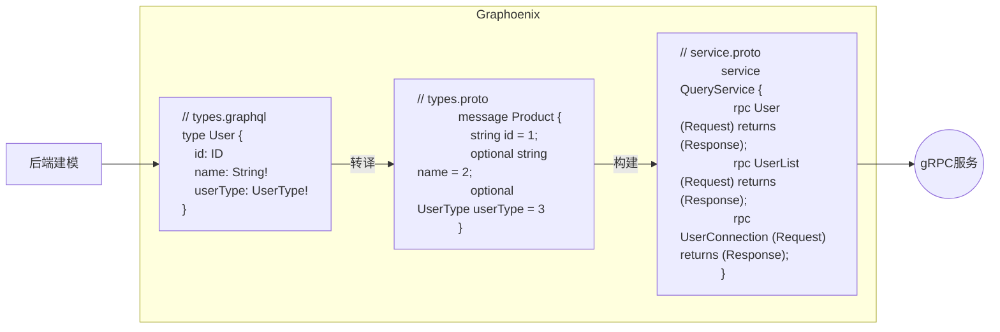

# gRPC

[gRPC](https://grpc.io/) 是一种高性能, 开源的远程过程调用（RPC）框架, 最初由Google开发. 它使用HTTP/2作为传输协议, 并采用 [Protocol Buffers](https://protobuf.dev/)（protobuf）作为接口描述语言和数据序列化格式. [gRPC](https://grpc.io/) 支持多种编程语言, 可以实现跨语言的服务调用. 其特点包括双向流, 负载均衡, 认证和超时控制等, 适用于微服务架构下的高效通信

## 安装

### protobuf 插件

1. 引用插件生成 protobuf 文件

```gradle title="build.gradle"
buildscript {
    repositories {
        mavenLocal()
        jcenter()
        gradlePluginPortal()
    }
    dependencies {
        // highlight-start
        classpath 'io.graphoenix:graphoenix-gradle-plugin:0.0.1-SNAPSHOT'
        // highlight-end
    }
}

plugins {
    id 'java'
    // highlight-start
    id 'com.google.protobuf' version '0.9.1'
    // highlight-end
}
apply plugin: 'io.graphoenix'
classes.dependsOn {
    generateGraphQLSource
    // highlight-start
    generateProtobufV3
    // highlight-end
}
```

2. 生成 dto 和 protobuf

```bash
./gradlew :user-package:build
```

<details>
<summary>protobuf目录</summary>

```txt
|-- order-microservices
    |-- user-package                                用户模块
        |-- build.gradle
        |-- src
            |-- main
                |-- java
                |   |-- demo.gp.user
                |       |-- package-info.java
                // highlight-start
                |-- proto
                |   |-- demo.gp.user
                |       |-- enums.proto             枚举类型
                |       |-- input_objects.proto     输入类型
                |       |-- interfaces.proto        接口类型
                |       |-- objects.proto           对象类型
                |       |-- query.proto             查询服务
                |       |-- mutation.proto          变更服务
                // highlight-end
                |-- resources
                    |-- graphql
                        |-- user.gql                定义用户相关类型
```

</details>

Graphoenix 根据 GraphQL 生成对应的 protobuf 定义文件




## 查询

### 普通查询