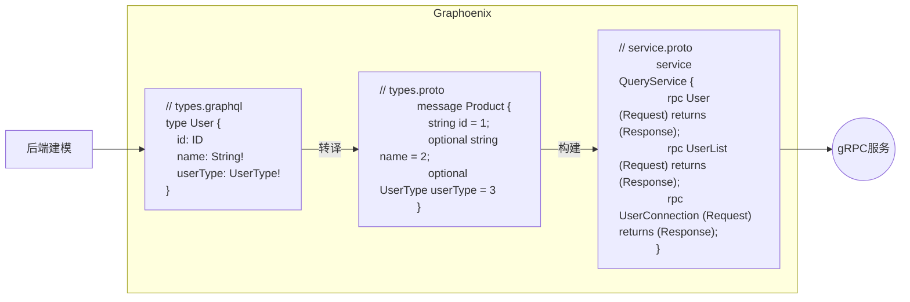

# gRPC

[gRPC](https://grpc.io/) 是一种高性能, 开源的远程过程调用（RPC）框架, 最初由 Google 开发. 它使用 HTTP/2 作为传输协议, 并采用 [Protocol Buffers](https://protobuf.dev/)（protobuf）作为接口描述语言和数据序列化格式. [gRPC](https://grpc.io/) 支持多种编程语言, 可以实现跨语言的服务调用. 其特点包括双向流, 负载均衡, 认证和超时控制等, 适用于微服务架构下的高效通信

## 安装

### protobuf 插件

1. 引用插件生成 protobuf 文件

```gradle title="build.gradle"
buildscript {
    repositories {
        mavenLocal()
        jcenter()
        gradlePluginPortal()
    }
    dependencies {
        // highlight-start
        classpath 'io.graphoenix:graphoenix-gradle-plugin:0.0.1-SNAPSHOT'
        // highlight-end
    }
}

plugins {
    id 'java'
    // highlight-start
    id 'com.google.protobuf' version '0.9.1'
    // highlight-end
}
apply plugin: 'io.graphoenix'
classes.dependsOn {
    generateGraphQLSource
    // highlight-start
    generateProtobufV3
    // highlight-end
}
```

2. 生成 dto 和 protobuf

```bash
./gradlew :user-package:build
```

<details>
<summary>protobuf目录</summary>

```txt
|-- order-microservices
    |-- user-package                                用户模块
        |-- build.gradle
        |-- src
            |-- main
                |-- java
                |   |-- demo.gp.user
                |       |-- package-info.java
                // highlight-start
                |-- proto
                |   |-- demo.gp.user
                |       |-- enums.proto             枚举类型
                |       |-- input_objects.proto     输入类型
                |       |-- interfaces.proto        接口类型
                |       |-- objects.proto           对象类型
                |       |-- query.proto             查询服务
                |       |-- mutation.proto          变更服务
                // highlight-end
                |-- resources
                    |-- graphql
                        |-- user.gql                定义用户相关类型
```

</details>

Graphoenix 根据 GraphQL 生成对应的 protobuf 定义文件



### gRPC 依赖

安装 graphoenix-grpc-server 模块, Graphoenix 自动实现 gRPC 服务接口

```gradle title="build.gradle"
dependencies {
    implementation 'io.graphoenix:graphoenix-core:0.0.1-SNAPSHOT'
    implementation 'io.graphoenix:graphoenix-r2dbc:0.0.1-SNAPSHOT'
    // highlight-start
    // gRPC 服务
    implementation 'io.graphoenix:graphoenix-grpc-server:0.0.1-SNAPSHOT'
    // highlight-end

    implementation 'io.nozdormu:nozdormu-inject:0.0.1-SNAPSHOT'
    implementation 'io.nozdormu:nozdormu-config:0.0.1-SNAPSHOT'

    implementation 'org.mariadb:r2dbc-mariadb:1.1.4'

    annotationProcessor 'io.graphoenix:graphoenix-annotation-processor:0.0.1-SNAPSHOT'
    annotationProcessor 'io.graphoenix:graphoenix-sql:0.0.1-SNAPSHOT'
    // highlight-start
    // gRPC 服务
    annotationProcessor 'io.graphoenix:graphoenix-grpc-server:0.0.1-SNAPSHOT'
    // highlight-end
}
```

## 查询和变更

### 查询

使用与 Query 对象中同名的方法查询, 使用 `setSelectionSet` 方法来设置查询字段

```java
import demo.gp.user.dto.enumType.grpc.UserType;
import demo.gp.user.grpc.*;
import io.graphoenix.core.dto.enumType.grpc.Operator;
import io.graphoenix.core.dto.inputObjectType.grpc.StringExpression;
import io.grpc.ManagedChannel;
import io.grpc.ManagedChannelBuilder;
import org.junit.jupiter.api.Test;

import static org.junit.jupiter.api.Assertions.*;

public class UserGrpcTest {

    // highlight-start
    // gRPC server 地址
    private static final String userGrpcAddress = "localhost:50053";
    private static final ManagedChannel userManagedChannel = ManagedChannelBuilder.forTarget(userGrpcAddress).usePlaintext().build();
    private static final QueryServiceGrpc.QueryServiceBlockingStub queryServiceStub = QueryServiceGrpc.newBlockingStub(userManagedChannel);
    // highlight-end

    @Test
    void queryUserTest() {
        // highlight-start
        QueryUserRequest queryUserRequest = QueryUserRequest.newBuilder()
                .setSelectionSet("{name userType}")
                .setName(
                        StringExpression.newBuilder()
                                .setOpr(Operator.EQ_OPERATOR)
                                .setVal("Alice")
                                .build()
                )
                .build();
        QueryUserResponse response = queryServiceStub.user(queryUserRequest);
        // highlight-end

        assertAll(
                () -> assertEquals(response.getUser().getName(), "Alice"),
                () -> assertEquals(response.getUser().getUserType(), UserType.VIP_USER_TYPE),
                () -> assertEquals(response.getUser().getEmail(), "")
        );
    }
}
```

方法等同于如下 GraphQL 查询

```graphql
query {
  user(name: { opr: EQ, val: "Alice" }) {
    name
    userType
  }
}
```

### 变更

使用与 Mutation 对象中同名的方法变更, 使用 `setSelectionSet` 方法来设置查询字段

```java
import demo.gp.user.dto.enumType.grpc.UserType;
import demo.gp.user.grpc.*;
import io.graphoenix.core.dto.enumType.grpc.Operator;
import io.graphoenix.core.dto.inputObjectType.grpc.StringExpression;
import io.grpc.ManagedChannel;
import io.grpc.ManagedChannelBuilder;
import org.junit.jupiter.api.Test;

import static org.junit.jupiter.api.Assertions.*;

public class UserGrpcTest {

    // highlight-start
    // gRPC server 地址
    private static final String userGrpcAddress = "localhost:50053";
    private static final ManagedChannel userManagedChannel = ManagedChannelBuilder.forTarget(userGrpcAddress).usePlaintext().build();
    private static final MutationServiceGrpc.MutationServiceBlockingStub mutationServiceBlockingStub = MutationServiceGrpc.newBlockingStub(userManagedChannel);
    // highlight-end

    @Test
    void MutationUserTest() {
        // highlight-start
        MutationUserRequest mutationUserRequest = MutationUserRequest.newBuilder()
                .setName("Uma")
                .setEmail("uma@example.com")
                .setUserType(UserType.VIP_USER_TYPE)
                .build();
        MutationUserResponse response = mutationServiceBlockingStub.user(mutationUserRequest);
        // highlight-end

        assertAll(
                () -> assertEquals(response.getUser().getName(), "Uma"),
                () -> assertEquals(response.getUser().getEmail(), "uma@example.com"),
                () -> assertEquals(response.getUser().getUserType(), UserType.VIP_USER_TYPE)
        );
    }
}
```

方法等同于如下 GraphQL 变更

```graphql
mutaion {
  user(name: "Uma", email: "uma@example.com", userType: VIP) {
    id
    name
    email
    userType
  }
}
```

## 响应式

Graphoenix 支持 [Reactive gRPC](https://github.com/salesforce/reactive-grpc), 响应式 Stub 以 Reactor 开头命名

```java
import demo.gp.user.dto.enumType.grpc.UserType;
import demo.gp.user.grpc.*;
import io.graphoenix.core.dto.enumType.grpc.Operator;
import io.graphoenix.core.dto.inputObjectType.grpc.StringExpression;
import io.grpc.ManagedChannel;
import io.grpc.ManagedChannelBuilder;
import org.junit.jupiter.api.Test;
import reactor.core.publisher.Mono;
import reactor.test.StepVerifier;

import static org.junit.jupiter.api.Assertions.*;

public class UserGrpcTest {

    // highlight-start
    // gRPC server 地址
    private static final String userGrpcAddress = "localhost:50053";
    private static final ManagedChannel userManagedChannel = ManagedChannelBuilder.forTarget(userGrpcAddress).usePlaintext().build();
    // 响应式 Stub
    private static final ReactorQueryServiceGrpc.ReactorQueryServiceStub reactorQueryServiceStub = ReactorQueryServiceGrpc.newReactorStub(userManagedChannel);
    // highlight-end

    @Test
    void reactorQueryUserTest() {
        // highlight-start
        QueryUserRequest queryUserRequest = QueryUserRequest.newBuilder()
                .setName(
                        StringExpression.newBuilder()
                                .setOpr(Operator.EQ_OPERATOR)
                                .setVal("Bob")
                                .build()
                )
                .build();
        Mono<QueryUserResponse> responseMono = reactorQueryServiceStub.user(queryUserRequest);
        // highlight-end

        StepVerifier.create(responseMono)
                .assertNext(response ->
                        assertAll(
                                () -> assertEquals(response.getUser().getName(), "Bob"),
                                () -> assertEquals(response.getUser().getEmail(), "bob@example.com"),
                                () -> assertEquals(response.getUser().getUserType(), UserType.REGULAR_USER_TYPE)
                        )
                )
                .expectComplete()
                .verify();
    }
}
```

## 负载均衡

Graphoenix 提供 `PackageNameResolverProvider` 全面支持 gRPC 负载均衡, 使用 `package://package.name` 作为模块地址, 支持 `pick_first` 和 `round_robin` 两种模式

```java
import io.grpc.ManagedChannel;
import io.grpc.NameResolverRegistry;
import io.graphoenix.grpc.client.resolver.PackageNameResolverProvider;

public class UserGrpcTest {


    // private static final String userGrpcAddress = "localhost:50053";
    // private static final ManagedChannel userManagedChannel = ManagedChannelBuilder.forTarget(userGrpcAddress).usePlaintext().build();
    // highlight-start
    // gRPC server 地址
    private static final String userGrpcAddress = "package://demo.gp.user";
    private static final ManagedChannel userManagedChannel = ManagedChannelBuilder.forTarget(userGrpcAddress).defaultLoadBalancingPolicy("round_robin").usePlaintext().build()
    // highlight-end
    private static final QueryServiceGrpc.QueryServiceBlockingStub queryServiceStub = QueryServiceGrpc.newBlockingStub(userManagedChannel);

    @Inject
    public UserGrpcTest(PackageNameResolverProvider packageNameResolverProvider) {
        // highlight-start
        // 注册地址工厂
        NameResolverRegistry.getDefaultRegistry().register(packageNameResolverProvider);
        // highlight-end
    }
}
```
