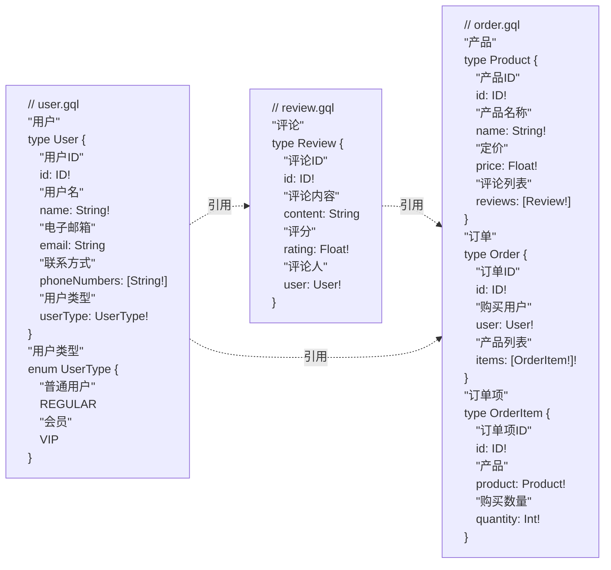

# 微服务

微服务架构（Microservices Architecture）是一种将单个应用程序分解为多个独立部署的小服务的架构模式, 每个服务专注于特定的业务功能, 具有高内聚和松耦合的特点. 它允许各个服务独立开发, 部署和扩展, 支持灵活的技术选型, 提高系统的弹性和扩展性, 然而微服务架构也带来了系统复杂性增加, 运维成本高, 通信开销大和数据一致性保障难等挑战. 它特别适用于需要高扩展性, 复杂业务逻辑和快速迭代的大规模应用. 选择微服务架构需要权衡其优缺点, 并根据具体的业务需求和技术能力进行决策

Graphoenix 通过不同的包名(Package Name)来区分模块, 每个模块可以独立提供服务, 通过 gRPC 等通讯协议构成微服务架构, 也可以与其他模块合并为后作为单体架构提供服务


## 服务拆分

我们将[快速开始](/docs/tutorial/quick-start)中的[订单系统](/docs/tutorial/quick-start#1-定义-graphql)拆分为订单(demo.gp.order), 用户(demo.gp.user), 评论(demo.gp.review)三个子系统

<details>
<summary>项目结构</summary>

```
|-- order-microservices
    |-- build.gradle
    |-- gradle.properties
    |-- settings.gradle
    |-- order-app                               订单系统
    |   |-- build.gradle
    |   |-- src
    |       |-- main
    |           |-- java
    |           |   |-- demo.gp.order
    |           |       |-- App.java
    |           |-- resources
    |               |-- application.conf
    |-- order-package                           订单模块
    |   |-- build.gradle
    |   |-- src
    |       |-- main
    |           |-- java
    |           |   |-- demo.gp.order
    |           |       |-- package-info.java
    |           |-- resources
    |               |-- graphql
    |                   |-- order.gql           定义订单相关类型
    |-- review-app                              评论系统
    |   |-- build.gradle
    |   |-- src
    |       |-- main
    |           |-- java
    |           |   |-- demo.gp.review
    |           |       |-- App.java
    |           |-- resources
    |               |-- application.conf
    |-- review-package                          评论模块
    |   |-- build.gradle
    |   |-- src
    |       |-- main
    |           |-- java
    |           |   |-- demo.gp.review
    |           |       |-- package-info.java
    |           |-- resources
    |               |-- graphql
    |                   |-- review.gql          定义评论相关类型
    |-- user-app                                用户系统
    |   |-- build.gradle
    |   |-- src
    |       |-- main
    |           |-- java
    |           |   |-- demo.gp.user
    |           |       |-- App.java
    |           |-- resources
    |               |-- application.conf
    |-- user-package                            用户模块
        |-- build.gradle
        |-- src
            |-- main
                |-- java
                |   |-- demo.gp.user
                |       |-- package-info.java
                |-- resources
                    |-- graphql
                        |-- user.gql            定义用户相关类型
```

</details>

1. 用户模块中定义用户(User)和用户类型(UserType)
2. 评论模块中定义评论(Review), 评论的评论人字段(user)引用用户模块的用户(User)
3. 订单模块中定义订单(Order)和产品(Product), 订单的购买用户字段(user)引用用户模块的用户(User), 产品的评论列表字段(reviews)引用评论模块的评论(Review)


