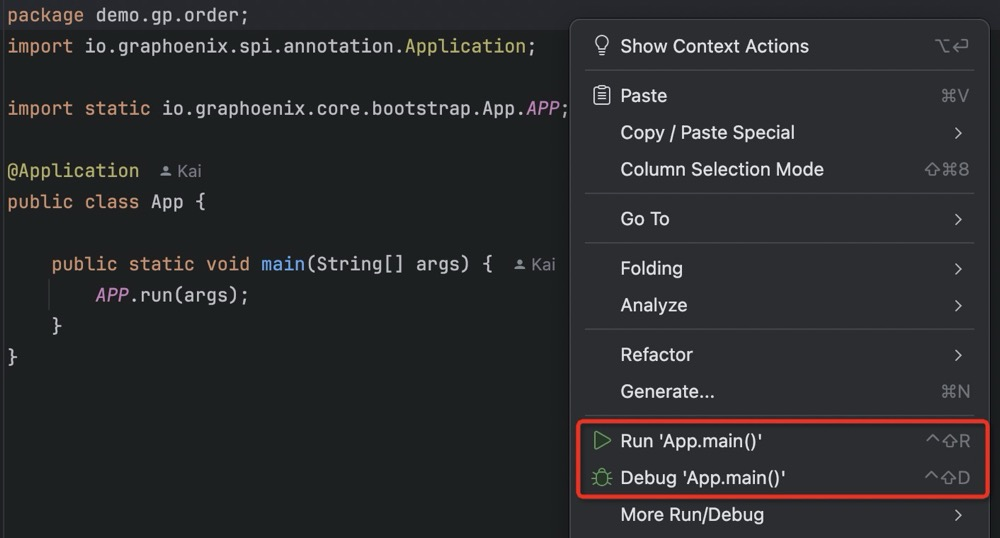

# 微服务

微服务架构（Microservices Architecture）是一种将单个应用程序分解为多个独立部署的小服务的架构模式, 每个服务专注于特定的业务功能, 具有高内聚和松耦合的特点. 它允许各个服务独立开发, 部署和扩展, 支持灵活的技术选型, 提高系统的弹性和扩展性. 然而微服务架构也带来了系统复杂性增加, 运维成本高, 通信开销大和数据一致性保障难等挑战

Graphoenix 全面支持微服务架构, 提供服务注册, 网关, 熔断, 负载均衡, 分布式事务等全套的微服务解决方案. 系统通过不同的包名(Package Name)来区分模块, 每个模块可以独立提供服务, 通过 gRPC 等通讯协议构成微服务矩阵, 也可以与其他模块合并为单体架构提供服务


## 服务拆分

微服务的拆分是将一个单体应用分解为多个独立部署的小服务, 每个服务专注于特定业务功能. 通过领域驱动设计(DDD), 业务功能划分, 独立数据库, 独立部署和服务通信, 实现更好的隔离和独立性

我们将[快速开始](/docs/tutorial/quick-start)中的[订单系统](/docs/tutorial/quick-start#1-定义-graphql)拆分为订单(demo.gp.order), 用户(demo.gp.user), 评论(demo.gp.review)三个子系统

### 项目结构

项目按照功能分为模块(package)和服务(app), 服务作为模块的载体, 按照不同的组合方式构建单体架构或微服务矩阵:

1. app(package1 + package2 + package3) = monolithic
2. app1(package1) + app2(package2) + app3(package3) = microservices

<details>
<summary>项目结构</summary>

```
|-- order-microservices
    |-- build.gradle
    |-- gradle.properties
    |-- settings.gradle
    |-- order-app                               订单系统
    |   |-- build.gradle
    |   |-- src
    |       |-- main
    |           |-- java
    |           |   |-- demo.gp.order
    |           |       |-- App.java
    |           |-- resources
    |               |-- application.conf
    |-- order-package                           订单模块
    |   |-- build.gradle
    |   |-- src
    |       |-- main
    |           |-- java
    |           |   |-- demo.gp.order
    |           |       |-- package-info.java
    |           |-- resources
    |               |-- graphql
    |                   |-- order.gql           定义订单相关类型
    |-- review-app                              评论系统
    |   |-- build.gradle
    |   |-- src
    |       |-- main
    |           |-- java
    |           |   |-- demo.gp.review
    |           |       |-- App.java
    |           |-- resources
    |               |-- application.conf
    |-- review-package                          评论模块
    |   |-- build.gradle
    |   |-- src
    |       |-- main
    |           |-- java
    |           |   |-- demo.gp.review
    |           |       |-- package-info.java
    |           |-- resources
    |               |-- graphql
    |                   |-- review.gql          定义评论相关类型
    |-- user-app                                用户系统
    |   |-- build.gradle
    |   |-- src
    |       |-- main
    |           |-- java
    |           |   |-- demo.gp.user
    |           |       |-- App.java
    |           |-- resources
    |               |-- application.conf
    |-- user-package                            用户模块
        |-- build.gradle
        |-- src
            |-- main
                |-- java
                |   |-- demo.gp.user
                |       |-- package-info.java
                |-- resources
                    |-- graphql
                        |-- user.gql            定义用户相关类型
```

</details>

### 依赖关系

梳理微服务之间的依赖关系需明确业务边界, 定义服务契约, 并绘制依赖图. 注意避免循环依赖和最小化依赖, 采用松耦合设计, 确保健壮性和容错性

例:

1. 用户模块中定义用户(User)和用户类型(UserType)
2. 评论模块中定义评论(Review), 评论的评论人字段(user)引用用户模块的用户(User)
3. 订单模块中定义订单(Order)和产品(Product), 订单的购买用户字段(user)引用用户模块的用户(User), 产品的评论列表字段(reviews)引用评论模块的评论(Review)


## 安装

### protobuf 插件

模块之间默认使用 gRPC 进行通讯, 需要引用插件生成 protobuf 文件

<details>
<summary>user-package</summary>

```gradle title="build.gradle"
buildscript {
    repositories {
        mavenLocal()
        jcenter()
        gradlePluginPortal()
    }
    dependencies {
        // highlight-start
        classpath 'io.graphoenix:graphoenix-gradle-plugin:0.0.1-SNAPSHOT'
        // highlight-end
    }
}

plugins {
    id 'java'
    // highlight-start
    id 'com.google.protobuf' version '0.9.1'
    // highlight-end
}
apply plugin: 'io.graphoenix'
classes.dependsOn {
    generateGraphQLSource
    // highlight-start
    generateProtobufV3
    // highlight-end
}
```

生成 dto 和 protobuf

```bash
./gradlew :user-package:build
```

</details>

<details>
<summary>review-package</summary>

```gradle title="build.gradle"
buildscript {
    repositories {
        mavenLocal()
        jcenter()
        gradlePluginPortal()
    }
    dependencies {
        // highlight-start
        classpath 'io.graphoenix:graphoenix-gradle-plugin:0.0.1-SNAPSHOT'
        // highlight-end
    }
}

plugins {
    id 'java'
    // highlight-start
    id 'com.google.protobuf' version '0.9.1'
    // highlight-end
}
apply plugin: 'io.graphoenix'
classes.dependsOn {
    generateGraphQLSource
    // highlight-start
    generateProtobufV3
    // highlight-end
}
```

生成 dto 和 protobuf

```bash
./gradlew :review-package:build
```

</details>

<details>
<summary>order-package</summary>

```gradle title="build.gradle"
buildscript {
    repositories {
        mavenLocal()
        jcenter()
        gradlePluginPortal()
    }
    dependencies {
        // highlight-start
        classpath 'io.graphoenix:graphoenix-gradle-plugin:0.0.1-SNAPSHOT'
        // highlight-end
    }
}

plugins {
    id 'java'
    // highlight-start
    id 'com.google.protobuf' version '0.9.1'
    // highlight-end
}
apply plugin: 'io.graphoenix'
classes.dependsOn {
    generateGraphQLSource
    // highlight-start
    generateProtobufV3
    // highlight-end
}
```

生成 dto 和 protobuf

```bash
./gradlew :order-package:build
```

</details>

### 模块(package)依赖

安装和配置 gRPC, 引用其他模块

<details>
<summary>user-package</summary>

```gradle title="build.gradle"
// highlight-start
// gRPC 配置
protobuf {
    protoc {
        artifact = 'com.google.protobuf:protoc:3.21.7'
    }
    plugins {
        grpc {
            artifact = 'io.grpc:protoc-gen-grpc-java:1.52.1'
        }
        reactor {
            artifact = 'com.salesforce.servicelibs:reactor-grpc:1.2.3'
        }
    }
    generateProtoTasks {
        all()*.plugins {
            grpc {}
            reactor {}
        }
    }
}
// highlight-end

// highlight-start
// gRPC 目录配置
sourceSets {
    main {
        java {
            srcDirs 'build/generated/source/proto/main/java'
            srcDirs 'build/generated/source/proto/main/grpc'
            srcDirs 'build/generated/source/proto/main/reactor'
        }
    }
}
// highlight-end

dependencies {
    // highlight-start
    // 引用核心
    implementation 'io.graphoenix:graphoenix-core:0.0.1-SNAPSHOT'
    // highlight-end
    implementation 'io.nozdormu:nozdormu-inject:0.0.1-SNAPSHOT'
    implementation 'io.nozdormu:nozdormu-async:0.0.1-SNAPSHOT'
    implementation 'io.nozdormu:nozdormu-interceptor:0.0.1-SNAPSHOT'
    implementation 'io.nozdormu:nozdormu-config:0.0.1-SNAPSHOT'

    // highlight-start
    // gRPC 依赖
    runtimeOnly 'io.grpc:grpc-netty-shaded:1.52.1'
    implementation 'io.grpc:grpc-protobuf:1.52.1'
    implementation 'io.grpc:grpc-stub:1.52.1'
    implementation 'com.salesforce.servicelibs:reactor-grpc-stub:1.2.3'

    compileOnly 'org.apache.tomcat:annotations-api:6.0.53' // necessary for Java 9+
    // highlight-end

    annotationProcessor 'io.graphoenix:graphoenix-annotation-processor:0.0.1-SNAPSHOT'
    annotationProcessor 'io.nozdormu:nozdormu-inject:0.0.1-SNAPSHOT'
    annotationProcessor 'io.nozdormu:nozdormu-async:0.0.1-SNAPSHOT'
    annotationProcessor 'io.nozdormu:nozdormu-interceptor:0.0.1-SNAPSHOT'
    annotationProcessor 'io.nozdormu:nozdormu-config:0.0.1-SNAPSHOT'

    // highlight-start
    // 引用核心
    protobuf 'io.graphoenix:graphoenix-core:0.0.1-SNAPSHOT'
    // highlight-end

    testImplementation platform('org.junit:junit-bom:5.9.1')
    testImplementation 'org.junit.jupiter:junit-jupiter'
}
```

</details>

<details>
<summary>review-package</summary>

```gradle title="build.gradle"
// highlight-start
// gRPC 配置
protobuf {
    protoc {
        artifact = 'com.google.protobuf:protoc:3.21.7'
    }
    plugins {
        grpc {
            artifact = 'io.grpc:protoc-gen-grpc-java:1.52.1'
        }
        reactor {
            artifact = 'com.salesforce.servicelibs:reactor-grpc:1.2.3'
        }
    }
    generateProtoTasks {
        all()*.plugins {
            grpc {}
            reactor {}
        }
    }
}
// highlight-end

// highlight-start
// gRPC 目录配置
sourceSets {
    main {
        java {
            srcDirs 'build/generated/source/proto/main/java'
            srcDirs 'build/generated/source/proto/main/grpc'
            srcDirs 'build/generated/source/proto/main/reactor'
        }
    }
}
// highlight-end

dependencies {
    // highlight-start
    // 引用核心
    implementation 'io.graphoenix:graphoenix-core:0.0.1-SNAPSHOT'
    // 引用 User 模块
    implementation project(':user-package')
    // highlight-end
    implementation 'io.nozdormu:nozdormu-inject:0.0.1-SNAPSHOT'
    implementation 'io.nozdormu:nozdormu-async:0.0.1-SNAPSHOT'
    implementation 'io.nozdormu:nozdormu-interceptor:0.0.1-SNAPSHOT'
    implementation 'io.nozdormu:nozdormu-config:0.0.1-SNAPSHOT'

    // highlight-start
    // gRPC 依赖
    runtimeOnly 'io.grpc:grpc-netty-shaded:1.52.1'
    implementation 'io.grpc:grpc-protobuf:1.52.1'
    implementation 'io.grpc:grpc-stub:1.52.1'
    implementation 'com.salesforce.servicelibs:reactor-grpc-stub:1.2.3'

    compileOnly 'org.apache.tomcat:annotations-api:6.0.53' // necessary for Java 9+
    // highlight-end

    annotationProcessor 'io.graphoenix:graphoenix-annotation-processor:0.0.1-SNAPSHOT'
    // highlight-start
    // 引用 User 模块
    annotationProcessor project(':user-package')
    // highlight-end
    annotationProcessor 'io.nozdormu:nozdormu-inject:0.0.1-SNAPSHOT'
    annotationProcessor 'io.nozdormu:nozdormu-async:0.0.1-SNAPSHOT'
    annotationProcessor 'io.nozdormu:nozdormu-interceptor:0.0.1-SNAPSHOT'
    annotationProcessor 'io.nozdormu:nozdormu-config:0.0.1-SNAPSHOT'

    // highlight-start
    // 引用核心
    protobuf 'io.graphoenix:graphoenix-core:0.0.1-SNAPSHOT'
    // 引用 User 模块
    protobuf project(':user-package')
    // highlight-end

    testImplementation platform('org.junit:junit-bom:5.9.1')
    testImplementation 'org.junit.jupiter:junit-jupiter'
}
```

</details>

<details>
<summary>order-package</summary>

```gradle title="build.gradle"
// highlight-start
// gRPC 配置
protobuf {
    protoc {
        artifact = 'com.google.protobuf:protoc:3.21.7'
    }
    plugins {
        grpc {
            artifact = 'io.grpc:protoc-gen-grpc-java:1.52.1'
        }
        reactor {
            artifact = 'com.salesforce.servicelibs:reactor-grpc:1.2.3'
        }
    }
    generateProtoTasks {
        all()*.plugins {
            grpc {}
            reactor {}
        }
    }
}
// highlight-end

// highlight-start
// gRPC 目录配置
sourceSets {
    main {
        java {
            srcDirs 'build/generated/source/proto/main/java'
            srcDirs 'build/generated/source/proto/main/grpc'
            srcDirs 'build/generated/source/proto/main/reactor'
        }
    }
}
// highlight-end

dependencies {
    // highlight-start
    // 引用核心
    implementation 'io.graphoenix:graphoenix-core:0.0.1-SNAPSHOT'
    // 引用 User 模块
    implementation project(':user-package')
    // 引用 Review 模块
    implementation project(':review-package')
    // highlight-end
    implementation 'io.nozdormu:nozdormu-inject:0.0.1-SNAPSHOT'
    implementation 'io.nozdormu:nozdormu-async:0.0.1-SNAPSHOT'
    implementation 'io.nozdormu:nozdormu-interceptor:0.0.1-SNAPSHOT'
    implementation 'io.nozdormu:nozdormu-config:0.0.1-SNAPSHOT'

    // highlight-start
    // gRPC 依赖
    runtimeOnly 'io.grpc:grpc-netty-shaded:1.52.1'
    implementation 'io.grpc:grpc-protobuf:1.52.1'
    implementation 'io.grpc:grpc-stub:1.52.1'
    implementation 'com.salesforce.servicelibs:reactor-grpc-stub:1.2.3'

    compileOnly 'org.apache.tomcat:annotations-api:6.0.53' // necessary for Java 9+
    // highlight-end

    annotationProcessor 'io.graphoenix:graphoenix-annotation-processor:0.0.1-SNAPSHOT'
    // highlight-start
    // 引用 User 模块
    annotationProcessor project(':user-package')
    // 引用 Review 模块
    annotationProcessor project(':review-package')
    // highlight-end
    annotationProcessor 'io.nozdormu:nozdormu-inject:0.0.1-SNAPSHOT'
    annotationProcessor 'io.nozdormu:nozdormu-async:0.0.1-SNAPSHOT'
    annotationProcessor 'io.nozdormu:nozdormu-interceptor:0.0.1-SNAPSHOT'
    annotationProcessor 'io.nozdormu:nozdormu-config:0.0.1-SNAPSHOT'

    // highlight-start
    // 引用核心
    protobuf 'io.graphoenix:graphoenix-core:0.0.1-SNAPSHOT'
    // 引用 User 模块
    protobuf project(':user-package')
    // 引用 Review 模块
    protobuf project(':review-package')
    // highlight-end

    testImplementation platform('org.junit:junit-bom:5.9.1')
    testImplementation 'org.junit.jupiter:junit-jupiter'
}
```

</details>

### 服务(app)依赖

引用模块, 安装服务依赖

<details>
<summary>user-app</summary>

```gradle title="build.gradle"
dependencies {
    // highlight-start
    // User 模块
    implementation project(':user-package')
    // highlight-end
    implementation 'io.graphoenix:graphoenix-core:0.0.1-SNAPSHOT'
    implementation 'io.graphoenix:graphoenix-r2dbc:0.0.1-SNAPSHOT'
    // highlight-start
    // Http 服务
    implementation 'io.graphoenix:graphoenix-http-server:0.0.1-SNAPSHOT'
    // gRPC 服务
    implementation 'io.graphoenix:graphoenix-grpc-server:0.0.1-SNAPSHOT'
    // highlight-end

    implementation 'io.nozdormu:nozdormu-inject:0.0.1-SNAPSHOT'
    implementation 'io.nozdormu:nozdormu-async:0.0.1-SNAPSHOT'
    implementation 'io.nozdormu:nozdormu-interceptor:0.0.1-SNAPSHOT'
    implementation 'io.nozdormu:nozdormu-config:0.0.1-SNAPSHOT'

    implementation 'org.mariadb:r2dbc-mariadb:1.1.4'

    // highlight-start
    // User 模块
    annotationProcessor project(':user-package')
    // highlight-end
    annotationProcessor 'io.graphoenix:graphoenix-annotation-processor:0.0.1-SNAPSHOT'
    annotationProcessor 'io.graphoenix:graphoenix-sql:0.0.1-SNAPSHOT'
    // highlight-start
    // gRPC 服务
    annotationProcessor 'io.graphoenix:graphoenix-grpc-server:0.0.1-SNAPSHOT'
    // highlight-end
}
```

</details>

<details>
<summary>review-app</summary>

```gradle title="build.gradle"
dependencies {
    // highlight-start
    // Review 模块
    implementation project(':review-package')
    // highlight-end
    implementation 'io.graphoenix:graphoenix-core:0.0.1-SNAPSHOT'
    implementation 'io.graphoenix:graphoenix-r2dbc:0.0.1-SNAPSHOT'
    // highlight-start
    // Http 服务
    implementation 'io.graphoenix:graphoenix-http-server:0.0.1-SNAPSHOT'
    // gRPC 服务
    implementation 'io.graphoenix:graphoenix-grpc-server:0.0.1-SNAPSHOT'
    // gRPC 客户端, 调用其他模块
    implementation 'io.graphoenix:graphoenix-grpc-client:0.0.1-SNAPSHOT'
    // highlight-end

    implementation 'io.nozdormu:nozdormu-inject:0.0.1-SNAPSHOT'
    implementation 'io.nozdormu:nozdormu-async:0.0.1-SNAPSHOT'
    implementation 'io.nozdormu:nozdormu-interceptor:0.0.1-SNAPSHOT'
    implementation 'io.nozdormu:nozdormu-config:0.0.1-SNAPSHOT'

    implementation 'org.mariadb:r2dbc-mariadb:1.1.4'

    // highlight-start
    // Review 模块
    annotationProcessor project(':review-package')
    // highlight-end
    annotationProcessor 'io.graphoenix:graphoenix-annotation-processor:0.0.1-SNAPSHOT'
    annotationProcessor 'io.graphoenix:graphoenix-sql:0.0.1-SNAPSHOT'
    // highlight-start
    // gRPC 服务
    annotationProcessor 'io.graphoenix:graphoenix-grpc-server:0.0.1-SNAPSHOT'
    // gRPC 客户端, 调用其他模块
    annotationProcessor 'io.graphoenix:graphoenix-grpc-client:0.0.1-SNAPSHOT'
    // highlight-end
}
```

</details>

<details>
<summary>order-app</summary>

```gradle title="build.gradle"
dependencies {
    // highlight-start
    // Order 模块
    implementation project(':order-package')
    // highlight-end
    implementation 'io.graphoenix:graphoenix-core:0.0.1-SNAPSHOT'
    implementation 'io.graphoenix:graphoenix-r2dbc:0.0.1-SNAPSHOT'
    // highlight-start
    // Http 服务
    implementation 'io.graphoenix:graphoenix-http-server:0.0.1-SNAPSHOT'
    // gRPC 服务
    implementation 'io.graphoenix:graphoenix-grpc-server:0.0.1-SNAPSHOT'
    // gRPC 客户端, 调用其他模块
    implementation 'io.graphoenix:graphoenix-grpc-client:0.0.1-SNAPSHOT'
    // highlight-end

    implementation 'io.nozdormu:nozdormu-inject:0.0.1-SNAPSHOT'
    implementation 'io.nozdormu:nozdormu-async:0.0.1-SNAPSHOT'
    implementation 'io.nozdormu:nozdormu-interceptor:0.0.1-SNAPSHOT'
    implementation 'io.nozdormu:nozdormu-config:0.0.1-SNAPSHOT'

    implementation 'org.mariadb:r2dbc-mariadb:1.1.4'

    // highlight-start
    // Order 模块
    annotationProcessor project(':order-package')
    // highlight-end
    annotationProcessor 'io.graphoenix:graphoenix-annotation-processor:0.0.1-SNAPSHOT'
    annotationProcessor 'io.graphoenix:graphoenix-sql:0.0.1-SNAPSHOT'
    // highlight-start
    // gRPC 服务
    annotationProcessor 'io.graphoenix:graphoenix-grpc-server:0.0.1-SNAPSHOT'
    // gRPC 客户端, 调用其他模块
    annotationProcessor 'io.graphoenix:graphoenix-grpc-client:0.0.1-SNAPSHOT'
    // highlight-end
}
```

</details>

## 配置

### 配置数据库和服务

```conf title="user-app/src/main/resources/application.conf"
r2dbc {
  driver = "mariadb"
  database = "user"
  user = "root"
  password = "root"
}
http {
  port = 8082   //Http 端口
}
grpc {
  port = 50053  //gRPC 端口
}
```

```conf title="review-app/src/main/resources/application.conf"
r2dbc {
  driver = "mariadb"
  database = "review"
  user = "root"
  password = "root"
}
http {
  port = 8081   //Http 端口
}
grpc {
  port = 50052  //gRPC 端口
}
```

```conf title="order-app/src/main/resources/application.conf"
r2dbc {
  driver = "mariadb"
  database = "order"
  user = "root"
  password = "root"
}
```

### 配置模块地址

在 `package.members` 中配置每个模块的地址, 每个模块都可以提供多个服务作为冗余

```conf title="review-app/src/main/resources/application.conf"
package {
  members: {"demo.gp.user": [{host: "127.0.0.1", port: 50053, protocol: "GRPC"}]}
}
```

```conf title="order-app/src/main/resources/application.conf"
package {
  members: {"demo.gp.review": [{host: "127.0.0.1", port: 50052, protocol: "GRPC"}], "demo.gp.user": [{host: "127.0.0.1", port: 50053, protocol: "GRPC"}]}
}
```

## 启动

1. Run/Debug user-app/src/main/java/demo/gp/user/App.java
2. Run/Debug review-app/src/main/java/demo/gp/review/App.java
3. Run/Debug order-app/src/main/java/demo/gp/order/App.java



## 查询和变更

架构的切换不会改变查询和变更的使用, Graphoenix 通过底层技术屏蔽不同架构的差异, 让接口层的表现保持一致

<details>
<summary>测试数据</summary>

```graphql
mutation {
  userList(
    list: [
      { id: "1", name: "Alice", email: "alice@example.com", userType: VIP }
      { id: "2", name: "Bob", email: "bob@example.com", userType: REGULAR }
      { id: "3", name: "Charlie", email: "charlie@example.com", userType: VIP }
      { id: "4", name: "Diana", email: "diana@example.com", userType: REGULAR }
      { id: "5", name: "Edward", email: "edward@example.com", userType: VIP }
      { id: "6", name: "Fiona", email: "fiona@example.com", userType: REGULAR }
      { id: "7", name: "George", email: "george@example.com", userType: VIP }
      {
        id: "8"
        name: "Hannah"
        email: "hannah@example.com"
        userType: REGULAR
      }
      { id: "9", name: "Ian", email: "ian@example.com", userType: VIP }
      { id: "10", name: "Jane", email: "jane@example.com", userType: REGULAR }
      { id: "11", name: "Kyle", email: "kyle@example.com", userType: VIP }
      { id: "12", name: "Laura", email: "laura@example.com", userType: REGULAR }
      { id: "13", name: "Mike", email: "mike@example.com", userType: VIP }
      { id: "14", name: "Nina", email: "nina@example.com", userType: REGULAR }
      { id: "15", name: "Oliver", email: "oliver@example.com", userType: VIP }
      { id: "16", name: "Paula", email: "paula@example.com", userType: REGULAR }
      { id: "17", name: "Quentin", email: "quentin@example.com", userType: VIP }
      {
        id: "18"
        name: "Rachel"
        email: "rachel@example.com"
        userType: REGULAR
      }
      { id: "19", name: "Steve", email: "steve@example.com", userType: VIP }
      { id: "20", name: "Tina", email: "tina@example.com", userType: REGULAR }
    ]
  ) {
    id
  }
  reviewList(
    list: [
      {
        id: "1"
        content: "Great laptop, very fast and reliable."
        rating: 5
        user: { where: { id: { val: "10" } } }
      }
      {
        id: "2"
        content: "Decent laptop but a bit expensive."
        rating: 4
        user: { where: { id: { val: "8" } } }
      }
      {
        id: "3"
        content: "The phone is amazing, camera quality is top-notch."
        rating: 5
        user: { where: { id: { val: "6" } } }
      }
      {
        id: "4"
        content: "Tablet is good for the price."
        rating: 4
        user: { where: { id: { val: "4" } } }
      }
    ]
  ) {
    id
  }
  productList(
    list: [
      {
        id: "1"
        name: "Laptop"
        price: 999.99
        reviews: [
          { where: { id: { val: "1" } } }
          { where: { id: { val: "2" } } }
        ]
      }
      {
        id: "2"
        name: "Phone"
        price: 499.99
        reviews: [{ where: { id: { val: "3" } } }]
      }
      {
        id: "3"
        name: "Tablet"
        price: 299.99
        reviews: [{ where: { id: { val: "4" } } }]
      }
      { id: "4", name: "Monitor", price: 199.99 }
      { id: "5", name: "Keyboard", price: 49.99 }
    ]
  ) {
    id
  }
  orderList(
    list: [
      {
        user: { where: { id: { val: "1" } } }
        items: [
          { product: { where: { id: { val: "1" } } }, quantity: 1 }
          { product: { where: { id: { val: "3" } } }, quantity: 2 }
        ]
      }
      {
        user: { where: { id: { val: "2" } } }
        items: [{ product: { where: { id: { val: "2" } } }, quantity: 1 }]
      }
      {
        user: { where: { id: { val: "3" } } }
        items: [
          { product: { where: { id: { val: "4" } } }, quantity: 2 }
          { product: { where: { id: { val: "5" } } }, quantity: 3 }
        ]
      }
      {
        user: { where: { id: { val: "4" } } }
        items: [
          { product: { where: { id: { val: "1" } } }, quantity: 1 }
          { product: { where: { id: { val: "2" } } }, quantity: 1 }
          { product: { where: { id: { val: "3" } } }, quantity: 1 }
        ]
      }
    ]
  ) {
    id
  }
}
```

</details>

1. 例: 查询用户 Alice 的订单

```graphql
{
  orderList(user: { name: { val: "Alice" } }) {
    items {
      product {
        name
      }
      quantity
    }
  }
}
```

```json
{
  "data": {
    "orderList": [
      {
        "items": [
          {
            "product": {
              "name": "Laptop"
            },
            "quantity": 1
          },
          {
            "product": {
              "name": "Tablet"
            },
            "quantity": 2
          }
        ]
      }
    ]
  }
}
```

2. 例: 查询评价 4 分以上的产品

```graphql
{
  productList(reviews: { rating: { opr: GT, val: 4 } }) {
    name
    price
    reviews {
      content
      rating
      user {
        name
      }
    }
  }
}
```

```json
{
  "data": {
    "productList": [
      {
        "name": "Laptop",
        "price": 999.99,
        "reviews": [
          {
            "content": "Great laptop, very fast and reliable.",
            "rating": 5,
            "user": {
              "name": "Jane"
            }
          },
          {
            "content": "Decent laptop but a bit expensive.",
            "rating": 4,
            "user": {
              "name": "Hannah"
            }
          }
        ]
      },
      {
        "name": "Phone",
        "price": 499.99,
        "reviews": [
          {
            "content": "The phone is amazing, camera quality is top-notch.",
            "rating": 5,
            "user": {
              "name": "Fiona"
            }
          }
        ]
      }
    ]
  }
}
```

3. 例: 同时新增产品, 评论和用户

```graphql
mutation {
  product(
    name: "Mouse"
    price: 25.99
    reviews: [
      {
        content: "Been using this mouse for quite some time with no concerns. "
        rating: 4
        user: { name: "Victor", userType: VIP }
      }
    ]
  ) {
    name
    price
    reviews {
      content
      rating
      user {
        name
        userType
      }
    }
  }
}
```

```json
{
  "data": {
    "product": {
      "name": "Mouse",
      "price": 25.99,
      "reviews": [
        {
          "content": "Been using this mouse for quite some time with no concerns. ",
          "rating": 4,
          "user": {
            "name": "Victor",
            "userType": "VIP"
          }
        }
      ]
    }
  }
}
```
