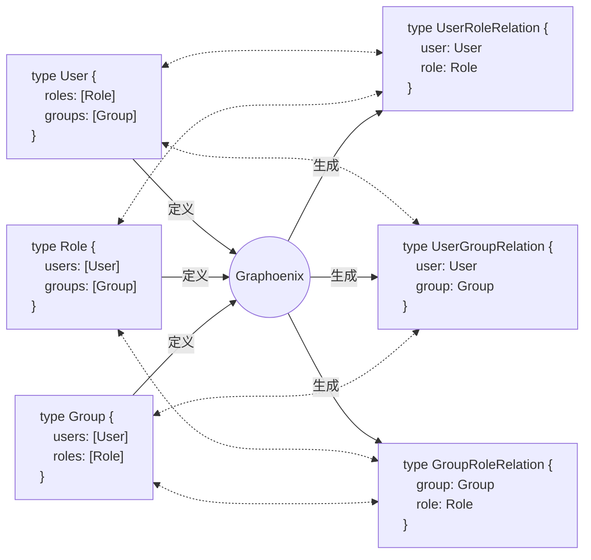
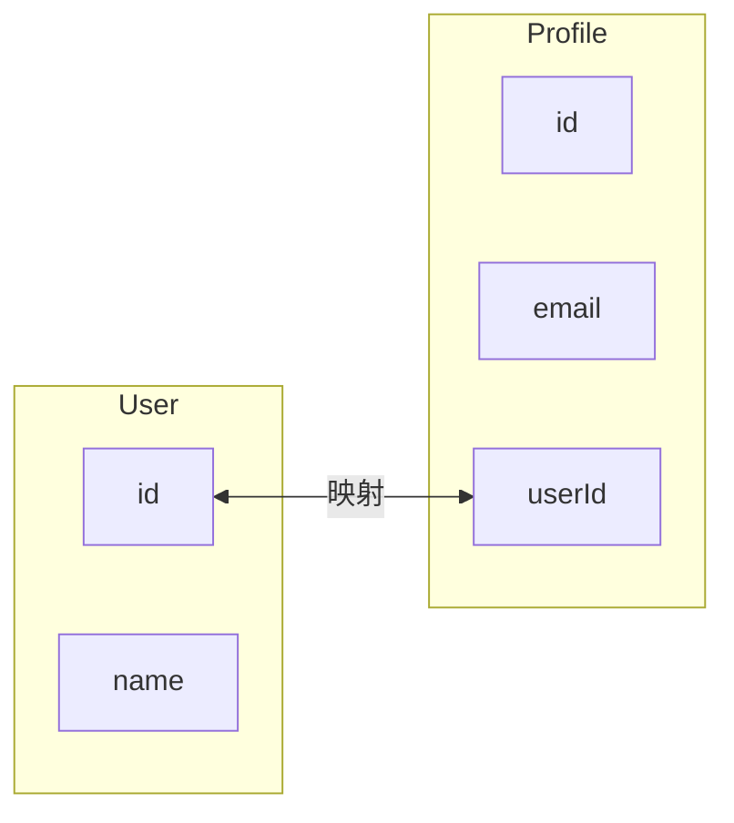
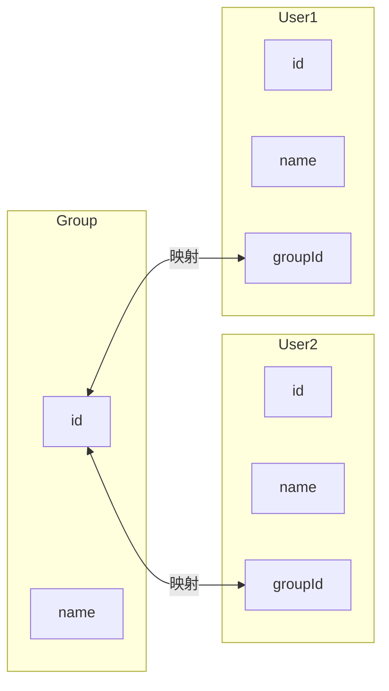
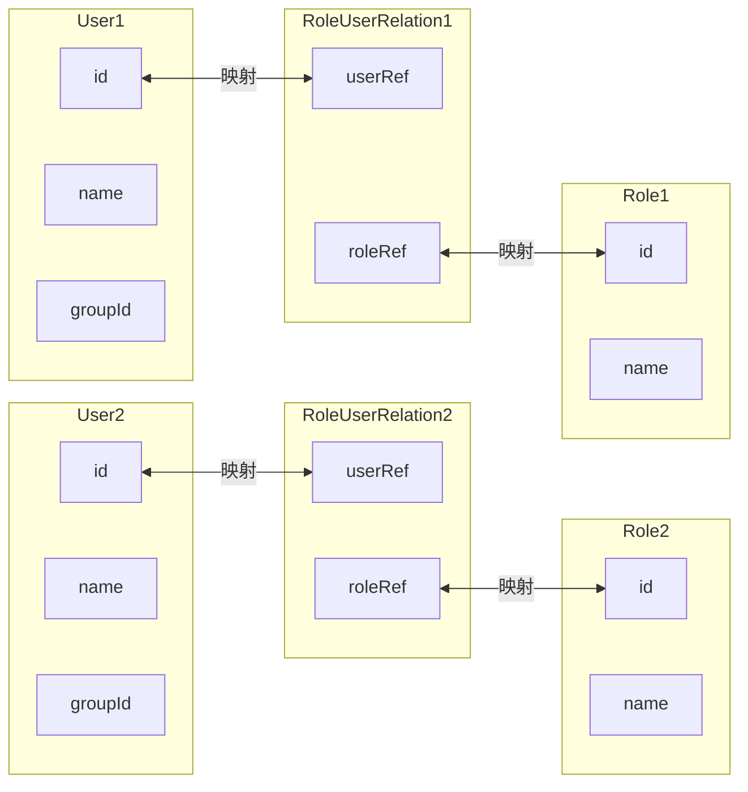
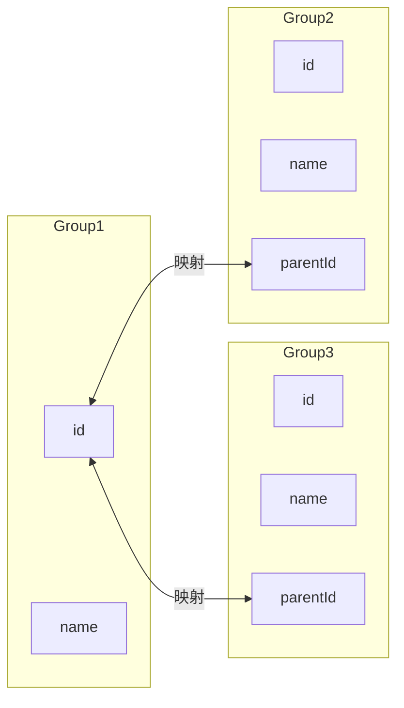

# 关系

在建模中，关系映射 (Relationship Mapping) 是指在数据库设计和对象关系映射 (ORM) 中定义实体之间关系的过程. 关系映射帮助我们理解和管理数据实体之间的关联. 主要有以下几种关系：

1. **一对一关系 (One-to-One Relationship)** :
    - 在这种关系中, 一个实体实例仅与另一个实体实例相关联. 例如, 一个人对应一个护照. 实现方式通常是在其中一个实体的表中包含另一个实体的主键作为外键
    - 在数据库中, 可以通过在一个表中添加唯一外键来实现

2. **一对多关系 (One-to-Many Relationship)** :
    - 这是最常见的关系类型, 其中一个实体实例可以关联多个另一个实体实例. 例如, 一个客户可以有多个订单. 实现方式是在 “多” 一方的表中添加 “单” 一方的主键作为外键
    - 在数据库中, 可以通过在 “多” 一方的表中添加外键来实现

3. **多对多关系 (Many-to-Many Relationship)** :
    - 在这种关系中, 多个实体实例可以与多个另一个实体实例相关联. 例如, 一个学生可以选修多门课程, 一门课程也可以有多个学生选修. 实现方式是使用一个中间表 (也叫关联表或交叉表) 来存储两个实体的主键
    - 在数据库中, 可以通过创建一个中间表来包含两个实体的主键来实现

4. **自引用关系 (Self-Referencing Relationship)** :
    - 这是指一个实体与它自己有关系. 例如, 一个员工可以有一个经理, 这个经理也是员工. 实现方式是在同一个表中使用外键指向自身的主键
    - 在数据库中, 可以通过在表中添加一个外键列来引用同一个表的主键来实现

## 关系构建

Graphoenix 根据 GraphQL 类型定义自动分析对象之间的关系映射, 默认为所有对象关系创建多对多关系(Many-to-Many)



## 关系映射指令

Graphoenix 提供 [`@map`](#map) 和 [`@fetch`](#fetch) 两个指令定义关系映射

### @map

在数据库层进行映射, 使用关系型数据库 JOIN 语句组合关联对象

| 属性   | 类型          | 说明     | 备注                                                                       |
| ------ | ------------- | -------- | -------------------------------------------------------------------------- |
| from   | String!       | 源字段   | 通过与目标字段(to)构建对象关系映射                                         |
| to     | String        | 目标字段 | 通过与源字段(from)构建对象关系映射                                         |
| with   | [With](#with) | 关系对象 | 多对多关系映射的关系对象                                                   |
| anchor | Boolean       | 锚点     | 锚点表示源字段储存目标字段的返回值, 通常情况下目标字段为ID类型时默认为锚点 |

### @fetch

在应用层进行映射, 在应用层对关联对象进行组合, 适用于分布式场景和不支持关系映射的非关系型数据库

| 属性     | 类型                                   | 说明     | 备注                                                                       |
| -------- | -------------------------------------- | -------- | -------------------------------------------------------------------------- |
| from     | String!                                | 源字段   | 通过与目标字段(to)构建对象关系映射                                         |
| to       | String                                 | 目标字段 | 通过与源字段(from)构建对象关系映射                                         |
| with     | [With](#with)                          | 关系对象 | 多对多关系映射的关系对象                                                   |
| anchor   | Boolean                                | 锚点     | 锚点表示源字段储存目标字段的返回值, 通常情况下目标字段为ID类型时默认为锚点 |
| protocol | [Protocol](/docs/guide/types#protocol) | 通讯类型 | 分布式场景下的通讯协议, 默认无需设置                                       |

### With

| 属性 | 类型   | 说明             | 备注                                 |
| ---- | ------ | ---------------- | ------------------------------------ |
| type | String | 关系对象名       | 多对多关系映射的关系对象名称         |
| from | String | 源对象映射字段   | 通过与源对象(from)的原字段进行关联   |
| to   | String | 目标对象映射字段 | 通过与目标对象的目标字段(to)进行关联 |

## 自定义关系映射

在某些场景下, Graphoenix 默认的关系构建并不能满足实际需求, 需要自定义关系映射:

### 一对一关系 (One-to-One)

```graphql
"用户"
type User {
    "ID"
    id: ID
    "姓名"
    name: String!
    "资料"
    profile: Profile @map(from: "id", to: "profileId")
}

"组"
type Profile {
    "ID"
    id: ID
    "名称"
    email: String!
    "用户"
    user: User @map(from: "userId", to: "id")
}
```



### 一对多关系 (One-to-Many)
```graphql
"用户"
type User {
    "ID"
    id: ID
    "姓名"
    name: String!
    "组"
    group: Group @map(from: "groupId", to: "id")
}

"组"
type Group {
    "ID"
    id: ID
    "名称"
    name: String!
    "用户"
    users: [User] @map(from: "id", to: "groupId")
}
```



### 多对多关系 (Many-to-Many)
```graphql
"用户"
type User {
    "ID"
    id: ID
    "姓名"
    name: String!
    "角色"
    roles: [Role] @map(from: "id", with: {type: "RoleUserRelation", to: "roleRef", from: "userRef"}, to: "id")
}

"角色"
type Role {
    "ID"
    id: ID
    "名称"
    name: String!
    "用户"
    users: [User] @map(from: "id", with: {type: "RoleUserRelation", to: "userRef", from: "roleRef"}, to: "id")
}
```



### 自引用关系 (Self-Referencing)
```graphql
"组"
type Group {
    "ID"
    id: ID
    "名称"
    name: String!
    "上级"
    parent: Group @map(from: "parentId", to: "id", anchor: true)
    "下级"
    subGroups: [Group] @map(from: "id", to: "parentId")
}
```

