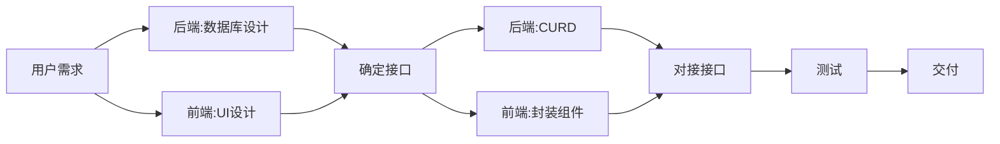
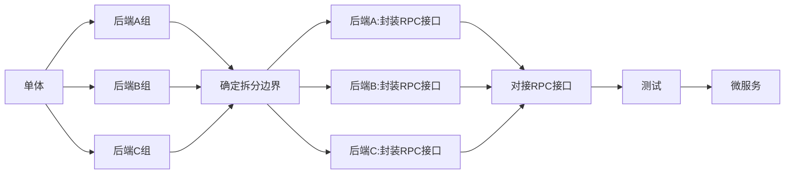
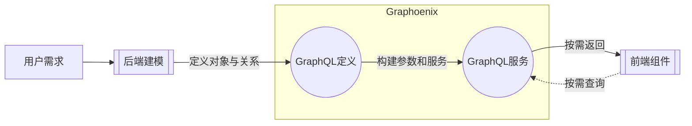
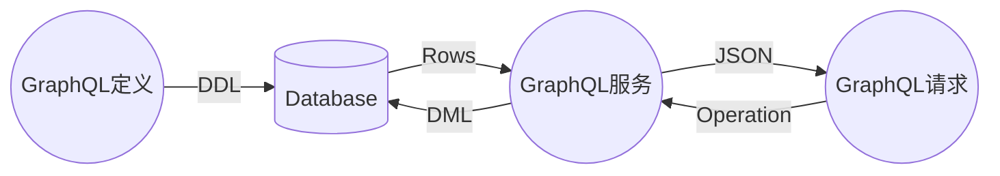
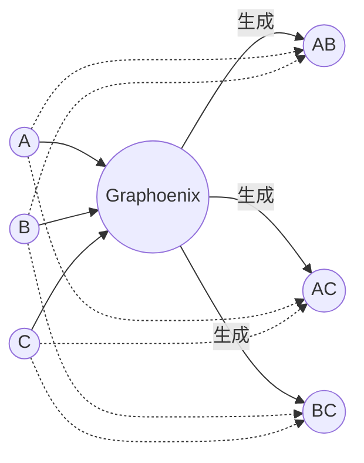
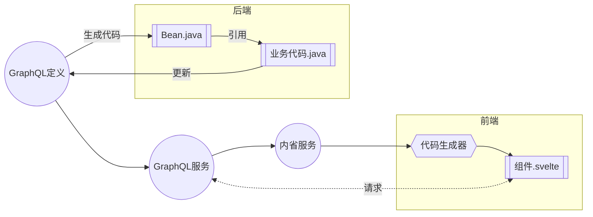
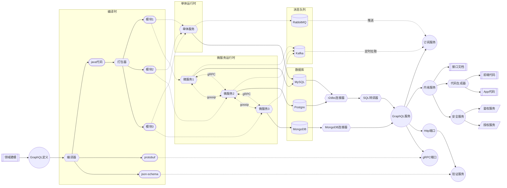

# 简介

**Graphoenix**是基于[GraphQL](https://graphql.org/)和[Reactor](https://projectreactor.io/)的 Java 全栈开发平台.

## 起源

简单回顾一下我们的开发过程, 过多的时间被浪费在了无意义的重复与拉扯之中

用一张图来简述项目的初期阶段

1. 用户需求永远是变量, 需求的变化会引起连锁反应, 最终导致前端和后端在"改 UI"与"改接口"之间反复拉扯
2. 后端的 CURD 是高度重复化的, 使用 Mybaits 非常考验开发人员的 SQL 水平, 业务逻辑过多的隐藏在 SQL 中使得可维护性下降, 也无法利用 IDE 和编译器的检测能力, 即便使用代码生成器或是 Mybatis Plus 等工具依然要在对象关系映射上投入大量精力, 且数据库难以迁移
3. 使用 JPA 为代表的 ORM 技术需要对框架本身有充分的了解, 使用不当极易发生性能问题和缓存问题, 由于 Java 代码的表达能力有限, 复杂的统计依然需要 SQL 补充, 但 JPA 的 SQL 支持不尽人意
4. 对于前端而言, 后端的对于接口的理解经常南辕北辙, 使用 Mock data 封装的组件和状态在接口对接后并不符合预期
5. 后端接口可能难以一次性返回组件所需要的所有数据, 且返回的数据结构不能直接使用, 这时就会产生大量的冗余请求和大量的数据封装
6. 大量组件的逻辑是高度重复的, 产生了大量的套娃组件, 使得前端大部分时间沦为 UI 和接口的代码焊接工

随着项目的进展, 代码量已经增长到难以维护, 单一的服务逐渐不能继续满足日益增长的用户访问, 这个时候服务需要按照业务进行拆分

1. 理清复杂的对象关系图是困难的, 对象之间的映射关系更是难以剥离, 它们可能隐藏在代码中也可能隐藏在 SQL 中, 未知的风险隐藏在系统的各个角落
2. 接口的变动可能会波及上下游各个服务, 对开发人员的协调难度远远大于对代码的修改
3. 拆分过程往往不可逆, 拆分后的代码在新项目复用时难度极大, 需要大量的基础设施构建
4. 微服务需要大量的运维投入, 部署和运维的复杂度呈几何式增长

## 新选择

Graphoenix 皆在在项目的各个阶段和各个环节提供规范化, 插件化, 可伸缩的解决方案, 充分利用 GraphQL 协议, 打造透明高效的开发流程, 释放 x10 倍的开发效率

### 按需所取

我们发现, 前端和后端把大量的时间浪费在了接口的定义和对接, 前端总是希望得到开箱即用的数据, 而后端则希望模式化的返回数据, Graphonix充分利用GraphQL协议的特性充当中间人, 自动适配数据库, 构建参数和实例化服务, 实时响应前端请求

### SQL引擎

对于CURD, Graphoenix实现了对于SQL的转译引擎, 根据GraphQL请求动态转译为SQL, 通过响应式的r2dbc连接与数据库交互, 轻量透明高性能

### 关系构建

得益于GraphQL对于图关系的描述能力, Graphoenix可以自动构建和托管对象关系

### 代码生成

1. 对于后端, 插件可以根据GraphQL定义生成Java Bean, 支持编程方式补充和拓展系统服务
2. 对于前端, 代码生成器对每个对象生成通用的Table, Form, Select等UI组件, 自动对接后端接口

_灵感来自[Hasura GraphQL Engine](https://hasura.io/)_
