# 简介

**Graphoenix** 是基于 [GraphQL](https://graphql.org/) 和 [Reactor](https://projectreactor.io/) 的 Java 全栈开发平台

## 什么是 Graphoenix?

Graphoenix 是对 GraphQL 协议的实现, 也是对 GraphQL 协议的拓展和增强, 皆在项目的各个阶段和各个环节提供规范化, 插件化, 可伸缩的架构方案, 充分利用 GraphQL 协议, 打造透明高效的开发流程, 释放 x10 倍的开发效率

### _[什么是 GraphQL?](https://graphql.org/)_

GraphQL 既是一种用于 API 的查询语言也是一个满足你数据查询的运行时. GraphQL 对你的 API 中的数据提供了一套易于理解的完整描述, 使得客户端能够准确地获得它需要的数据，而且没有任何冗余, 也让 API 更容易地随着时间推移而演进, 还能用于构建强大的开发者工具

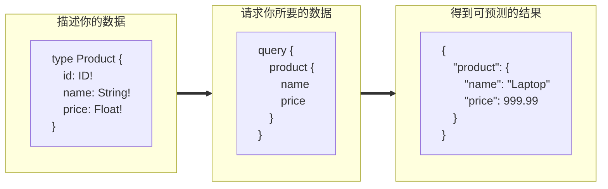

### 按需所取

前端总是希望得到开箱即用的数据, 而后端则希望模式化的返回数据. Graphonix 充分利用 GraphQL 协议的特性充当对接人, 按照后端的业务建模构建 GraphQL 服务, 实时响应前端的定制化请求, 同时内置可视化的开发工具 [GraphiQL](https://github.com/graphql/graphiql)

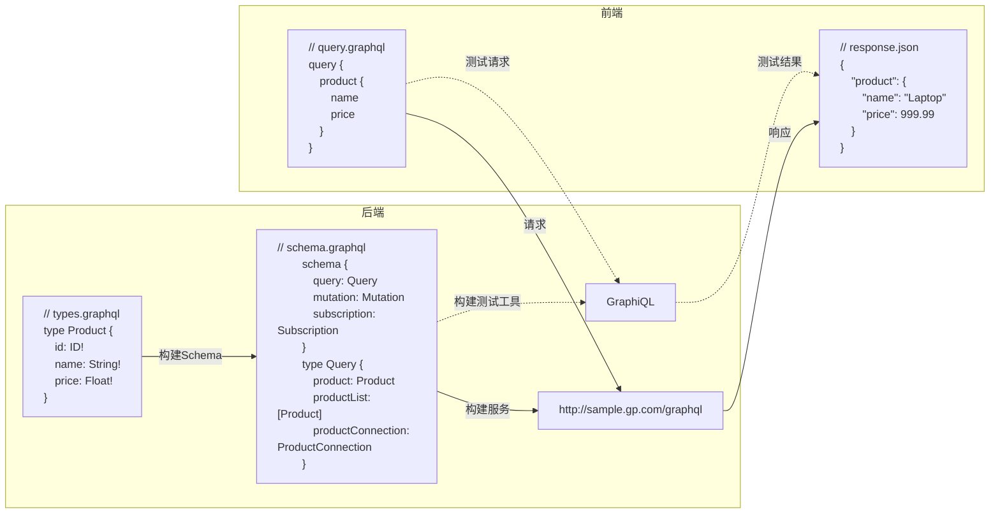

### SQL 转译

SQL 已经成为了业务层和持久化层交互的事实标准, 使用 JDBC 或 MyBatis 非常考验开发人员的 SQL 水平, 业务逻辑过多的隐藏在 SQL 中使得可维护性下降, 也无法利用 IDE 和编译器的检测能力. Graphoenix 实现了对于 SQL 的实时转译引擎, 根据 GraphQL 请求动态转译为 SQL, 通过响应式的 [R2DBC](https://r2dbc.io/) 与数据库连接, 轻量透明高性能, 无需开发者编写 SQL

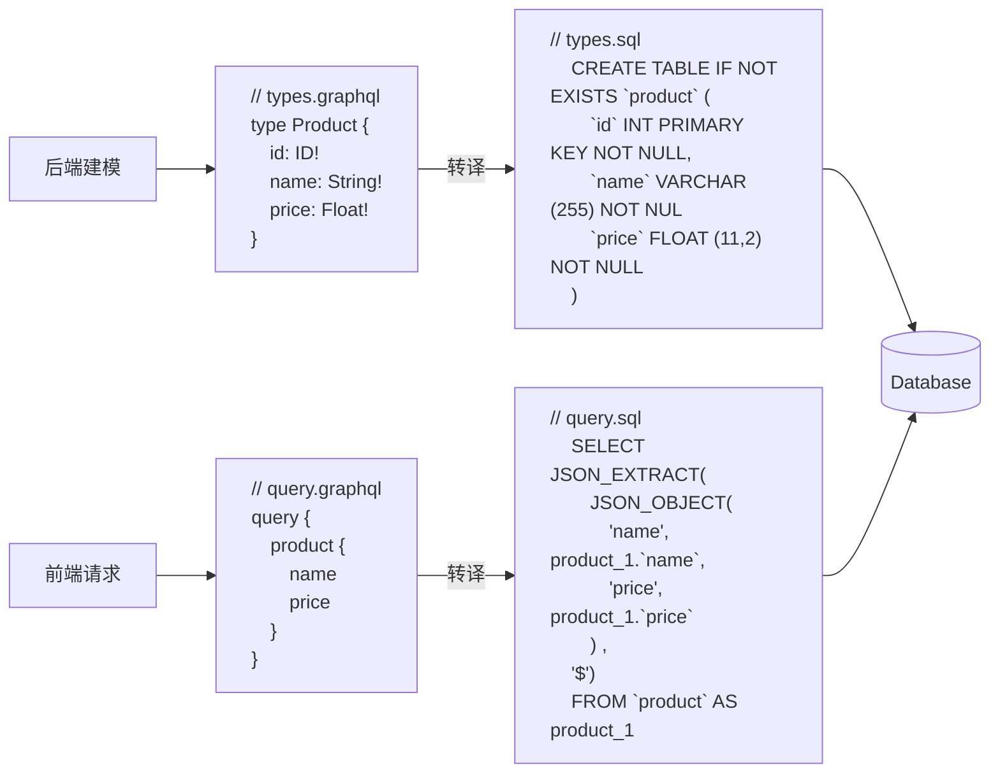

### 接口和参数构建

GraphQL 协议本身只定义类型和类型之间的关系, Graphoenix 在 GraphQL 类型定义的基础上自动构建查询, 变更和订阅接口, 同时构建好全部所需的参数

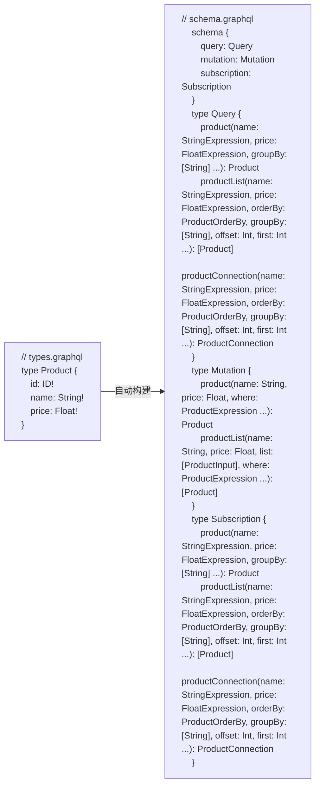

### 关系构建

以 Mybatis Plus 和 MyBatis Generator 为代表的增强工具封装了基础的 CURD, 但系统构建依然要在关系映射上生产大量的 JOIN 或关系封装, 大量隐藏在 SQL 和代码中的对象关系又会进一步导致服务拆分变得困难. 得益于 GraphQL 对于图关系的描述能力, Graphoenix 自动构建和托管对象关系, 完全把关系逻辑从业务代码中剥离

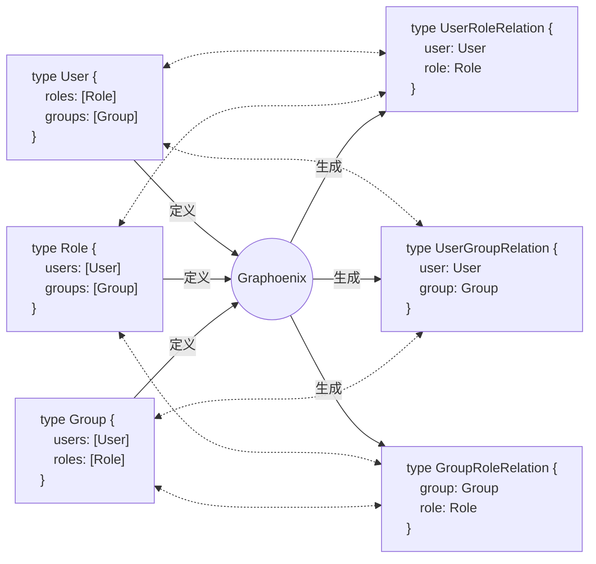

### 代码生成

1. 对于后端, Graphoenix 插件根据 GraphQL 定义生成 Java Entities, 支持以编程方式拓展系统服务
2. 对于前端, Graphoenix 代码生成器对每个定义的类型生成通用的 \<Table /\>, \<Form /\>, \<Select /\> 等 UI 组件

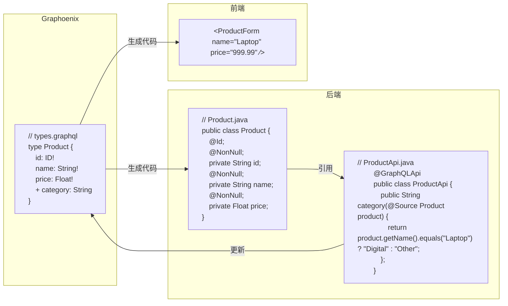

### 持久化接口

以 JPA 为代表的 ORM 技术需要对框架本身有充分的了解, 使用不当极易发生性能问题和缓存问题. Graphoenix 在编译阶段通过 Annotation processing 技术实现类似 JPA 的持久化接口, 编译器会根据不同的数据库和平台构建相对应的实现.

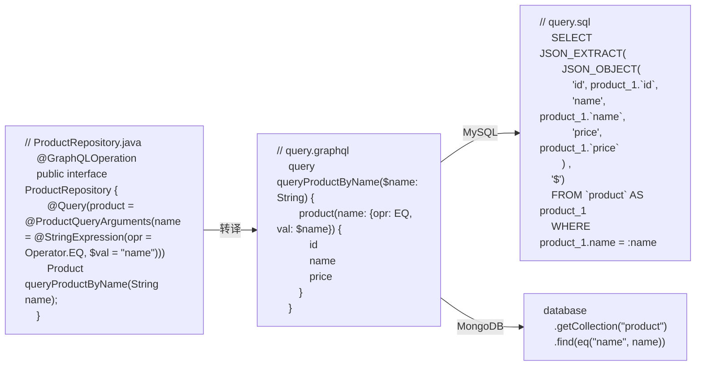

### 统一校验

相同的校验逻辑需要在前后端重复两次, 效率低下且极易产生差异. Graphoenix 编译器根据类型定义, 自动生成 [JSON Schema](https://json-schema.org/), 前后端统一校验

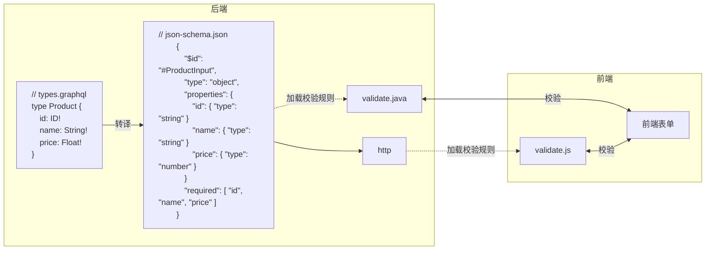

### 模块化

Graphoenix 在 GraphQL 协议的基础上引入模块化概念, 最大限度复用业务模型, 像乐高积木一样构建产品

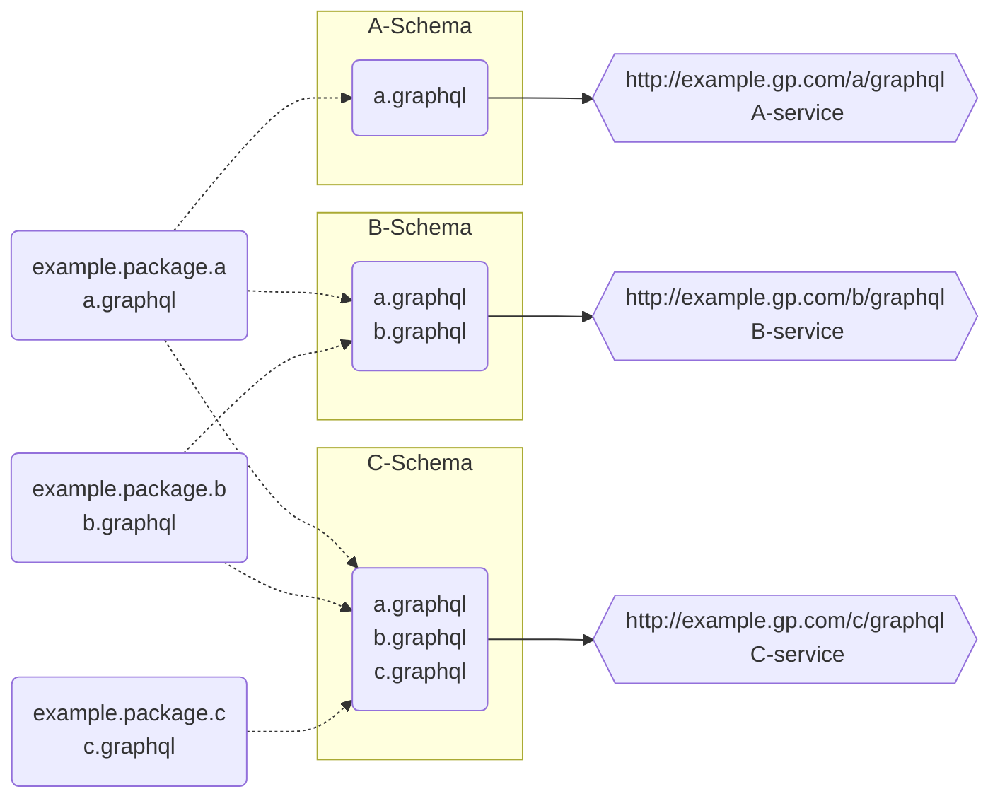

### 可伸缩架构

Graphoenix 架构可在项目的不同阶段按实际需求随意伸缩, 随着项目的扩张拆分为微服务, 也可随着项目的收缩合并为单体

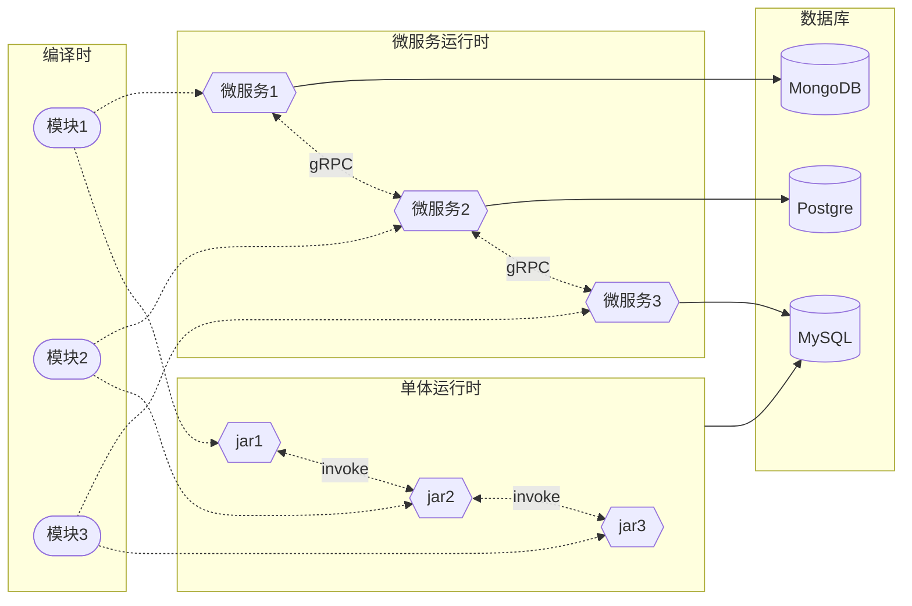

### 自适应事务

Graphoenix 根据单体和分布式架构自动组织事务, 动态规划本地事务和事务补偿

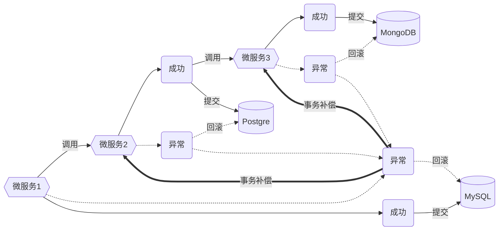

### 去中心

Graphoenix 基于[Gossip 协议](https://icyfenix.cn/distribution/consensus/gossip.html)实现服务发现, 无中心节点, 避免单点故障, 注册负载和熔断等机制以 Sidecar 模式提供服务, 无需复杂的微服务基础设施

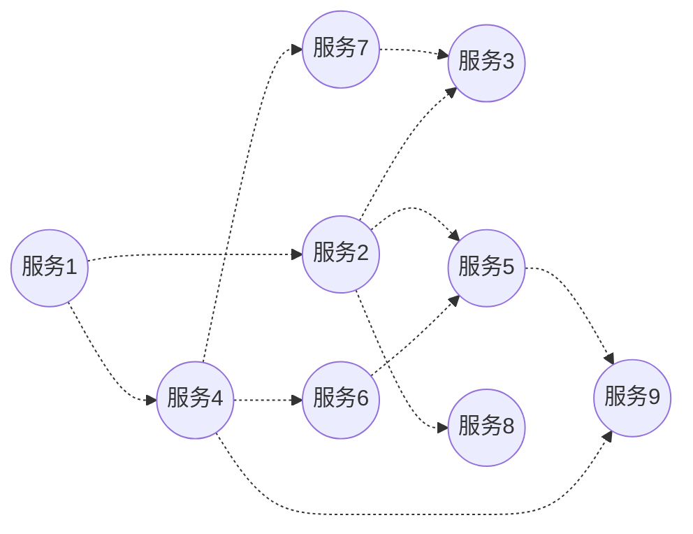

### 订阅

Graphoenix 提供开箱即用, 端到端的订阅服务, 后台实时高效的侦测数据变动, 通过消息队列推送到后端, 通过 SSE 推送到前端, 对数据敏感型场景提供全面支持

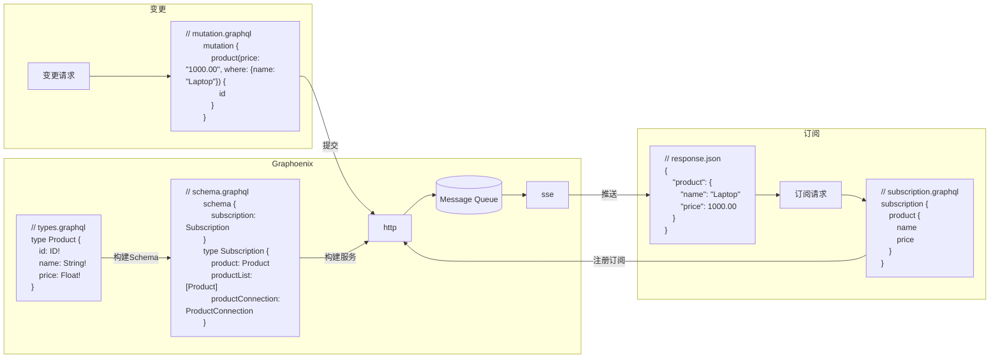

### gRPC

对于跨系统或跨语言远程调用的场景, Graphoenix 编译器根据类型定义, 自动生成 [protobuf](https://protobuf.dev/) , 提供开箱即用 [gRPC](https://grpc.io/) 服务

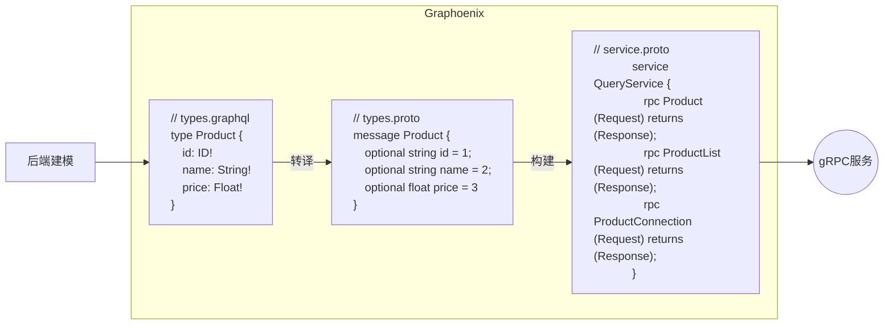

---

## 为什么是 Graphoenix?

### 对比[Apollo GraphQL](https://www.apollographql.com/)

Apollo GraphQL 是 GraphQL 生态最为强大的实现, 包含了 Server, Client, Federation 三部分

Apollo Server 更像是基于 JS 的数据路由器和聚合器, 通过实现 resolver 来实现 GraphQL 数据获取, 但数据库持久层需要开发者自己实现

Apollo Federation 与 Graphoenix Modules 都是对微服务的支持, 但 Apollo Federation 更像是一个中心节点的超级路由器, 而 Graphoenix Modules 是去中心化的集群

### 对比[Relay](https://relay.dev/)

Relay 是 Facebook 官方出品的针对 React 框架的 GraphQL 客户端, 他更符合 React 的设计哲学, 可以充分利用 GraphQL 的特性来封装 React 组件

Graphoenix 基于代码生成器直接生成 UI 组件, 为每个类型生成 \<Table /\>, \<Form /\>, \<Select /\> 等组件, 开箱即用, 组件基于 [Svelte](https://svelte.dev/) 构建, 后续会增加 Vue, React 等版本

### 对比[GraphQL Java](https://www.graphql-java.com/)和[Spring for GraphQL](https://docs.spring.io/spring-graphql/reference/index.html)

GraphQL Java 是 GraphQL 在 Java 平台的官方实现, Spring for GraphQL 是基于 GraphQL Java 的二次封装, 两者分别基于 DataFetcher 和 Controller 获取数据, 最后聚合成 GraphQL 服务. 但与 Apollo GraphQL 一样, 框架本身只做数据路由和聚合, 对于参数的构建和持久层的定义依然需要开发者自己承担

Graphoenix 同样是 Java 平台的 GraphQL 实现, 比起 GraphQL Java 不仅提供数据路由功能, 也实现了对于底层数据库持久层的封装, 并且自动构建筛选, 聚合, 排序和分页等参数, 开箱即用

### 对比[Hasura GraphQL Engine](https://hasura.io/)

GraphQL Engine 是 Hasura 对于 GraphQL 的实现, 使用 Haskell 开发, 提供了从接口到数据库的全栈封装. Graphoenix 最初的灵感就来自于 GraphQL Engine, 只需定义类型便可得到开箱即用的 GraphQL 接口, 无需额外的编程工作, 也无需关心底层的数据库. GraphQL Engine 对于开发者来说是极佳 GraphQL 体验. 但它也存在着一些问题, 比如 GraphQL Engine 更像是一个无代码平台, 他对于编程扩展的能力非常有限, 它本身又是基于 Haskell 构建, 导致二次开发及其困难. GraphQL Engine 是 Hasura 的产品, 依赖于 Hasura 平台, 有一定的平台绑定风险

基于上述的问题, Graphoenix 皆在实现一个拓展能力更强, 能够融入 Java 生态的 GraphQL Engine, 给开发者和使用者提供最佳的体验
