# 简介

**Graphoenix**是基于[GraphQL](https://graphql.org/)和[Reactor](https://projectreactor.io/)的 Java 全栈开发平台

## 起源

简单回顾一下我们的开发历程, 过多的时间被浪费在了无意义的重复与拉扯之中

项目的初期阶段

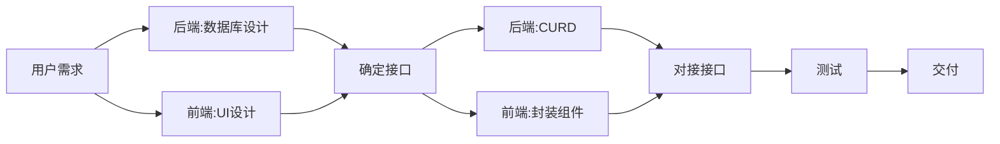

1. 用户需求永远是变量, 需求的变化会引起连锁反应, 最终导致前端和后端在"改 UI"与"改接口"之间反复拉扯
2. 后端的 CURD 是高度重复化的, 使用 Mybaits 非常考验开发人员的 SQL 水平, 业务逻辑过多的隐藏在 SQL 中使得可维护性下降, 也无法利用 IDE 和编译器的检测能力, 即便使用代码生成器或是 Mybatis Plus 等工具依然要在对象关系映射上投入大量精力, 且数据库难以迁移
3. 使用 JPA 为代表的 ORM 技术需要对框架本身有充分的了解, 使用不当极易发生性能问题和缓存问题, 由于 Java 代码的表达能力有限, 复杂的统计依然需要 SQL 补充, 但 JPA 的 SQL 支持不尽人意
4. 对于前端而言, 后端的对于接口的理解经常南辕北辙, 使用 Mock data 封装的组件和状态在接口对接后并不符合预期
5. 后端接口可能难以一次性返回组件所需要的所有数据, 且返回的数据结构不能直接使用, 这时就会产生大量的冗余请求和大量的二次数据封装
6. 大量组件的逻辑是高度重复的, 产生了大量的套娃组件, 使得前端大部分时间沦为 UI 和接口的代码焊接工

---

随着项目的进展, 代码量已经增长到难以维护, 单一的服务逐渐不能继续满足日益增长的用户访问, 服务按照业务拆分

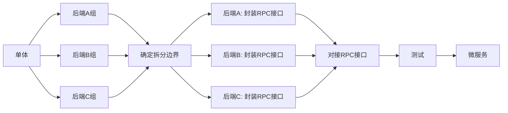

1. 理清复杂的对象关系图是困难的, 对象之间的映射关系更是难以剥离, 它们可能隐藏在代码中也可能隐藏在 SQL 中, 未知的风险隐藏在系统的各个角落
2. 接口的变动可能会波及上下游各个服务, 对开发人员的协调难度远远大于对代码的修改
3. 拆分过程往往不可逆, 拆分后的代码在新项目复用时难度极大, 需要大量的基础设施构建
4. 微服务需要大量的基础建设和运维投入, 项目复杂度呈几何式增长

## 新选择

Graphoenix 皆在项目的各个阶段和各个环节提供规范化, 插件化, 可伸缩的解决方案, 充分利用 GraphQL 协议, 打造透明高效的开发流程, 释放 x10 倍的开发效率

### 按需所取

前端和后端把大量的时间浪费在了接口的定义和对接, 前端总是希望得到开箱即用的数据, 而后端则希望模式化的返回数据, Graphonix充分利用GraphQL协议的特性充当中间人, 自动适配数据库, 构建参数和实例化服务, 实时响应前端请求

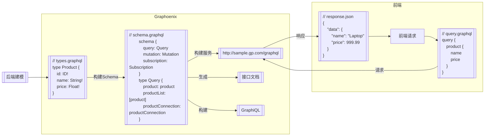

### SQL转译

对于CURD, Graphoenix实现了对于SQL的转译引擎, 根据GraphQL请求动态转译为SQL, 通过响应式的r2dbc连接与数据库交互, 轻量透明高性能

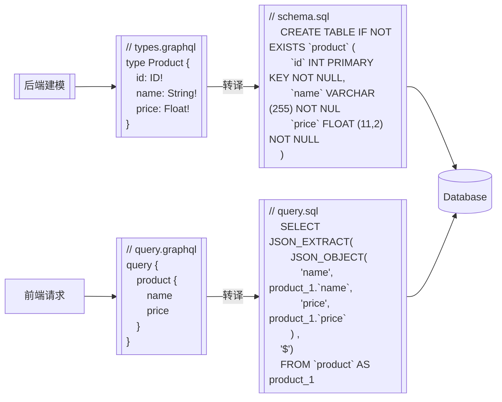

### 关系构建

得益于GraphQL对于图关系的描述能力, Graphoenix可以自动构建和托管对象关系

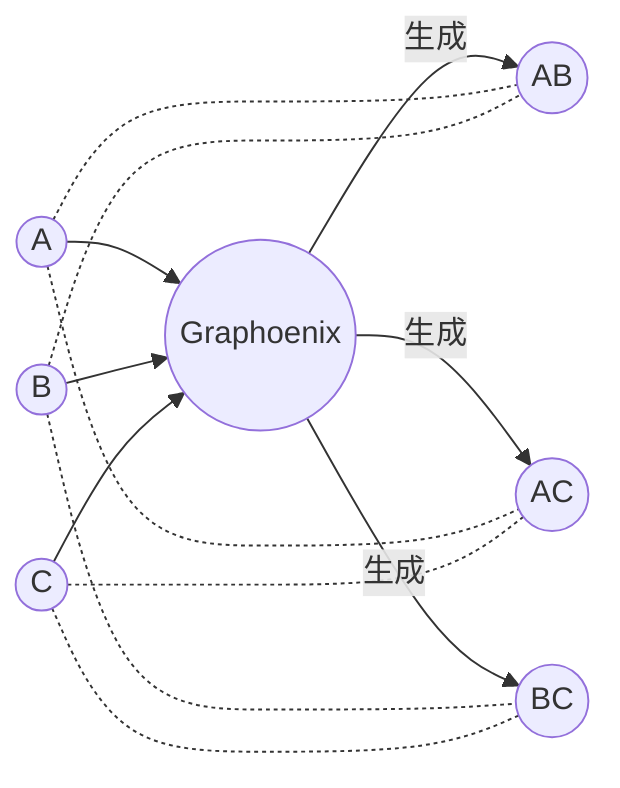

### 代码生成

1. 对于后端, Graphoenix插件根据GraphQL定义生成Java Bean, 支持编程方式拓展系统服务
2. 对于前端, Graphoenix代码生成器对每个定义的类型生成通用的Table, Form, Select等UI组件, 自动对接后端接口

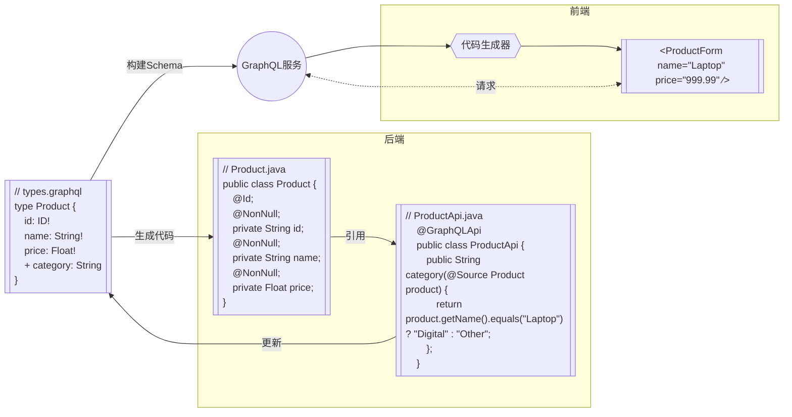

### 统一校验

相同的校验逻辑需要在前后端重复两次, 效率低下且极易产生差异, Graphoenix编译器根据类型定义, 自动生成[JSON Schema](https://json-schema.org/), 前后端统一校验

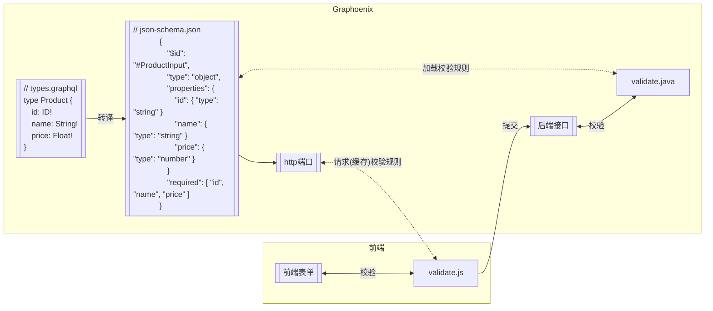

### 模块化

Graphoenix在GraphQL协议的基础上引入模块化概念, 最大限度复用业务模型, 系统选择合适的模块引用, 像乐高积木一样快速构建产品

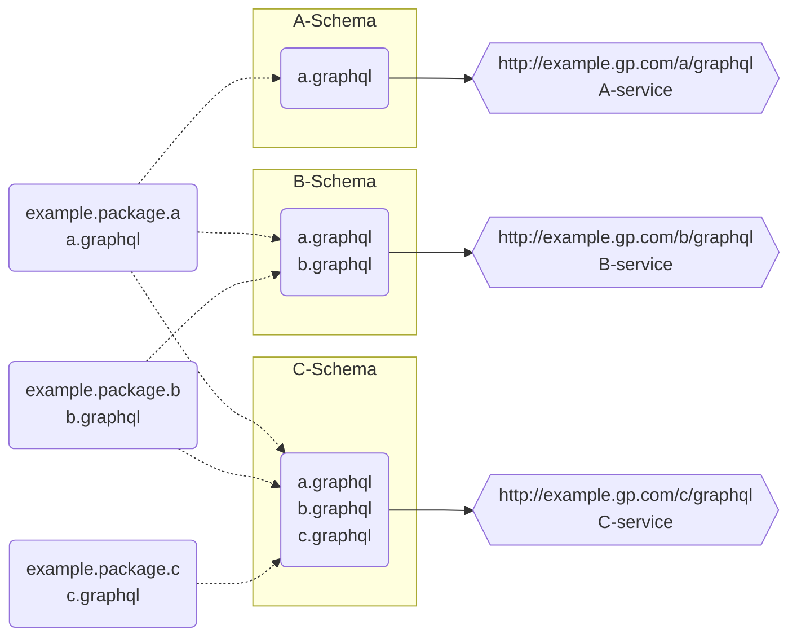

### 可伸缩

Graphoenix架构可在项目的不同阶段随意伸缩, 随着项目扩展拆分为微服务, 也可随着项目收缩合并为单体, Graphoenix根据不同架构自动调整底层技术

### 去中心

Graphoenix基于[Gossip 协议](https://icyfenix.cn/distribution/consensus/gossip.html)实现服务发现, 无中心节点, 避免单点故障, 无需复杂的微服务基础设施

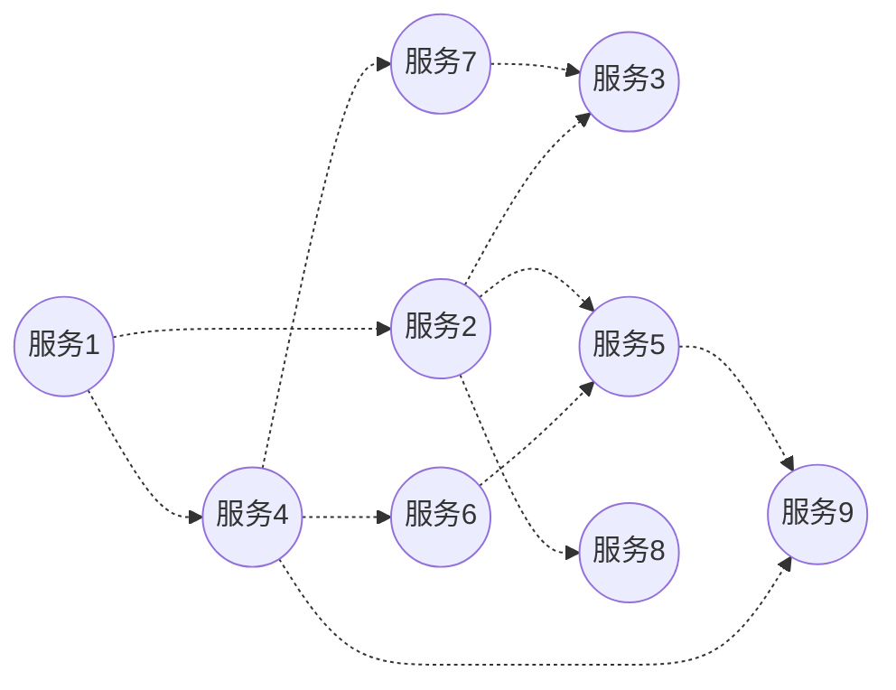

### 订阅

Graphoenix提供开箱即用, 端到端的订阅服务, 自动侦测数据变动, 通过消息队列推送到后端, 通过SSE推送到前端, 实时掌握数据流动, 对数据敏感型场景提供全面支持

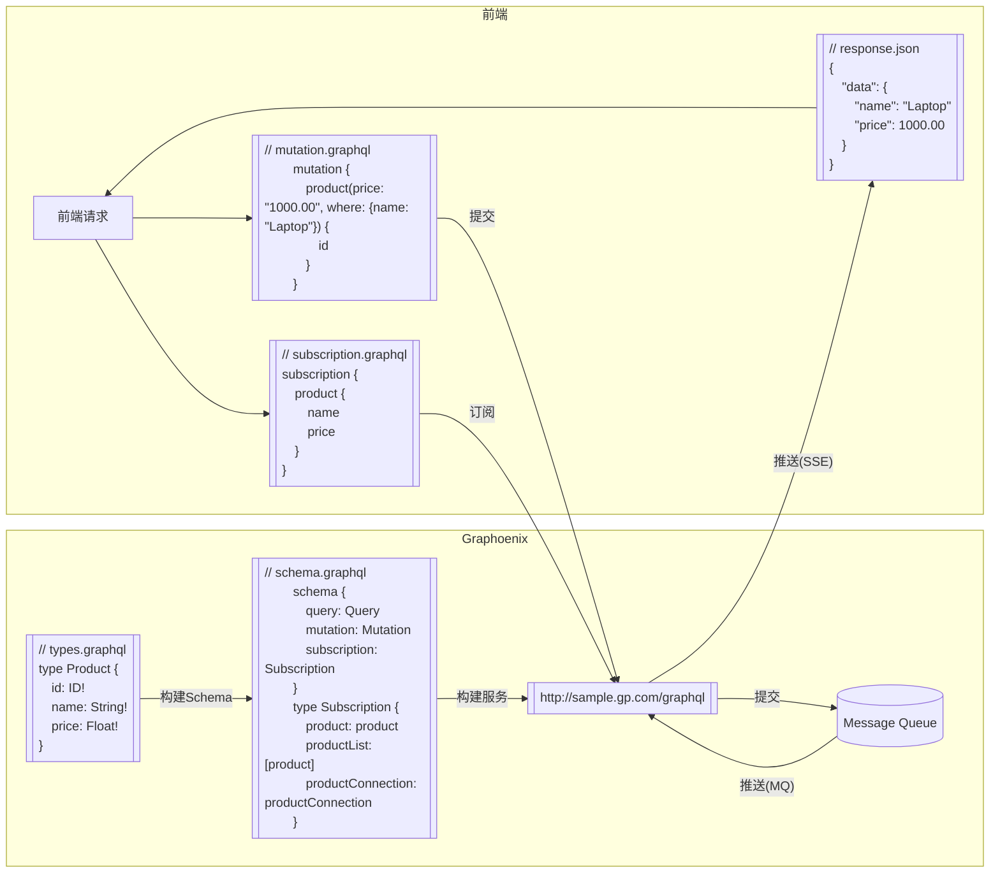

### gRPC

对于跨系统或跨语言远程调用的场景, Graphoenix编译器根据类型定义, 自动生成[protobuf](https://protobuf.dev/), 提供开箱即用gRPC接口

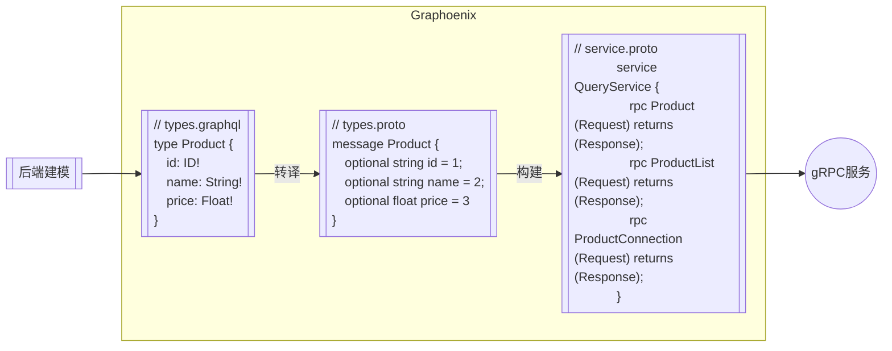

_灵感来自[Hasura GraphQL Engine](https://hasura.io/)_
