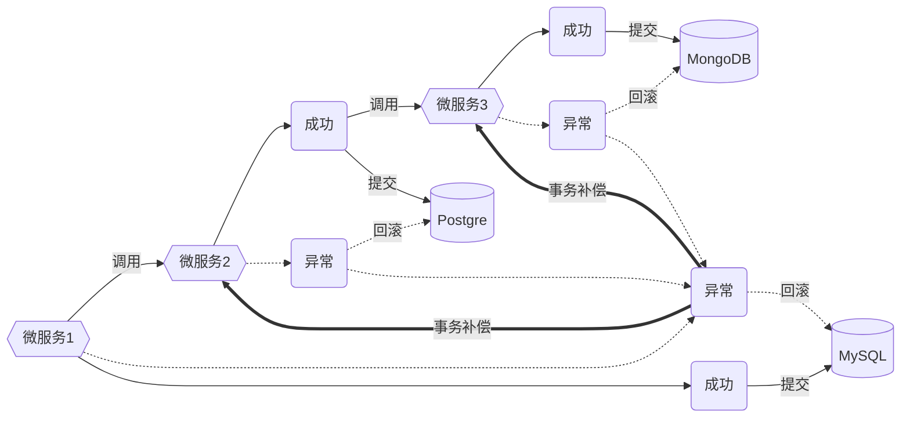

# 事务(transaction)

事务是一组操作的集合, 这些操作作为一个单元执行, 确保数据的一致性和完整性. Graphoenix 根据 [Jakarta Transactions](https://jakarta.ee/specifications/transactions/2.0/jakarta-transactions-spec-2.0) 协议对事务进行管理, 在单体架构下执行本地事务(ACID), 在微服务架构下对跨服务的调用执行事务补偿(TCC)

