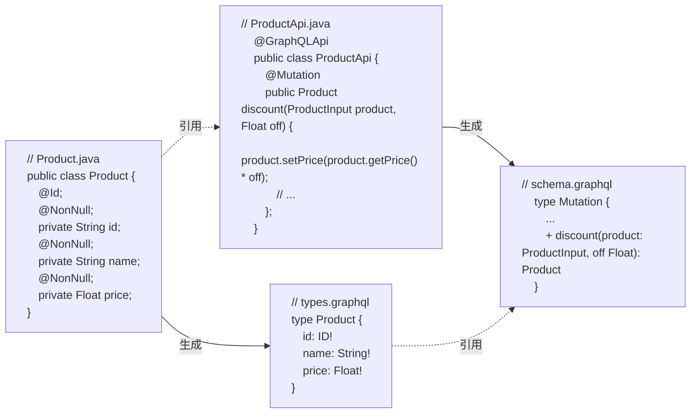
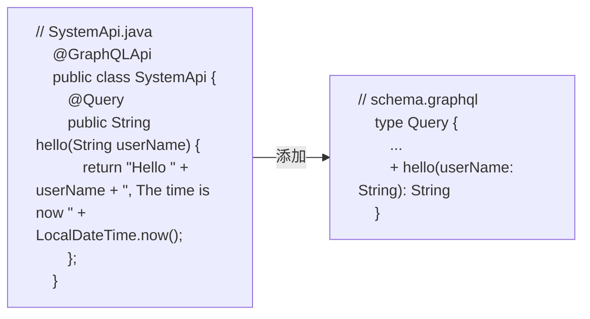
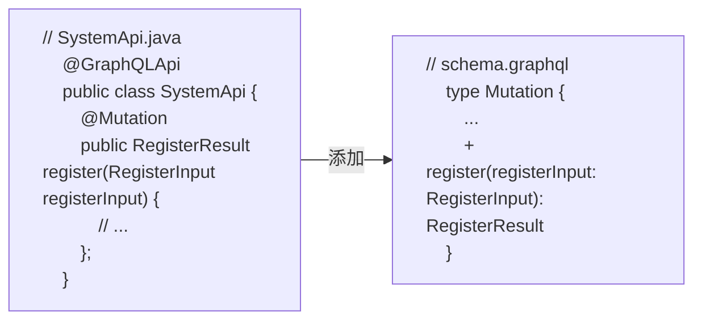
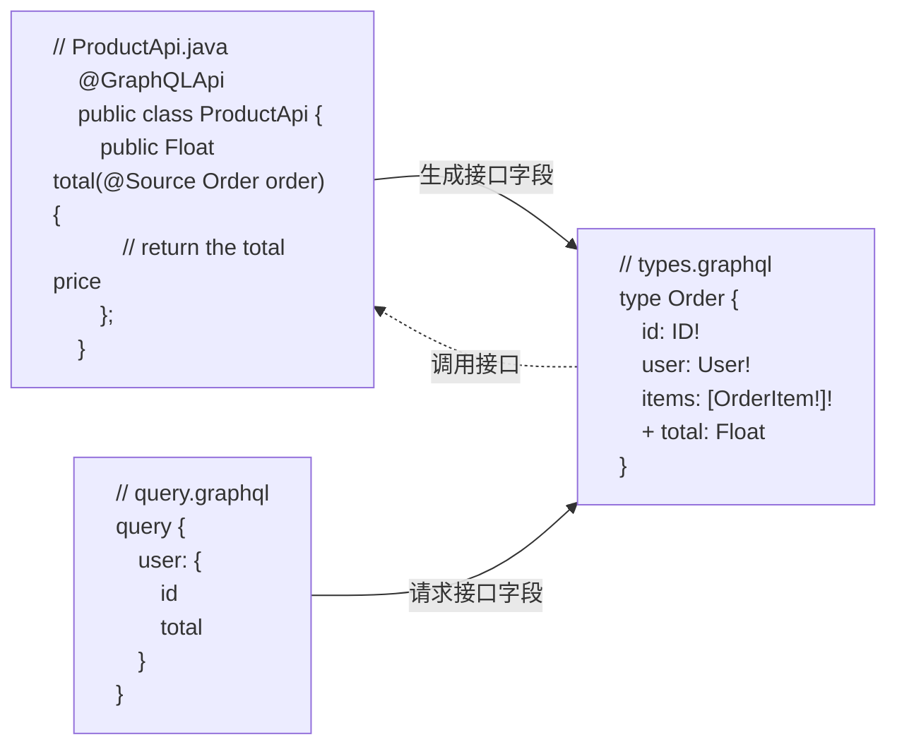
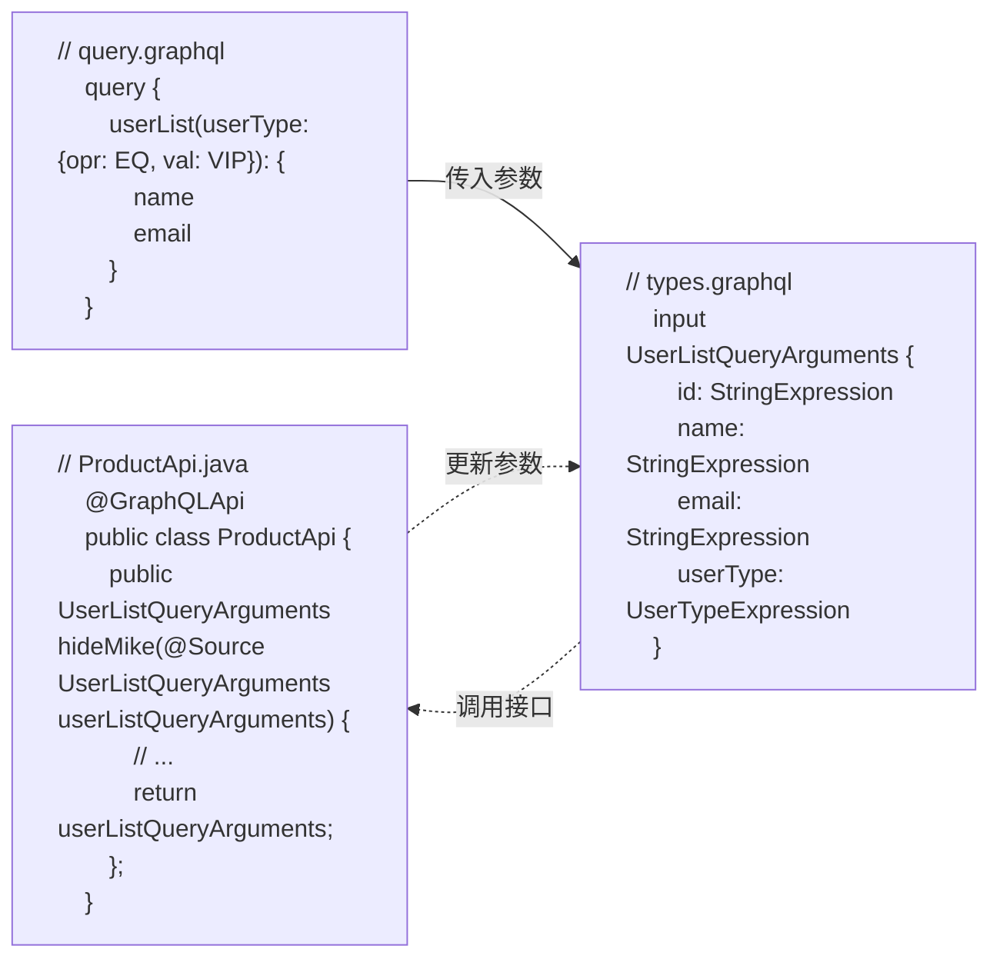

# GPI(GraphQL API)

定义 GraphQL 编程接口

GraphQL API 基于[Microprofile GraphQL 协议](https://github.com/eclipse/microprofile-graphql)实现, 接口使用注解和 GraphQL Entities 进行定义, 如果你使用过 Spring MVC 或是 Spring Boot, GPI 与 Controller 有一定的相似性. GPI 接口以编程的方式拓展 GraphQL

## 生成 GraphQL Entities

使用 Grphoenix 的 Gradle 插件可以根据 GraphQL 类型定义逐一生成对应的 Java Entities, API 接口可以使用生成的 Entities 定义接口方法的参数和返回值

### 引入 Gradle 插件

```gradle title="order-package/build.gradle"
buildscript {
    repositories {
        gradlePluginPortal()
        // highlight-start
        jcenter()
        // highlight-end
    }
    dependencies {
        // highlight-start
        classpath 'io.graphoenix:graphoenix-gradle-plugin:0.0.1-SNAPSHOT'
        // highlight-end
    }
}

// highlight-start
apply plugin: 'io.graphoenix'
// highlight-end
```

### 使用 Gradle 插件生成 Java Entities

```bash
./gradlew :order-package:generateGraphQLSource
```

插件会在对应目录生成枚举, 输入类型和对象类型

```txt
|-- order-package                             订单包
    |-- build.gradle
    |-- src
        |-- main
            |-- java
                |-- demo.gp.order
                    // highlight-start
                    |-- dto
                        |-- enumType          枚举类型
                        |-- inputObjectType   Input类型
                        |-- interfaceType     接口类型
                        |-- objectType        Object类型
                    // highlight-end
```

### 定义 GraphQL Entities

有时候 API 接口可能需要自定义的 Java Entities 作为方法的参数或返回值, 这些类型可能并没有定义在 GrpahQL 类型定义中, 此时可以使用 [`@Type`](#类注解) [`@Input`](#类注解) [`@Interface`](#类注解) [`@Enum`](#类注解) 类型注解分别来定义类型, 输入类型, 接口和枚举, 定义好的 Entities 会自动编译并添加到 GrahpQL 类型中作为补充



## GraphQL 接口类

使用 [`@GraphQLApi`](#类注解) 注解来定义接口类

1. 新建接口类

```txt
|-- order-package                             订单包
    |-- build.gradle
    |-- src
        |-- main
            |-- java
                |-- demo.gp.order
                    // highlight-start
                    |-- api
                        |-- SystemApi.java    系统API
                    // highlight-end
                    |-- dto
                        |-- annotation        GPA注解
                        |-- directive         指令注解
                        |-- enumType          枚举类型
                        |-- inputObjectType   Input类型
                        |-- interfaceType     接口类型
                        |-- objectType        Object类型
```

2. 定义接口类

```java
package demo.gp.order.api;

import jakarta.enterprise.context.ApplicationScoped;
import org.eclipse.microprofile.graphql.GraphQLApi;

// highlight-start
@GraphQLApi // 使用@GraphQLApi 注解标记接口所在 CDI Bean
// highlight-end
@ApplicationScoped
public class SystemApi {
  // 定义接口...
}
```

## 查询接口

使用 [`@Query`](#接口注解) 注解来定义查询接口, 接口会添加到查询类型中



### 普通查询接口

定义一个简单接口, 传入 userName, 返回欢迎和系统时间, 使用 [`@Query`](#接口注解) 注解标记接口方法

```java
package demo.gp.order.api;

import jakarta.enterprise.context.ApplicationScoped;
import org.eclipse.microprofile.graphql.GraphQLApi;
import org.eclipse.microprofile.graphql.Query;

import java.time.LocalDateTime;

@GraphQLApi
@ApplicationScoped
public class SystemApi {

// highlight-start
    @Query
    public String hello(String userName) {
        return "Hello " + userName + ", The time is now " + LocalDateTime.now();
    }
// highlight-end
}
```

查询 hello 接口

```graphql
{
  hello(userName: "Gosling")
}
```

```json
{
  "data": {
    "hello": "Hello Gosling, The time is now 2024-05-30T11:51:41.164692"
  }
}
```

### 异步查询接口

**接口支持[响应式](https://projectreactor.io/)类型的[返回值](#返回值说明) Mono 和 Flux**

例: 定义一个异步接口, 传入 userName, 异步返回欢迎和系统时间

```java
@GraphQLApi
@ApplicationScoped
public class SystemApi {

    // ...省略其他接口

// highlight-start
    @Query
    public Mono<String> helloAsync(String userName) {
        return Mono.just(LocalDateTime.now())
                .map(now -> "Hello " + userName + ", The time is now " + now);
    }
// highlight-end
}
```

查询 helloAsync 接口

```graphql
{
  helloAsync(userName: "Gosling")
}
```

```json
{
  "data": {
    "helloAsync": "Hello Gosling, The time is now 2024-05-31T16:18:39.851451"
  }
}
```

## 变更接口

使用 [`@Mutation`](#接口注解) 注解来定义变更接口, 接口会添加到变更类型中



### 普通变更接口

例: 定义一个用户注册 register 接口, 使用 [`@Mutation`](#接口注解) 注解标记接口方法

```java
@GraphQLApi
@ApplicationScoped
public class SystemApi {

    // ...省略其他方法

    // highlight-start
    @Mutation
    public RegisterResult register(RegisterInput registerInput) {
        String account = registerInput.getEmail().substring(0, registerInput.getEmail().indexOf("@"));
        Integer age = Period.between(registerInput.getBirthday(), LocalDate.now()).getYears();

        RegisterResult registerResult = new RegisterResult();
        registerResult.setAccount(account);
        registerResult.setPassword(UUID.randomUUID().toString());
        registerResult.setAge(age);

        return registerResult;
    }
    // highlight-end
}
```

调用 register 接口

```graphql
mutation {
  register(
    registerInput: {
      name: "Gosling"
      email: "gosling@java.com"
      birthday: "1955-05-19"
    }
  ) {
    account
    password
    age
  }
}
```

```json
{
  "data": {
    "register": {
      "account": "gosling",
      "password": "vuvvtrachs",
      "age": 69
    }
  }
}
```

### 异步变更接口

和查询一样, 变更接口同样支持[异步返回值](#返回值说明)

定义一个异步变更接口, 返回 Flux

```java
@GraphQLApi
@ApplicationScoped
public class SystemApi {

    // ...省略其他接口

// highlight-start
    @Mutation
    public Flux<String> countingSheep(int count) {
        return Flux.range(0, count)
                .map(index -> index + 1 + " sheep");
    }
// highlight-end
}
```

查询 countingSheep 接口

```graphql
mutation {
  countingSheep(count: 3)
}
```

Flux 的元素会聚合成数组后返回

```json
{
  "data": {
    "countingSheep": ["1 sheep", "2 sheep", "3 sheep"]
  }
}
```

## 字段接口

在有些场景下, 需要在数据库返回后对结果进行加工, 并产生新的字段, 如数学计算和调用规则引擎等

使用 [`@Source`](#接口注解) 注解在方法参数中标记带有 [`@Type`](#类注解) 注解的 Entity, 每一次对接口字段的请求都会调用对应的方法来获取返回值



例: 计算每一个订单的价格合计

```java
@GraphQLApi
@ApplicationScoped
public class SystemApi {

    // ...省略其他接口

// highlight-start
    public Float total(@Source Order order) {
        if (order.getItems() != null) {
            return order.getItems().stream()
                    .filter(orderItem -> orderItem.getProduct() != null && orderItem.getProduct().getPrice() != null)
                    .map(orderItem -> orderItem.getProduct().getPrice() * orderItem.getQuantity())
                    .reduce(Float::sum)
                    .orElse(null);
        }
        return null;
    }
// highlight-end
}
```

此时 Order 对象会生成一个新的名为 total 的字段

```graphql
type Order implements Meta {
  "订单ID"
  id: ID!
  "购买用户"
  user: User!
  "产品列表"
  items: [OrderItem!]!
  // highlight-start
  total: Float
  // highlight-end
}
```

查询用户 Diana 的订单

```graphql
{
  user(name: {opr: EQ, val: "Diana"}) {
    name
    orders {
      items {
        product {
          name
          price
        }
        quantity
      }
      // highlight-start
      total
      // highlight-end
    }
  }
}
```

订单会在 api 接口中计算后返回结果

```json
{
  "data": {
    "user": {
      "name": "Diana",
      "orders": [
        {
          "items": [
            {
              "product": {
                "name": "Laptop",
                "price": 999.99
              },
              "quantity": 1
            },
            {
              "product": {
                "name": "Phone",
                "price": 499.99
              },
              "quantity": 1
            },
            {
              "product": {
                "name": "Tablet",
                "price": 299.99
              },
              "quantity": 1
            }
          ],
          // highlight-start
          "total": 1799.97
          // highlight-end
        }
      ]
    }
  }
}
```

## 参数接口

在有些场景下, 需要在数据库查询和变更前对查询条件或提交内容进行加工, 如校验, 鉴权或修改等

使用 [`@Source`](#接口注解) 注解在接口参数中标记带有 [`@Input`](#类注解) 注解的 Bean, 接口的返回值将会覆盖原始参数



例: 在后台增加条件, 隐藏用户 Mike

```java
@GraphQLApi
@ApplicationScoped
public class SystemApi {

    // ...省略其他接口

// highlight-start
    public UserListQueryArguments hideMike(@Source UserListQueryArguments userListQueryArguments) {
        if (userListQueryArguments == null) {
            userListQueryArguments = new UserListQueryArguments();
        }
        StringExpression stringExpression = new StringExpression();
        stringExpression.setOpr(Operator.NEQ);
        stringExpression.setVal("Mike");
        userListQueryArguments.setName(stringExpression);
        return userListQueryArguments;
    }
// highlight-end
}
```

查询用户列表

```graphql
{
  userList {
    name
  }
}
```

用户列表中没有 Mike

```json
{
  "data": {
    "userList": [
      {
        "name": "Alice"
      },
      {
        "name": "Bob"
      },
      {
        "name": "Charlie"
      },
      {
        "name": "Diana"
      },
      {
        "name": "Edward"
      },
      {
        "name": "Fiona"
      },
      {
        "name": "George"
      },
      {
        "name": "Hannah"
      },
      {
        "name": "Ian"
      },
      {
        "name": "Jane"
      },
      {
        "name": "Kyle"
      },
      {
        "name": "Laura"
      },
      {
        "name": "Nina"
      },
      {
        "name": "Oliver"
      },
      {
        "name": "Paula"
      },
      {
        "name": "Quentin"
      },
      {
        "name": "Rachel"
      },
      {
        "name": "Steve"
      },
      {
        "name": "Tina"
      }
    ]
  }
}
```

---

## **注解说明**

### 类注解

| 注解        | 说明                                                                              | 示例                                                                                                                                                                                    | GraphQL 类型                                                                                      |
| ----------- | --------------------------------------------------------------------------------- | --------------------------------------------------------------------------------------------------------------------------------------------------------------------------------------- | ------------------------------------------------------------------------------------------------- |
| @GraphQLApi | 定义 GraphQL 接口类, 接口类中可以定义<br />查询接口, 变更接口, 字段接口和参数接口 |                                                                                                                                                                                         |                                                                                                   |
| @Input      | 定义 GraphQL 输入类型                                                             | @Input("StarshipInput")<br/>public class Starship \{<br/>&emsp;private String id;<br/>&emsp;private String name;<br/>&emsp;private float length;<br/>&emsp;// getters/setters...<br/>\} | input StarshipInput \{<br/>&emsp;id: String<br/>&emsp;name: String<br/>&emsp;length: Float<br/>\} |
| @Type       | 定义 GraphQL 类型                                                                 | @Type("Starship")<br/>public class Starship \{<br/>&emsp;private String id;<br/>&emsp;private String name;<br/>&emsp;private float length;<br/>&emsp;// getters/setters...<br/>\}       | type Starship \{<br/>&emsp;id: String<br/>&emsp;name: String<br/>&emsp;length: Float<br/>\}       |
| @Input      | 定义 GraphQL 输入类型                                                             | @Input("StarshipInput")<br/>public class Starship \{<br/>&emsp;private String id;<br/>&emsp;private String name;<br/>&emsp;private float length;<br/>&emsp;// getters/setters...<br/>\} | input StarshipInput \{<br/>&emsp;id: String<br/>&emsp;name: String<br/>&emsp;length: Float<br/>\} |
| @Interface  | 定义 GraphQL 接口类型                                                             | @Interface("Aircraft")<br/>public interface IAircraft \{<br/>&emsp;private String getName();<br/>\}                                                                                     | interface Aircraft \{<br/>&emsp;name: String<br/>\}                                               |
| @Enum       | 定义 GraphQL 枚举类型                                                             | @Enum("ClothingSize")<br/>public enum ShirtSize \{<br/>&emsp;S,<br/>&emsp;M,<br/>&emsp;L,<br/>&emsp;XL,<br/>&emsp;XXL<br/>\}                                                            | enum ClothingSize \{<br/>&emsp;S<br/>&emsp;M<br/>&emsp;L<br/>&emsp;XL<br/>&emsp;XXL<br/>\}        |

### 字段注解

| 注解     | 说明         | 示例                                                                                                                                                              | GraphQL 类型                                                                  |
| -------- | ------------ | ----------------------------------------------------------------------------------------------------------------------------------------------------------------- | ----------------------------------------------------------------------------- |
| @Id      | 定义 ID 类型 | @Type<br/>public class Person \{<br/>&emsp;@Id<br/>&emsp;private String id;<br/>&emsp;private String name;<br/>&emsp;// getters/setters...<br/>\}                 | type Person \{<br/>&emsp;id: ID<br/>&emsp;name: String<br/>\}                 |
| @NonNull | 定义非空类型 | @Input<br/>public class StarshipInput \{<br/>&emsp;@NonNull<br/>&emsp;private String name;<br/>&emsp;private Float length;<br/>&emsp;// getters/setters...<br/>\} | input StarshipInput \{<br/>&emsp;name: String!<br/>&emsp;length: Float<br/>\} |

### 接口注解

| 注解      | 说明                   | 示例                                                                                                                 | GraphQL 接口                                                                                    |
| --------- | ---------------------- | -------------------------------------------------------------------------------------------------------------------- | ----------------------------------------------------------------------------------------------- |
| @Query    | 定义查询接口           | @Query("friendsOf")<br/>public List\<Character\> getFriendsOf(Character character) \{<br/>&emsp;// return ...<br/>\} | type Query \{<br/>&emsp;friendsOf(character: CharacterInput): [Character]<br/>\}                |
| @Mutation | 定义变更接口           | @Mutation("addCharacter")<br/>public Character save(Character character) \{<br/>&emsp;// return ...<br/>\}           | type Mutation \{<br/>&emsp;addCharacter(character: CharacterInput): Character<br/>\}            |
| @Source   | 定义字段接口或参数接口 | public List \<Tweet\> tweets(@Source("tweetsForMe") Character character) \{<br/>&emsp;// return ...<br/>\}           | type Character \{<br/>&emsp;# Other fields ...<br/>&emsp;tweetsForMe(last: Int): [Tweet]<br/>\} |

### 其他注解

| 注解          | 说明       | 示例                                                                                                                                                                                                                                               | GraphQL 接口                                                                                                                                                                           |
| ------------- | ---------- | -------------------------------------------------------------------------------------------------------------------------------------------------------------------------------------------------------------------------------------------------- | -------------------------------------------------------------------------------------------------------------------------------------------------------------------------------------- |
| @DefaultValue | 定义默认值 | public List \<Character\> getByName(@DefaultValue("Han Solo") String name) \{<br/>&emsp;// ...<br/>\}                                                                                                                                              | type Query \{<br/>&emsp;searchByName(name: String = "Han Solo"): [Character]<br/>\}                                                                                                    |
| @Description  | 定义注释   | @Description("Vehicle for traveling between star systems")<br/>public class Starship \{<br/>&emsp;private String id;<br/>&emsp;private float length;<br/>&emsp;@Description("Name of a particular starship")<br/>&emsp;private String name;<br/>\} | "Vehicle for traveling between star systems"<br/>type Starship \{<br/>&emsp;id: String<br/>&emsp;length: Float<br/>&emsp;"Name of a particular starship"<br/>&emsp;name: String<br/>\} |

## **返回值说明**

| 方法返回类型   | GraphQL 类型 | 说明                       | 示例 (Type=User)                                                        | GraphQL 接口                          |
| -------------- | ------------ | -------------------------- | ----------------------------------------------------------------------- | ------------------------------------- |
| (Type)         | (Type)       | 同步查询                   | User queryUser(String name) \{<br/>&emsp;return ... <br/>\}             | queryUser(name: String): User         |
| Mono\<(Type)\> | (Type)       | 异步查询                   | Mono\<User\> queryUser(String name) \{<br/>&emsp;return ... <br/>\}     | queryUser(name: String): User         |
| Flux\<(Type)\> | \[(Type)\]   | 异步查询, 聚合为数组后返回 | Flux\<User\> queryUserList(String name) \{<br/>&emsp;return ... <br/>\} | queryUserList(name: String): \[User\] |
