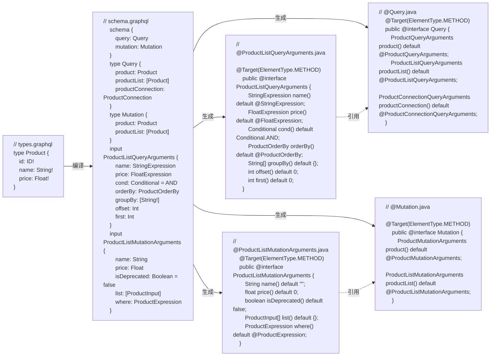

# GPA(GraphQL Persistence API)

定义 GraphQL 持久化接口

GraphQL Persistence API 基于 Java 接口和注解定义, 将接口方法映射为 GraphQL 查询或变更, 提供代码级的数据访问及操作能力, Graphoenix 编译器会针对不同数据库和存储方案提供不同的实现. 如果你使用过 JPA(Java Persistence API), GPA 与 Repository 有一定的相似性


## 生成 GPA 注解

[使用 Gradle 插件生成定义 GPA 接口需要的注解和 Java Entitis](/docs/tutorial/graphql-api#生成-graphql-entities), 插件会根据 GraphQL 定义生成 [`@Query`](#接口注解) 和 [`@Mutation`](#接口注解) 注解, 注解中包含所有 GraphQL 接口定义



**请注意此处的 [`@Query`](#接口注解) 和 [`@Mutation`](#接口注解) 注解并不是 `org.eclipse.microprofile.graphql` 包下的 `@Query` 和 `@Mutation`**

```txt
|-- order-package                             订单包
    |-- build.gradle
    |-- src
        |-- main
        |   |-- java
        |       |-- demo.gp.order
        |           |-- api
        |               |-- SystemApi.java    系统API
        |           |-- dto
        |           |-- repository
                    // highlight-start
        |           |   |-- annotation        GPA注解
                    // highlight-end
        |           |   |-- directive         指令注解
        |           |   |-- enumType          枚举类型
        |           |   |-- inputObjectType   Input类型
        |           |   |-- objectType        Object类型
```

## 定义 GPA 接口

使用 `@GraphQLOperation` 注解来定义 GPA 接口

1. 新建 GPA 接口

```txt
|-- order-package                             订单包
    |-- build.gradle
    |-- src
        |-- main
        |   |-- java
        |       |-- demo.gp.order
        |           |-- dto
        |           |   |-- annotation              GPA注解
        |           |   |-- directive               指令注解
        |           |   |-- enumType                枚举类型
        |           |   |-- inputObjectType         Input类型
        |           |   |-- objectType              Object类型
                    // highlight-start
        |           |-- repository
        |               |-- UserRepository.java     用户Repository
                    // highlight-end
```

2. 定义接口类

```java
package demo.gp.order.repository;

import io.graphoenix.spi.annotation.GraphQLOperation;

// highlight-start
@GraphQLOperation // 使用@GraphQLOperation 注解标记接口所在 CDI Bean
// highlight-end
public interface UserRepository {

    // 定义接口
}
```

## 查询接口

使用 [`@Query`](#接口注解) 注解来定义查询接口, 接口会添加到查询类型中

### 普通查询

例: 查询所有 VIP 用户

定义 queryVIPUserList 方法, 使用 [`@Query`](#接口注解) 注解标记接口方法, 请注意, 此处的 `@Query` 注解是在之前生成的的[GPA 注解](/docs/tutorial/graphql-api#生成-graphql-entities), **并非 org.eclipse.microprofile.graphql.Query**

```java
package demo.gp.order.repository;

// highlight-start
import demo.gp.order.dto.annotation.Query;
// highlight-end
import demo.gp.order.dto.annotation.UserListQueryArguments;
import demo.gp.order.dto.annotation.UserTypeExpression;
import demo.gp.order.dto.enumType.UserType;
import demo.gp.order.dto.objectType.User;
import io.graphoenix.core.dto.enumType.Operator;
import io.graphoenix.spi.annotation.GraphQLOperation;

import java.util.List;

// highlight-start
@GraphQLOperation // 使用@GraphQLOperation 注解标记接口所在 CDI Bean
// highlight-end
public interface UserRepository {

    // highlight-start
    // 查询所有用户类型=VIP的User
    @Query(userList = @UserListQueryArguments(userType = @UserTypeExpression(opr = Operator.EQ, val = UserType.VIP)))
    // highlight-end
    Mono<List<User>> queryVIPUserList();
}
```

接口等同于如下 GraphQL 查询

```graphql
query queryVIPUserList {
  userList(userType: { opr: EQ, val: VIP }) {
    id
    name
    email
    userType
    # ...
  }
}
```

测试每一个 User 的 userType

```java
package demo.gp.order.test;

import demo.gp.order.dto.enumType.UserType;
import demo.gp.order.dto.objectType.User;
import demo.gp.order.repository.UserRepository;
import io.nozdormu.spi.context.BeanContext;
import org.junit.jupiter.api.Test;

import java.util.List;

import static org.junit.jupiter.api.Assertions.*;

@ExtendWith(TestResultLoggerExtension.class)
public class UserRepositoryTest {

    private final UserRepository userRepository = BeanContext.get(UserRepository.class);

    @Test
    void queryVIPUserListTest() {
        List<User> userLit = userRepository.queryVIPUserList().block();
        assertAll(
                userLit.stream().map((item) -> () -> assertEquals(item.getUserType(), UserType.VIP))
        );
    }
}
```

### 查询变量

注解中以 **`$`** 开头的参数可以指定方法中的参数作为变量, 等同于 GraphQL 中的 [Variables](https://graphql.org/learn/queries/#variables)

例: 根据用户类型变量查询用户

```java
package demo.gp.order.repository;

// highlight-start
import demo.gp.order.dto.annotation.Query;
// highlight-end
import demo.gp.order.dto.annotation.UserListQueryArguments;
import demo.gp.order.dto.annotation.UserTypeExpression;
import demo.gp.order.dto.enumType.UserType;
import demo.gp.order.dto.objectType.User;
import io.graphoenix.core.dto.enumType.Operator;
import io.graphoenix.spi.annotation.GraphQLOperation;

import java.util.List;

@GraphQLOperation
public interface UserRepository {

    // highlight-start
    // 查询所有用户类型=userType参数的User
    @Query(userList = @UserListQueryArguments(userType = @UserTypeExpression(opr = Operator.EQ, $val = "userType")))
    // highlight-end
    Mono<List<User>> queryUserListByUserType(UserType userType);
}
```

接口等同于如下 GraphQL 查询

```graphql
query queryUserListByUserType($userType: UserType) {
  userList(userType: { opr: EQ, val: $userType }) {
    id
    name
    email
    userType
    # ...
  }
}
```

测试每一个 User 的 userType

```java
@ExtendWith(TestResultLoggerExtension.class)
public class UserRepositoryTest {

    private final UserRepository userRepository = BeanContext.get(UserRepository.class);

    @Test
    void queryUserListByUserTypeTest() {
        List<User> userLit = userRepository.queryUserListByUserType(UserType.REGULAR).block();
        assertAll(
                userLit.stream().map((item) -> () -> assertEquals(item.getUserType(), UserType.REGULAR))
        );
    }
}
```

### 查询字段

GPA 接口在默认情况下只会查询所有 Scalar 和 Enum 字段, 可以使用 `@SelectionSet` 注解自定义查询字段

1. 例: 定义用户查询, 只查询 name 字段

```java
@GraphQLOperation
public interface UserRepository {

    @Query(userList = @UserListQueryArguments(userType = @UserTypeExpression(opr = Operator.EQ, $val = "userType")))
    // highlight-start
    // 查询name字段
    @SelectionSet("{ name }")
    // highlight-end
    Mono<List<User>> queryUserNameListByUserType(UserType userType);
}
```

接口等同于如下 GraphQL 查询

```graphql
query queryUserNameListByUserType($userType: UserType) {
  userList(userType: { opr: EQ, val: $userType }) {
    name
  }
}
```

测试每一个 User 的 返回字段, 除 name 字段外全部为 null

```java
@ExtendWith(TestResultLoggerExtension.class)
public class UserRepositoryTest {

    private final UserRepository userRepository = BeanContext.get(UserRepository.class);

    @Test
    void queryUserNameListByUserTypeTest() {
        List<User> userLit = userRepository.queryUserNameListByUserType(UserType.REGULAR).block();
        assertAll(
                userLit.stream().map((item) ->
                        () -> assertAll(
                                () -> assertNotNull(item.getName()),
                                () -> assertNull(item.getId()),
                                () -> assertNull(item.getUserType()),
                                () -> assertNull(item.getEmail()),
                                () -> assertNull(item.getPhoneNumbers())
                        )
                )
        );
    }
}
```

2. 例: 查询 Alice 的订单

使用 name 参数作为用户名查询变量, 查询用户的订单信息

```java
@GraphQLOperation
public interface UserRepository {

    // highlight-start
    @Query(user = @UserQueryArguments(name = @StringExpression(opr = Operator.EQ, $val = "name")))
    @SelectionSet("{ name orders { items { product { name } quantity } } }")
    // highlight-end
    Mono<User> queryUserOrdersListByName(String name);
}
```

接口等同于如下 GraphQL 查询

```graphql
query queryUserOrdersListByName($name: String) {
  userList(userType: { opr: EQ, val: $name }) {
    name
    orders {
      items {
        product {
          name
        }
        quantity
      }
    }
  }
}
```

测试每一个 User 的 订单信息

```java
@ExtendWith(TestResultLoggerExtension.class)
public class UserRepositoryTest {

    private final UserRepository userRepository = BeanContext.get(UserRepository.class);

    @Test
    void queryUserOrdersListByNameTest() {
        User user = userRepository.queryUserOrdersListByName("Alice").block();
        assertAll(
                () -> assertEquals(user.getOrders().size(), 1),
                () -> assertEquals(new ArrayList<>(user.getOrders()).get(0).getItems().size(), 2),
                () -> assertEquals(new ArrayList<>(new ArrayList<>(user.getOrders()).get(0).getItems()).get(0).getProduct().getName(), "Laptop"),
                () -> assertEquals(new ArrayList<>(new ArrayList<>(user.getOrders()).get(0).getItems()).get(0).getQuantity(), 1),
                () -> assertEquals(new ArrayList<>(new ArrayList<>(user.getOrders()).get(0).getItems()).get(1).getProduct().getName(), "Tablet"),
                () -> assertEquals(new ArrayList<>(new ArrayList<>(user.getOrders()).get(0).getItems()).get(1).getQuantity(), 2)
        );
    }
}
```

### 统计查询

GPA 接口同样支持[统计查询](/docs/tutorial/query#统计)

1. 例: 分组查询普通用户和会员用户的数量

```java
@GraphQLOperation
public interface UserRepository {

    // highlight-start
    @Query(userList = @UserListQueryArguments(groupBy = {"userType"}))
    @SelectionSet("{ userType idCount }")
    // highlight-end
    Mono<List<User>> queryUserCountByUserType();
}
```

接口等同于如下 GraphQL 查询

```graphql
query queryUserCountByUserType {
  userList(groupBy: ["userType"]) {
    userType
    idCount
  }
}
```

```java
@ExtendWith(TestResultLoggerExtension.class)
public class UserRepositoryTest {

    private final UserRepository userRepository = BeanContext.get(UserRepository.class);

    @Test
    void queryUserCountByUserTypeTest() {
        List<User> userList = userRepository.queryUserCountByUserType().block();
        assertAll(
                () -> assertEquals(userList.size(), 2),
                () -> assertEquals(new ArrayList<>(userList).get(0).getUserType(), UserType.VIP),
                () -> assertEquals(new ArrayList<>(userList).get(0).getIdCount(), 12),
                () -> assertEquals(new ArrayList<>(userList).get(1).getUserType(), UserType.REGULAR),
                () -> assertEquals(new ArrayList<>(userList).get(1).getIdCount(), 12)
        );
    }
}
```

2. 例: 查询价格在 300 以内, 价格最高的产品

```java
@GraphQLOperation
public interface ProductRepository {

    // highlight-start
    @Query(product = @ProductQueryArguments(price = @FloatExpression(opr = Operator.LTE, $val = "price")))
    @SelectionSet("{ name priceMax }")
    // highlight-end
    Mono<Product> queryPriceMaxLessThan(Float price);
}
```

接口等同于如下 GraphQL 查询

```graphql
query queryPriceMaxLessThan($price: Float) {
  product(opr: LTE, val: $price) {
    name
    priceMax
  }
}
```

```java
@ExtendWith(TestResultLoggerExtension.class)
public class ProductRepositoryTest {

    private final ProductRepository productRepository = BeanContext.get(ProductRepository.class);

    @Test
    void queryPriceMaxLessThanTest() {
        Product product = productRepository.queryPriceMaxLessThan(300.00f).block();
        assertAll(
                () -> assertEquals(product.getName(), "Tablet"),
                () -> assertEquals(product.getPriceMax(), 299.99f)
        );
    }
}
```

## 变更接口

使用 [`@Mutation`](#接口注解) 注解标记接口方法, 请注意, 此处的 `@Mutation` 注解是在之前生成的的[GPA 注解](/docs/tutorial/graphql-api#生成-graphql-entities), **并非 org.eclipse.microprofile.graphql.Mutation**

### 新增

例: 新增用户 Yara

```java
@GraphQLOperation
public interface UserRepository {

    // highlight-start
    @Mutation(user = @UserMutationArguments($input = "userInput"))
    // highlight-end
    @SelectionSet("{ id name email userType }")
    Mono<User> mutationUser(UserInput userInput);
}
```

接口等同于如下 GraphQL 变更

```graphql
mutation mutationUser($userInput: UserInput) {
  user(input: $userInput) {
    id
    name
    email
    userType
  }
}
```

```java
@ExtendWith(TestResultLoggerExtension.class)
public class UserRepositoryTest {

    private final UserRepository userRepository = BeanContext.get(UserRepository.class);

    @Test
    void mutationUserTest() {
        UserInput userInput = new UserInput();
        userInput.setName("Yara");
        userInput.setEmail("yara@example.com");
        userInput.setUserType(UserType.VIP);
        User user = userRepository.mutationUser(userInput).block();
        assertAll(
                () -> assertNotNull(user.getId()),
                () -> assertEquals(user.getName(), "Yara"),
                () -> assertEquals(user.getEmail(), "yara@example.com"),
                () -> assertEquals(user.getUserType(), UserType.VIP)
        );
    }
}
```

### 更新

使用 `where` 字段可以指定更新条件

例: 通过用户名更新用户类型

```java
@GraphQLOperation
public interface UserRepository {

    // highlight-start
    @Mutation(user = @UserMutationArguments($userType = "userType", where = @UserExpression(name = @StringExpression(opr = Operator.EQ, $val = "name"))))
    // highlight-end
    @SelectionSet("{ id name userType }")
    Mono<User> updateUserTypeByName(UserType userType, String name);
}
```

接口等同于如下 GraphQL 变更

```graphql
mutation updateUserTypeByName($userType: UserType, $name: String) {
  user(userType: $userType, where: { opr: EQ, val: $name }) {
    id
    name
    userType
  }
}
```

```java
@ExtendWith(TestResultLoggerExtension.class)
public class UserRepositoryTest {

    private final UserRepository userRepository = BeanContext.get(UserRepository.class);

    @Test
    void updateUserTypeByNameTest() {
        User user = userRepository.updateUserTypeByName(UserType.REGULAR, "Yara").block();
        assertAll(
                () -> assertEquals(user.getName(), "Yara"),
                () -> assertEquals(user.getUserType(), UserType.REGULAR)
        );
    }
}
```

### 删除

通过设置 `isDeprecated = true` 来删除对象

例: 通过用户名删除用户

```java
@GraphQLOperation
public interface UserRepository {

    // highlight-start
    @Mutation(user = @UserMutationArguments(isDeprecated = true, where = @UserExpression(name = @StringExpression(opr = Operator.EQ, $val = "name"))))
    // highlight-end
    @SelectionSet("{ id }")
    Mono<User> removeUserByName(String name);
}
```

接口等同于如下 GraphQL 变更

```graphql
mutation removeUserByName($name: String) {
  user(isDeprecated: true, where: { opr: EQ, val: $name }) {
    id
  }
}
```

```java
@ExtendWith(TestResultLoggerExtension.class)
public class UserRepositoryTest {

    private final UserRepository userRepository = BeanContext.get(UserRepository.class);

    @Test
    void removeUserByNameTest() {
        User user = userRepository.removeUserByName("Yara").block();
        assertNull(user);
    }
}
```

## **注解说明**

### 接口注解

| 注解          | 说明         | 示例                                                                                                                                                                                               | GraphQL 操作                                                                                                                                                              |
| ------------- | ------------ | -------------------------------------------------------------------------------------------------------------------------------------------------------------------------------------------------- | ------------------------------------------------------------------------------------------------------------------------------------------------------------------------- |
| @Query        | 定义查询接口 | **@Query(userList = @UserListQueryArguments(userType = @UserTypeExpression(opr = Operator.EQ, val = UserType.VIP)))**<br/>Mono\<List\<User\>\> queryVIPUserList();                                 | query queryVIPUserList \{<br/>&emsp;userList(userType: \{ opr: EQ, val: VIP \}) \{<br/>&emsp;&emsp;id<br/>&emsp;&emsp;name<br/>&emsp;&emsp;userType<br/>&emsp;\}<br/>\}   |
| @Mutation     | 定义变更接口 | **@Mutation(user = @UserMutationArguments($input = "userInput"))**<br/>Mono\<User\> mutationUser(UserInput userInput);                                                                             | mutation mutationUser($userInput: UserInput) \{<br/>&emsp;user(input: $userInput) \{<br/>&emsp;&emsp;id<br/>&emsp;&emsp;name<br/>&emsp;&emsp;userType<br/>&emsp;\}<br/>\} |
| @SelectionSet | 定义查询字段 | @Query(userList = @UserListQueryArguments(userType = @UserTypeExpression(opr = Operator.EQ, val = UserType.VIP)))<br/>**@SelectionSet("\{ name \}")**<br/>Mono\<List\<User\>\> queryVIPUserList(); | query queryVIPUserList \{<br/>&emsp;userList(userType: \{ opr: EQ, val: VIP \}) \{<br/>&emsp;&emsp;**name**<br/>&emsp;\}<br/>\}                                           |
