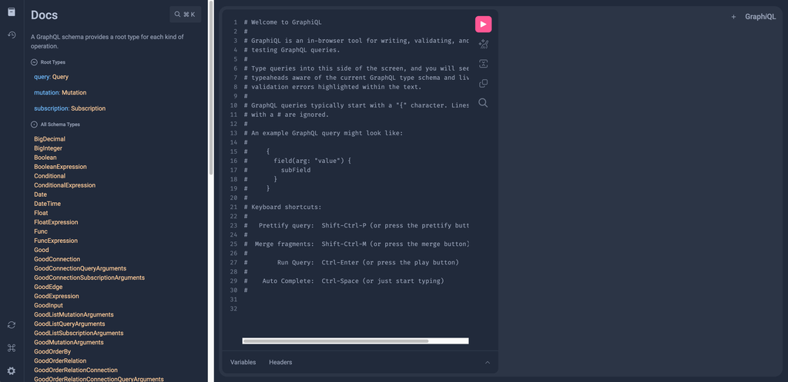
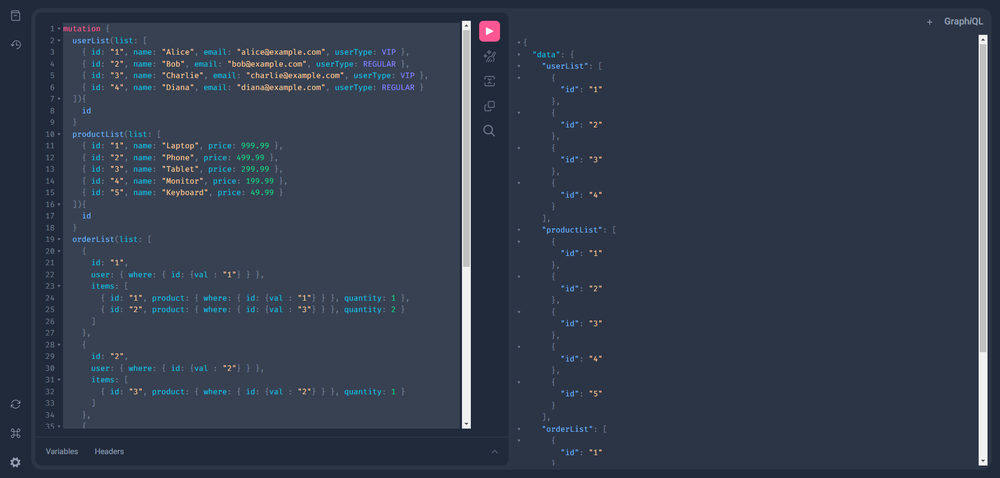

# 准备工作

在正式开始之前, 我们先花一点时间了解基础知识, 准备客户端工具和生成示例数据

## 预备知识

如果还没有基本的 GraphQL 知识, 可以先去[GraphQL 官网](https://graphql.org/)([中文站](https://graphql.cn/))了解基础概念

[GraphQL 生态](https://www.howtographql.com/)

[Awesome list of GraphQL](https://github.com/chentsulin/awesome-graphql/)

## 工具

可以直接访问内置的客户端工具: http://localhost:8906/


也推荐使用全平台的 Altair GraphQL Client: https://altairgraphql.dev/


## 示例数据

最后我们使用[变更](/docs/guide/mutation)来初始化一些示例数据, 变更的内容会在后面的示例里更详细的说明

```graphql
mutation {
  userList(
    list: [
      { id: "1", name: "Alice", email: "alice@example.com", userType: VIP }
      { id: "2", name: "Bob", email: "bob@example.com", userType: REGULAR }
      { id: "3", name: "Charlie", email: "charlie@example.com", userType: VIP }
      { id: "4", name: "Diana", email: "diana@example.com", userType: REGULAR }
      { id: "5", name: "Edward", email: "edward@example.com", userType: VIP }
      { id: "6", name: "Fiona", email: "fiona@example.com", userType: REGULAR }
      { id: "7", name: "George", email: "george@example.com", userType: VIP }
      {
        id: "8"
        name: "Hannah"
        email: "hannah@example.com"
        userType: REGULAR
      }
      { id: "9", name: "Ian", email: "ian@example.com", userType: VIP }
      { id: "10", name: "Jane", email: "jane@example.com", userType: REGULAR }
      { id: "11", name: "Kyle", email: "kyle@example.com", userType: VIP }
      { id: "12", name: "Laura", email: "laura@example.com", userType: REGULAR }
      { id: "13", name: "Mike", email: "mike@example.com", userType: VIP }
      { id: "14", name: "Nina", email: "nina@example.com", userType: REGULAR }
      { id: "15", name: "Oliver", email: "oliver@example.com", userType: VIP }
      { id: "16", name: "Paula", email: "paula@example.com", userType: REGULAR }
      { id: "17", name: "Quentin", email: "quentin@example.com", userType: VIP }
      {
        id: "18"
        name: "Rachel"
        email: "rachel@example.com"
        userType: REGULAR
      }
      { id: "19", name: "Steve", email: "steve@example.com", userType: VIP }
      { id: "20", name: "Tina", email: "tina@example.com", userType: REGULAR }
    ]
  ) {
    id
  }
  productList(
    list: [
      { id: "1", name: "Laptop", price: 999.99 }
      { id: "2", name: "Phone", price: 499.99 }
      { id: "3", name: "Tablet", price: 299.99 }
      { id: "4", name: "Monitor", price: 199.99 }
      { id: "5", name: "Keyboard", price: 49.99 }
    ]
  ) {
    id
  }
  orderList(
    list: [
      {
        user: { where: { id: { val: "1" } } }
        items: [
          { product: { where: { id: { val: "1" } } }, quantity: 1 }
          { product: { where: { id: { val: "3" } } }, quantity: 2 }
        ]
      }
      {
        user: { where: { id: { val: "2" } } }
        items: [{ product: { where: { id: { val: "2" } } }, quantity: 1 }]
      }
      {
        user: { where: { id: { val: "3" } } }
        items: [
          { product: { where: { id: { val: "4" } } }, quantity: 2 }
          { product: { where: { id: { val: "5" } } }, quantity: 3 }
        ]
      }
      {
        user: { where: { id: { val: "4" } } }
        items: [
          { product: { where: { id: { val: "1" } } }, quantity: 1 }
          { product: { where: { id: { val: "2" } } }, quantity: 1 }
          { product: { where: { id: { val: "3" } } }, quantity: 1 }
        ]
      }
    ]
  ) {
    id
  }
}
```

复制以上内容到客户端执行即可


也可在项目启动后在数据库中导入数据

```sql
INSERT INTO `order`.`user` (name,email,phone_numbers,user_type,is_deprecated,version,realm_id,create_user_id,create_time,update_user_id,update_time,create_group_id,`__typename`) VALUES
	 ('Alice','alice@example.com',NULL,'VIP',0,NULL,NULL,NULL,NULL,NULL,NULL,NULL,'User'),
	 ('Bob','bob@example.com',NULL,'REGULAR',0,NULL,NULL,NULL,NULL,NULL,NULL,NULL,'User'),
	 ('Charlie','charlie@example.com',NULL,'VIP',0,NULL,NULL,NULL,NULL,NULL,NULL,NULL,'User'),
	 ('Diana','diana@example.com',NULL,'REGULAR',0,NULL,NULL,NULL,NULL,NULL,NULL,NULL,'User'),
	 ('Edward','edward@example.com',NULL,'VIP',0,NULL,NULL,NULL,NULL,NULL,NULL,NULL,'User'),
	 ('Fiona','fiona@example.com',NULL,'REGULAR',0,NULL,NULL,NULL,NULL,NULL,NULL,NULL,'User'),
	 ('George','george@example.com',NULL,'VIP',0,NULL,NULL,NULL,NULL,NULL,NULL,NULL,'User'),
	 ('Hannah','hannah@example.com',NULL,'REGULAR',0,NULL,NULL,NULL,NULL,NULL,NULL,NULL,'User'),
	 ('Ian','ian@example.com',NULL,'VIP',0,NULL,NULL,NULL,NULL,NULL,NULL,NULL,'User'),
	 ('Jane','jane@example.com',NULL,'REGULAR',0,NULL,NULL,NULL,NULL,NULL,NULL,NULL,'User');

INSERT INTO `order`.`user` (name,email,phone_numbers,user_type,is_deprecated,version,realm_id,create_user_id,create_time,update_user_id,update_time,create_group_id,`__typename`) VALUES
	 ('Kyle','kyle@example.com',NULL,'VIP',0,NULL,NULL,NULL,NULL,NULL,NULL,NULL,'User'),
	 ('Laura','laura@example.com',NULL,'REGULAR',0,NULL,NULL,NULL,NULL,NULL,NULL,NULL,'User'),
	 ('Mike','mike@example.com',NULL,'VIP',0,NULL,NULL,NULL,NULL,NULL,NULL,NULL,'User'),
	 ('Nina','nina@example.com',NULL,'REGULAR',0,NULL,NULL,NULL,NULL,NULL,NULL,NULL,'User'),
	 ('Oliver','oliver@example.com',NULL,'VIP',0,NULL,NULL,NULL,NULL,NULL,NULL,NULL,'User'),
	 ('Paula','paula@example.com',NULL,'REGULAR',0,NULL,NULL,NULL,NULL,NULL,NULL,NULL,'User'),
	 ('Quentin','quentin@example.com',NULL,'VIP',0,NULL,NULL,NULL,NULL,NULL,NULL,NULL,'User'),
	 ('Rachel','rachel@example.com',NULL,'REGULAR',0,NULL,NULL,NULL,NULL,NULL,NULL,NULL,'User'),
	 ('Steve','steve@example.com',NULL,'VIP',0,NULL,NULL,NULL,NULL,NULL,NULL,NULL,'User'),
	 ('Tina','tina@example.com',NULL,'REGULAR',0,NULL,NULL,NULL,NULL,NULL,NULL,NULL,'User');

INSERT INTO `order`.product (name,price,is_deprecated,version,realm_id,create_user_id,create_time,update_user_id,update_time,create_group_id,`__typename`) VALUES
	 ('Laptop',999.99,0,NULL,NULL,NULL,NULL,NULL,NULL,NULL,'Product'),
	 ('Phone',499.99,0,NULL,NULL,NULL,NULL,NULL,NULL,NULL,'Product'),
	 ('Tablet',299.99,0,NULL,NULL,NULL,NULL,NULL,NULL,NULL,'Product'),
	 ('Monitor',199.99,0,NULL,NULL,NULL,NULL,NULL,NULL,NULL,'Product'),
	 ('Keyboard',49.99,0,NULL,NULL,NULL,NULL,NULL,NULL,NULL,'Product');

INSERT INTO `order`.`order` (is_deprecated,version,realm_id,create_user_id,create_time,update_user_id,update_time,create_group_id,`__typename`) VALUES
	 (0,NULL,NULL,NULL,NULL,NULL,NULL,NULL,'Order'),
	 (0,NULL,NULL,NULL,NULL,NULL,NULL,NULL,'Order'),
	 (0,NULL,NULL,NULL,NULL,NULL,NULL,NULL,'Order'),
	 (0,NULL,NULL,NULL,NULL,NULL,NULL,NULL,'Order');

INSERT INTO `order`.order_item (quantity,is_deprecated,version,realm_id,create_user_id,create_time,update_user_id,update_time,create_group_id,`__typename`) VALUES
	 (1,0,NULL,NULL,NULL,NULL,NULL,NULL,NULL,'OrderItem'),
	 (2,0,NULL,NULL,NULL,NULL,NULL,NULL,NULL,'OrderItem'),
	 (1,0,NULL,NULL,NULL,NULL,NULL,NULL,NULL,'OrderItem'),
	 (2,0,NULL,NULL,NULL,NULL,NULL,NULL,NULL,'OrderItem'),
	 (3,0,NULL,NULL,NULL,NULL,NULL,NULL,NULL,'OrderItem'),
	 (1,0,NULL,NULL,NULL,NULL,NULL,NULL,NULL,'OrderItem'),
	 (1,0,NULL,NULL,NULL,NULL,NULL,NULL,NULL,'OrderItem'),
	 (1,0,NULL,NULL,NULL,NULL,NULL,NULL,NULL,'OrderItem');

INSERT INTO `order`.order_order_item_relation (order_ref,order_item_ref,is_deprecated,version,realm_id,create_user_id,create_time,update_user_id,update_time,create_group_id,`__typename`) VALUES
	 ('1','1',0,NULL,NULL,NULL,NULL,NULL,NULL,NULL,'OrderOrderItemRelation'),
	 ('1','2',0,NULL,NULL,NULL,NULL,NULL,NULL,NULL,'OrderOrderItemRelation'),
	 ('2','3',0,NULL,NULL,NULL,NULL,NULL,NULL,NULL,'OrderOrderItemRelation'),
	 ('3','4',0,NULL,NULL,NULL,NULL,NULL,NULL,NULL,'OrderOrderItemRelation'),
	 ('3','5',0,NULL,NULL,NULL,NULL,NULL,NULL,NULL,'OrderOrderItemRelation'),
	 ('4','6',0,NULL,NULL,NULL,NULL,NULL,NULL,NULL,'OrderOrderItemRelation'),
	 ('4','7',0,NULL,NULL,NULL,NULL,NULL,NULL,NULL,'OrderOrderItemRelation'),
	 ('4','8',0,NULL,NULL,NULL,NULL,NULL,NULL,NULL,'OrderOrderItemRelation');

INSERT INTO `order`.order_user_relation (user_ref,order_ref,is_deprecated,version,realm_id,create_user_id,create_time,update_user_id,update_time,create_group_id,`__typename`) VALUES
	 ('1','1',0,NULL,NULL,NULL,NULL,NULL,NULL,NULL,'OrderUserRelation'),
	 ('2','2',0,NULL,NULL,NULL,NULL,NULL,NULL,NULL,'OrderUserRelation'),
	 ('3','3',0,NULL,NULL,NULL,NULL,NULL,NULL,NULL,'OrderUserRelation'),
	 ('4','4',0,NULL,NULL,NULL,NULL,NULL,NULL,NULL,'OrderUserRelation');

INSERT INTO `order`.order_item_product_relation (order_item_ref,product_ref,is_deprecated,version,realm_id,create_user_id,create_time,update_user_id,update_time,create_group_id,`__typename`) VALUES
	 ('1','1',0,NULL,NULL,NULL,NULL,NULL,NULL,NULL,'OrderItemProductRelation'),
	 ('2','3',0,NULL,NULL,NULL,NULL,NULL,NULL,NULL,'OrderItemProductRelation'),
	 ('3','2',0,NULL,NULL,NULL,NULL,NULL,NULL,NULL,'OrderItemProductRelation'),
	 ('4','4',0,NULL,NULL,NULL,NULL,NULL,NULL,NULL,'OrderItemProductRelation'),
	 ('5','5',0,NULL,NULL,NULL,NULL,NULL,NULL,NULL,'OrderItemProductRelation'),
	 ('6','1',0,NULL,NULL,NULL,NULL,NULL,NULL,NULL,'OrderItemProductRelation'),
	 ('7','2',0,NULL,NULL,NULL,NULL,NULL,NULL,NULL,'OrderItemProductRelation'),
	 ('8','3',0,NULL,NULL,NULL,NULL,NULL,NULL,NULL,'OrderItemProductRelation');
```
