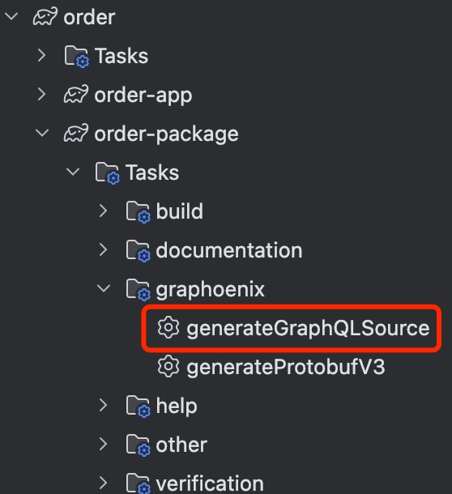

# 快速开始

我们基于一个订单系统的开发,逐步展示平台特性.

1. [GraphQL 类型](https://graphql.org/learn/schema/)的定义
2. [GraphQL 的查询,变更](https://graphql.org/learn/queries/)和[订阅](https://graphql.org/blog/2015-10-16-subscriptions/)
3. GPA-based (GraphQL Persistence API) repositories
4. 基于[MicroProfile](https://microprofile.io/)和[Jakarta EE](https://jakarta.ee/specifications/)协议的依赖注入,切面和配置
5. 异步(Async)和同步(Await)
6. 基于[Gossip](https://icyfenix.cn/distribution/consensus/gossip.html)协议的分布式和[gRPC](https://grpc.io/)通讯
7. 基于[JWT](https://jwt.io/)和[Casbin](https://casbin.org/)定制的鉴权与授权
8. 基于[Svelte](https://svelte.dev/)和[Tailwind CSS](https://tailwindcss.com/)定制的 UI 界面

### 系统要求

- [JDK >= 11.0](https://www.oracle.com/in/java/technologies/javase/jdk11-archive-downloads.html/)
- [MariaDB >= 10.6.0](https://mariadb.com/kb/en/mariadb-1060-release-notes/) 或 [MySQL >= 8.0](https://dev.mysql.com/downloads/mysql/8.0.html/)
- [RabbitMQ >= 3.0](https://www.rabbitmq.com/docs/download/) (可选)

推荐使用Docker构建开发环境
```yaml title="docker-compose.yml"
version: "3.8"

services:
  order-mariadb:
    container_name: order-mariadb
    image: mariadb:10.6
    restart: unless-stopped
    ports:
      - "3306:3306"
    environment:
      MYSQL_ROOT_PASSWORD: root
      MYSQL_DATABASE: order
      MYSQL_USER: your-username
      MYSQL_PASSWORD: your-password
      MYSQL_HOST : '%'
    networks:
      - order-net

  order-rabbitmq:
    container_name: order-rabbitmq
    image: rabbitmq:3
    restart: unless-stopped
    ports:
      - "5672:5672"
    networks:
      - order-net

networks:
  order-net:
```

## 初始化项目

推荐使用官方脚手架快速初始化项目 **[Graphoenix Server Initializer](https://gp-init.github.io)**.

<iframe src="https://gp-init.github.io" width="450px" height="650px" frameborder="0" scrolling="no"> </iframe>

Graphoenix 使用[Gradle](https://docs.gradle.org/6.9.4/userguide/userguide.html)进行构建,未来会推出 Maven 版本:

项目结构:

```
|-- order
    |-- build.gradle
    |-- gradle.properties
    |-- settings.gradle
    |-- order-app                             启动器,引入订单和其他包
    |   |-- build.gradle
    |   |-- src
    |       |-- main
    |           |-- java
    |           |   |-- demo.gp.order
    |           |       |-- App.java          启动类
    |           |-- resources
    |               |-- application.conf      配置文件
    |-- order-package                         订单包
    |   |-- build.gradle
    |   |-- src
    |       |-- main
    |           |-- java
    |           |   |-- demo.gp.order
    |           |       |-- package-info.java package-info所在目录作为包名
    |           |-- resources
    |               |-- graphql
    |                   |-- order.gql         定义订单相关类型
    |-- other-package                         可根据需求可以加入其他包
        |-- build.gradle
        |-- src
            |-- main
                |-- java
                |   |-- demo.gp.other
                |       |-- package-info.java
                |-- resources
                    |-- graphql
                        |-- other.gql         定义其他相关类型
```

如上所示,app 项目引入 order 和 other 两个包,如同货轮(app)和集装箱(order,other),可根据需求灵活的组合成单体架构或拆分为分布式架构.

### 配置包

1. 引入依赖与 Gradle 插件

```gradle title="order-package/build.gradle"
buildscript {
    repositories {
        gradlePluginPortal()
        jcenter()
    }
    dependencies {
        classpath 'io.graphoenix:graphoenix-gradle-plugin:0.0.1-SNAPSHOT'
    }
}

apply plugin: 'io.graphoenix'

repositories {
    mavenCentral()
    jcenter() //Graphoenix的反编译器jd-core发布在jcenter,未来反编译器将替换为IDEA使用的fernflower,之后不再依赖
}

dependencies {
    // highlight-start
    implementation 'io.graphoenix:graphoenix-core:0.0.1-SNAPSHOT' //核心
    implementation 'io.nozdormu:nozdormu-inject:0.0.1-SNAPSHOT'  //依赖注入
    implementation 'io.nozdormu:nozdormu-config:0.0.1-SNAPSHOT'  //配置

    annotationProcessor 'io.graphoenix:graphoenix-annotation-processor:0.0.1-SNAPSHOT' //核心编译器
    //implementation依赖全部加入到annotationProcessor
    annotationProcessor 'io.nozdormu:nozdormu-inject:0.0.1-SNAPSHOT'
    annotationProcessor 'io.nozdormu:nozdormu-config:0.0.1-SNAPSHOT'
    // highlight-end
}
```

2. 定义 GraphQL Schema,关于 GraphQL 的基础知识,可以参考[GraphQL 官方教程](https://graphql.org/learn/)

定义订单和货物

```graphql title="order-package/src/main/resources/graphql/order.gql"
"订单"
type Order {
  "ID"
  id: ID
  "订单编码"
  number: String!
  "购买货物"
  goods: [Good!]
}

"货物信息"
type Good {
  "ID"
  id: ID
  "货物名称"
  name: String!
  "定价"
  price: Float!
}
```

3. 生成 Java Bean

```bash
./gradlew :order-package:generateGraphQLSource
```

或使用 IDEA



插件将根据 graphql 文件生成 Java bean,可使用这些 Java bean 进行业务逻辑编写和 GPA 接口定义.

```
|-- order-package                             订单包
    |-- build.gradle
    |-- src
        |-- main
            |-- java
                |-- demo.gp.order
                    |-- dto
                        |-- annotation        GPA注解
                        |-- directive         指令注解
                        |-- inputObjectType   Input实体
                        |-- objectType        Object实体
```

### 配置启动器

1. 引入依赖

```gradle title="order-app/build.gradle"
repositories {
    mavenCentral()
    jcenter() //Graphoenix的反编译器jd-core发布在jcenter,未来反编译器将替换为IDEA使用的fernflower,之后不再依赖
}

dependencies {
    // highlight-start
    implementation 'io.graphoenix:graphoenix-core:0.0.1-SNAPSHOT' //核心
    implementation 'io.nozdormu:nozdormu-inject:0.0.1-SNAPSHOT'  //依赖注入
    implementation 'io.nozdormu:nozdormu-config:0.0.1-SNAPSHOT'  //配置
    implementation 'io.graphoenix:graphoenix-http-server:0.0.1-SNAPSHOT' //http服务器
    implementation 'io.graphoenix:graphoenix-r2dbc:0.0.1-SNAPSHOT' //r2dbc数据库连接
    implementation 'io.graphoenix:graphoenix-introspection:0.0.1-SNAPSHOT' //内省
    implementation 'io.graphoenix:graphoenix-admin:0.0.1-SNAPSHOT' //开发者工具,提供GraphiQL和GraphQL Voyager

    implementation 'org.mariadb:r2dbc-mariadb:1.1.4' //mariadb驱动
    //implementation group: 'io.netty', name: 'netty-resolver-dns-native-macos', version: '4.1.81.Final', classifier: 'osx-aarch_64' //如果使用苹果m1芯片需要引用

    annotationProcessor 'io.graphoenix:graphoenix-annotation-processor:0.0.1-SNAPSHOT' //核心编译器
    //implementation依赖全部加入到annotationProcessor
    annotationProcessor 'io.nozdormu:nozdormu-inject:0.0.1-SNAPSHOT'
    annotationProcessor 'io.nozdormu:nozdormu-config:0.0.1-SNAPSHOT'
    annotationProcessor 'io.graphoenix:graphoenix-http-server:0.0.1-SNAPSHOT'
    annotationProcessor 'io.graphoenix:graphoenix-r2dbc:0.0.1-SNAPSHOT'
    annotationProcessor 'io.graphoenix:graphoenix-introspection:0.0.1-SNAPSHOT'
    annotationProcessor 'org.mariadb:r2dbc-mariadb:1.1.4'
    // highlight-end
}
```

2. 创建启动类

```java title="order-app/src/main/java/demo/gp/order/App.java"
package demo.gp.order;

import io.graphoenix.spi.annotation.Application;

import static io.graphoenix.core.bootstrap.App.APP;

@Application    // 添加@Application注解标记为启动类
public class App {

    public static void main(String[] args) {
        APP.run(args);
    }
}
```

3. 配置服务与数据库

```hocon title="order-app/src/main/resources/graphql/application.conf"
graphql {
  buildIntrospection = true                           //生成内省文档
}
package {
  packageName = "demo.gp.order"                       //与包名相同
  localPackageNames = ["io.graphoenix.introspection"] //本地包配置,此处引入内省包
}
r2dbc {
  driver = "mariadb"  //此处使用mariadb驱动
  database = "order"  //数据库
  user = "root"       //数据库用户
  password = "root"   //数据库密码
}
```

## 启动

Start or Debug App.main

GraphQL endpoint: http://localhost:8080/graphql

GraphiQL endpoint: http://localhost:8906

Voyager endpoint: http://localhost:8906/voyager


