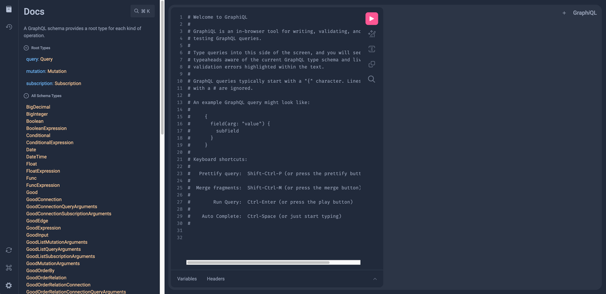

# 快速开始

初始化项目, 定义类型, 启动服务

## 系统要求

- [JDK >= 11.0](https://www.oracle.com/in/java/technologies/javase/jdk11-archive-downloads.html/)
- [MariaDB >= 10.6.0](https://mariadb.com/kb/en/mariadb-1060-release-notes/) 或 [MySQL >= 8.0](https://dev.mysql.com/downloads/mysql/8.0.html/)
- [RabbitMQ >= 3.0](https://www.rabbitmq.com/docs/download/) (可选)

<details>
<summary>推荐使用Docker构建开发环境</summary>

```yaml title="docker-compose.yml"
version: "3.8"

services:
  gp-mariadb:
    container_name: gp-mariadb
    image: mariadb:10.6
    restart: unless-stopped
    ports:
      - "3306:3306"
    environment:
      MYSQL_ROOT_PASSWORD: root
      MYSQL_DATABASE: order
      MYSQL_USER: your-username
      MYSQL_PASSWORD: your-password
      MYSQL_HOST: "%"
    networks:
      - gp-net

  gp-rabbitmq:
    container_name: gp-rabbitmq
    image: rabbitmq:3
    restart: unless-stopped
    ports:
      - "5672:5672"
    networks:
      - gp-net

networks:
  gp-net:
```

启动容器

```bash
docker-compose up -d
```

</details>

## 初始化项目

我们首先创建一个名为**order**的项目, 包名为**demo.gp.order**

使用官方脚手架快速初始化项目 **[Graphoenix Server Initializer](https://gp-init.github.io?name=order&packageName=demo.gp.order)**.

<details>
<summary>项目结构</summary>

```
|-- order
    |-- build.gradle
    |-- gradle.properties
    |-- settings.gradle
    |-- order-app                             启动模块, 引入订单和其他模块
    |   |-- build.gradle
    |   |-- src
    |       |-- main
    |           |-- java
    |           |   |-- demo.gp.order
    |           |       |-- App.java          启动类
    |           |-- resources
    |               |-- application.conf      配置文件
    |-- order-package                         订单模块
    |   |-- build.gradle
    |   |-- src
    |       |-- main
    |           |-- java
    |           |   |-- demo.gp.order
    |           |       |-- package-info.java package-info所在目录作为包名
    |           |-- resources
    |               |-- graphql
    |                   |-- order.gql         定义订单相关类型
    |-- other-package                         可根据需求可以加入其他模块
        |-- build.gradle
        |-- src
            |-- main
                |-- java
                |   |-- demo.gp.other
                |       |-- package-info.java
                |-- resources
                    |-- graphql
                        |-- other.gql         定义其他相关类型
```

</details>

### 1. 定义 GraphQL

设计一个简单的订单系统, 包括用户(User)和订单(Order)和产品(Product), 每个订单包含多个订单项(OrderItem)

_关于 GraphQL 类型定义的详细内容, 可以参考GraphQL官方教程中的[类型系统](https://graphql.org/learn/schema/)([中文版](https://graphql.cn/learn/schema/))_

```graphql title="order-package/src/main/resources/graphql/order.gql"
"用户"
type User {
  "用户ID"
  id: ID!
  "用户名"
  name: String!
  "电子邮箱"
  email: String
  "联系方式"
  phoneNumbers: [String!]
  "用户类型"
  userType: UserType!
  "订单"
  orders: [Order!]
}

"用户类型"
enum UserType {
  "普通用户"
  REGULAR
  "会员"
  VIP
}

"产品"
type Product {
  "产品ID"
  id: ID!
  "产品名称"
  name: String!
  "定价"
  price: Float!
}

"订单"
type Order {
  "订单ID"
  id: ID!
  "购买用户"
  user: User!
  "产品列表"
  items: [OrderItem!]!
}

"订单项"
type OrderItem {
  "订单项ID"
  id: ID!
  "产品"
  product: Product!
  "购买数量"
  quantity: Int!
}
```

### 2. 配置服务与数据库

```hocon title="order-app/src/main/resources/graphql/application.conf"
graphql {
  buildIntrospection = true // 生成内省文档
}
package {
  packageName = "demo.gp.order"                       // 包名
  localPackageNames = ["io.graphoenix.introspection"] // 引入内省模块
}
r2dbc {
  driver = "mariadb"  // 此处使用mariadb驱动
  database = "order"  // 数据库
  user = "root"       // 用户
  password = "root"   // 密码
}
```

## 启动

_Run/Debug_ order-app/src/main/java/demo/gp/order/App.java


GraphQL endpoint: http://localhost:8080/graphql

GraphiQL endpoint: http://localhost:8906



Voyager endpoint: http://localhost:8906/voyager


