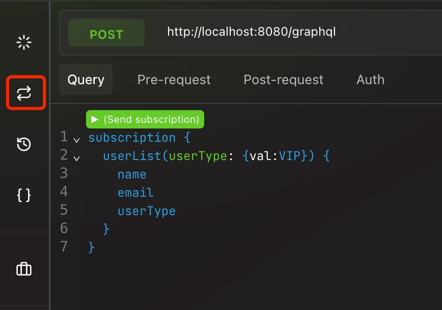
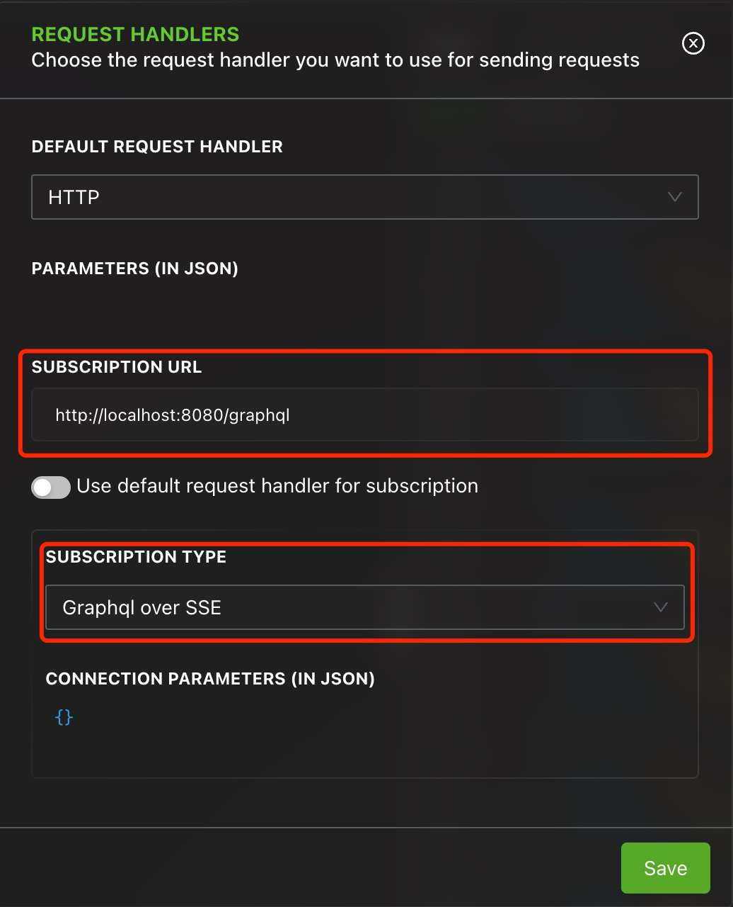
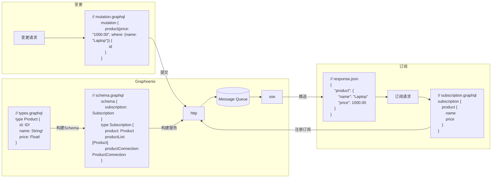

# 订阅(subscription)

快速浏览订阅示例

## 安装

添加依赖

```gradle
repositories {
    mavenCentral()
    // highlight-start
    jcenter()
    // highlight-end
}

dependencies {
    // highlight-start
    implementation 'org.graphoenix:graphoenix-rabbitmq:0.1.2'
    // highlight-end

    // ...
}
```

## Altair

使用 [Altair GraphQL Client](https://altairgraphql.dev/) 进行订阅测试


### 配置

1. 打开 Request Handlers
   

2. 配置订阅地址, 选择订阅类型为 SSE
   

---

## 基本订阅

### **订阅接口**

| 接口名           | 类型     | 参数                                               | 说明     | 示例 (Type=User) |
| ---------------- | -------- | -------------------------------------------------- | -------- | ---------------- |
| (type)           | (Type)   | [(Type)SubscriptionArguments](#订阅参数)           | 订阅单条 | user             |
| (type)List       | [(Type)] | [(Type)ListSubscriptionArguments](#订阅参数)       | 订阅列表 | userList         |
| (type)Connection | [(Type)] | [(Type)ConnectionSubscriptionArguments](#订阅参数) | 订阅分页 | userConnection   |

### 订阅与变更

变更请求会把变更内容发送到消息队列(MQ)中, 订阅会根据类型和字段订阅 MQ 中对应的频道, 在匹配到符合条件的变更内容后通过 SSE 推送新的数据



使用与字段同名的参数构造查询条件, [`opr`](/docs/guide/types#operator) 作为查询符号, [`val`](/docs/guide/types#scalarenumexpression) 作为查询内容, 如果查询内容为数组则使用 [`arr`](/docs/guide/types#scalarenumexpression)

例: 订阅所有类型是 VIP 的用户

```graphql
subscription {
  userList(userType: { val: VIP }) {
    name
    email
    userType
  }
}
```

```json
{
  "data": {
    "userList": [
      {
        "name": "Alice",
        "email": "alice@example.com",
        "userType": "VIP"
      },
      {
        "name": "Charlie",
        "email": "charlie@example.com",
        "userType": "VIP"
      },
      {
        "name": "Edward",
        "email": "edward@example.com",
        "userType": "VIP"
      },
      {
        "name": "George",
        "email": "george@example.com",
        "userType": "VIP"
      },
      {
        "name": "Ian",
        "email": "ian@example.com",
        "userType": "VIP"
      },
      {
        "name": "Kyle",
        "email": "kyle@example.com",
        "userType": "VIP"
      },
      {
        "name": "Mike",
        "email": "mike@example.com",
        "userType": "VIP"
      },
      {
        "name": "Oliver",
        "email": "oliver@example.com",
        "userType": "VIP"
      },
      {
        "name": "Quentin",
        "email": "quentin@example.com",
        "userType": "VIP"
      },
      {
        "name": "Steve",
        "email": "steve@example.com",
        "userType": "VIP"
      }
    ]
  }
}
```

通过变更新增 VIP 用户 Uma

```graphql
mutation {
  user(
    name: "Uma"
    email: "uma@example.com"
    userType: VIP
    phoneNumbers: ["13918124629", "18536492446"]
  ) {
    id
    name
    email
    phoneNumbers
    userType
  }
}
```

订阅收到新的推送数据

```graphql
{
  "data": {
    "userList": [
      {
        "name": "Alice",
        "email": "alice@example.com",
        "userType": "VIP"
      },
      {
        "name": "Charlie",
        "email": "charlie@example.com",
        "userType": "VIP"
      },
      {
        "name": "Edward",
        "email": "edward@example.com",
        "userType": "VIP"
      },
      {
        "name": "George",
        "email": "george@example.com",
        "userType": "VIP"
      },
      {
        "name": "Ian",
        "email": "ian@example.com",
        "userType": "VIP"
      },
      {
        "name": "Kyle",
        "email": "kyle@example.com",
        "userType": "VIP"
      },
      {
        "name": "Mike",
        "email": "mike@example.com",
        "userType": "VIP"
      },
      {
        "name": "Oliver",
        "email": "oliver@example.com",
        "userType": "VIP"
      },
      {
        "name": "Quentin",
        "email": "quentin@example.com",
        "userType": "VIP"
      },
      {
        "name": "Steve",
        "email": "steve@example.com",
        "userType": "VIP"
      },
      // highlight-start
      {
        "name": "Uma",
        "email": "uma@example.com",
        "userType": "VIP"
      }
      // highlight-end
    ]
  }
}
```

---

## **订阅参数**

| 参数名  | 类型                                                                     | 默认值 | 说明                                   | SQL 示例 (x=10 y=5)                                      |
| ------- | ------------------------------------------------------------------------ | ------ | -------------------------------------- | -------------------------------------------------------- |
| (field) | [(Scalar/Enum/Object)Expression](/docs/guide/types#scalarenumexpression) | 无     | 条件字段                               | SELECT id FROM t WHERE **t.field** = 'xyz'               |
| first   | Int                                                                      | 无     | 获取前 x 条                            | SELECT id FROM t LIMIT 10                                |
| last    | Int                                                                      | 无     | 获取后 x 条                            | SELECT id FROM t ORDER BY id DESC LIMIT 10               |
| offset  | Int                                                                      | 无     | 跳过 y 条                              | SELECT id FROM t LIMIT 5, 10                             |
| cond    | [Conditional](/docs/guide/types#conditional)                             | AND    | 参数内条件的组合关系                   | WHERE t.field = 'xyz' **AND** t.field \<\> 'abc'         |
| not     | Boolean                                                                  | false  | 条件取非                               | WHERE **NOT** (t.field = 'xyz' AND t.field \<\> 'abc')   |
| exs     | [[(Object)Expression]](/docs/guide/types#objectexpression)               | 无     | 同一字段多次作为查询条件时可使用此参数 | WHERE **(** t.field = 'xyz' AND t.field \<\> 'abc' **)** |
| orderBy | [[(Object)OrderBy]](/docs/guide/types#objectorderby)                     | 无     | 排序字段                               | SELECT id FROM t **ORDER BY** t.field                    |
| groupBy | [String]                                                                 | 无     | 分组字段                               | SELECT id FROM t **GROUP BY** t.field                    |
