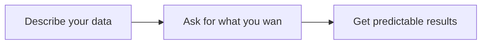

# 小结

截至目前为止, 从项目的初始化开始, 依次介绍了增删改查(CURD), 控制层(GPI), 持久层(GPA)

系统隐藏了所有的细枝末节, 只需定义GraphQL类型, 系统会基于最佳实践自动创建数据库, 构建参数, 创建映射关系等. 当然也可以根据实际场景调整构建过程, 在指南中会具体介绍详细配置

正如GraphQL主页上的介绍的那样

接下来可以根据实际需要, 选择特性了解

1. 依赖注入(IOC) 切面(AOP) 配置(Config): 经典的企业级Java三件套
2. 同步和异步: 基于Reactor的Async和Await
3. 微服务和GRPC: 单体和微服务可切换的集装箱架构
4. 订阅: 基于消息队列的和SSE的GraphQL订阅
5. 验证: 基于JSON Schema协议的验证
6. 鉴权和授权: 基于JWT的鉴权和基于Casbin的授权
7. UI: 基于Svelte和Tailwind CSS的UI组件
