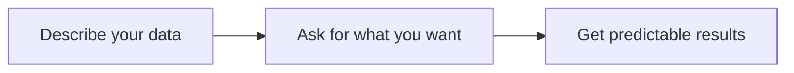

# 小结

目前为止, 从项目的初始化开始, 依次介绍了类型定义, 增删改查(CURD), 控制层(GPI)和持久层(GPA), 已经可以满足系统开发的基本需求

平台隐藏了所有的细枝末节, 只需定义 GraphQL 类型, 系统会基于最佳实践自动托管数据库, 构建接口和参数, 维护映射关系等, 让开发者专注于业务代码的编写

正如 GraphQL 主页上的介绍的那样

接下来可以根据实际需要选择特性进行了解

1. [依赖注入(IOC)](/docs/jakarta-ee/inject) / [切面(AOP)](/docs/jakarta-ee/interceptor) / [配置(Config)](/docs/jakarta-ee/config): 企业级 Java(Jakarta EE)
2. [异步和同步](/docs/jakarta-ee/reactor): 基于 Reactor 的 Async 和 Await
3. 微服务和 gRPC: 单体和微服务可切换的集装箱架构
4. 订阅: 基于消息队列的和 SSE 的 GraphQL 订阅
5. 验证: 基于 JSON Schema 协议的验证
6. 鉴权和授权: 基于 JWT 的鉴权和基于 Casbin 的授权
7. UI: 基于 Svelte 和 Tailwind CSS 的 UI 组件
