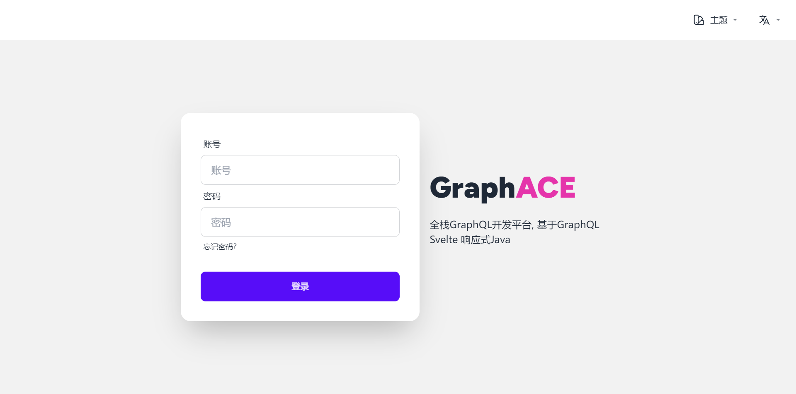
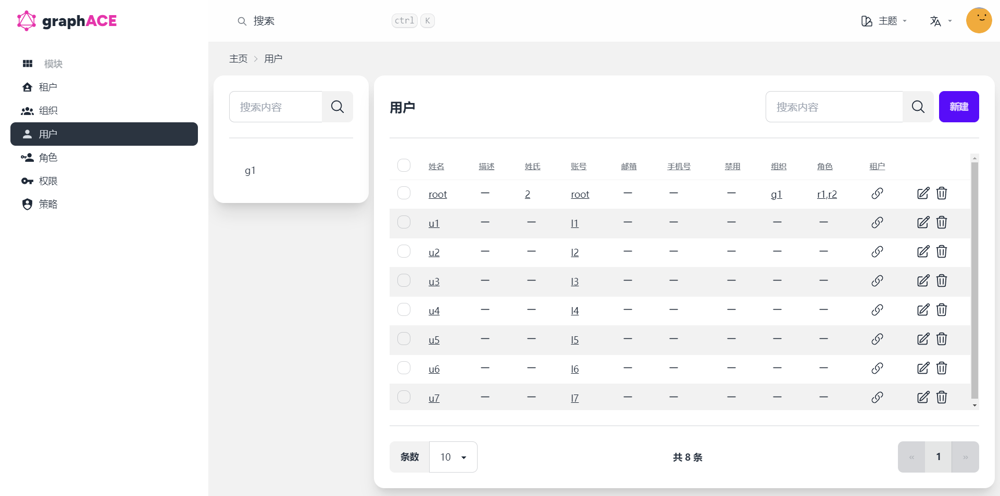

# Svelte(Kit)

[Svelte](https://svelte.dev/) 是一个编译时前端框架, 通过将组件直接编译为高效的原生 JavaScript, 提供了更小的打包体积和高性能的响应式编程体验. [SvelteKit](https://kit.svelte.dev/) 是基于 [Svelte](https://svelte.dev/) 的全栈框架, 支持服务端渲染(SSR), 静态生成(SSG), 文件系统路由和数据预加载等功能, 简化了现代 Web 应用的开发流程, 同时具备灵活的部署选项. 两者结合为开发者提供了高效简洁且性能卓越的开发体验

Graphoenix 根据 GraphQL 特性, 提供开箱即用的 UI 解决方案: [Graphence](https://github.com/doukai/graphace)
- 基于 [Svelte](https://svelte.dev/) 和 [SvelteKit](https://kit.svelte.dev/) 的全栈框架
- 基于 [Melt UI](https://melt-ui.com/) 的 Headless 组件
- 基于 [Tailwind CSS](https://tailwindcss.com/) 的 Utility-First CSS 框架
- 基于 [daisyUI](https://daisyui.com/) 的 CSS 组件
- 基于 [Houdini](https://houdinigraphql.com/) 的 GraphQL 客户端
- 基于 [typesafe-i18n](https://typesafe-i18n.pages.dev/) 的 i18n 国际化

## 系统要求

- [Node.js >= 18](https://nodejs.org/en/download/package-manager)

## 脚手架

使用 [Svelte 脚手架](https://gp-init.github.io/svelte/)初始化项目

项目结构:

```text
│  .env                 // 环境配置
│  .eslintignore
│  .eslintrc.cjs
│  .gitignore
│  .prettierrc
│  .typesafe-i18n.json
│  codegen.ts           // 代码生成器配置
│  houdini.config.js    // GraphQL 客户端配置
│  package.json
│  postcss.config.cjs
│  svelte.config.js     // svelte 配置
│  tailwind.config.cjs  // tailwind 配置
│  tsconfig.json
│  vite.config.ts       // vite 配置
│
├─src
│  │  app.css
│  │  app.d.ts
│  │  app.html
│  │  client.ts
│  │  hooks.server.ts
│  │
│  ├─lib
│  │  │  index.ts
│  │  │
│  │  ├─components  // 组件目录
│  │  │  │  index.ts
│  │  │  │
│  │  │  ├─login    // 登录组件
│  │  │  │      index.ts
│  │  │  │      LoginForm.svelte
│  │  │  │
│  │  │  ├─menu     // 菜单组件
│  │  │  │      DevMenu.svelte
│  │  │  │      index.ts
│  │  │  │      SideBarMenu.svelte
│  │  │  │      UserMenu.svelte
│  │  │  │
│  │  │  └─settings // 用户设置组件
│  │  │          CurrentUserForm.svelte
│  │  │          index.ts
│  │  │          ResetPasswordForm.svelte
│  │  │
│  │  └─i18n    // 多语言目录
│  │      │  export.ts  // 多语言导出
│  │      │  import.ts  // 多语言导入
│  │      │
│  │      ├─en
│  │      │  ├─errors           // en 异常定义
│  │      │  │      index.ts
│  │      │  │
│  │      │  └─(appName)        // en 文本定义
│  │      │          index.ts
│  │      │
│  │      └─zh
│  │          ├─errors          // zh 异常定义
│  │          │      index.ts
│  │          │
│  │          └─(appName)       // zh 文本定义
│  │                  index.ts
│  │
│  ├─routes // 页面路由
│  │  │  +page.server.ts
│  │  │  +page.svelte
│  │  │  +page.ts
│  │  │
│  │  ├─graphql
│  │  │      +server.ts
│  │  │
│  │  └─[lang]
│  │      ├─(app)   // 目录页面
│  │      │  │  +layout.server.ts
│  │      │  │  +layout.svelte
│  │      │  │  +layout.ts
│  │      │  │  +page.svelte
│  │      │  │  +page.ts
│  │      │  │
│  │      │  └─settings
│  │      │      ├─account
│  │      │      │      +page.svelte
│  │      │      │      +page.ts
│  │      │      │
│  │      │      └─password
│  │      │              +page.svelte
│  │      │              +page.ts
│  │      │
│  │      └─(main)  // 主页面
│  │          │  +layout.server.ts
│  │          │  +layout.svelte
│  │          │  +layout.ts
│  │          │
│  │          ├─login
│  │          │      +page.server.ts
│  │          │      +page.svelte
│  │          │      +page.ts
│  │          │
│  │          └─logout
│  │                  +page.server.ts
│  │                  +page.svelte
│  │                  +page.ts
│  │
│  └─utils
│          auth-util.ts
│          index.ts
│          validate-util.ts
│
└─static
        favicon.png
        robots.txt
```

## 配置

```text title=".env"
PUBLIC_GRAPHQL_URL=http://localhost:8080/graphql
AUTH_SCHEME=Basic
AUTH_TOKEN=root:root
```

- `PUBLIC_GRAPHQL_URL` : GraphQL 服务地址
- `AUTH_SCHEME` : 认证模式
- `AUTH_TOKEN` : 认证令牌

## 安装

- npm
```bash
npm install
```

- pnpm
```bash
pnpm install
```

## 启动

- npm
```bash
npm run dev
```

- pnpm
```bash
pnpm run dev
```





## 代码生成

使用 `graphql:codegen` 根据 GraphQL 定义生成 UI 组件

- npm
```bash
npm run graphql:codegen
```

- pnpm
```bash
pnpm run graphql:codegen
```

生成组件:

```text
└─components    // 组件目录
   │  index.ts
   │  
   ├─enums      // 枚举组件目录
   │  │  index.ts      
   │  │  
   │  └─(enum-name)
   │          index.ts
   │          (EnumName)Input.svelte    // 枚举选择器
   │          (EnumName)Item.svelte     // 枚举表单项
   │          (EnumName)Td.svelte       // 枚举表格单元
   │          (EnumName)Th.svelte       // 枚举检索表头
   │
   └──objects
      │  index.ts
      │
      └─(object-name)
             index.ts
             (ObjectName)ConnectionTable.svelte         // 对象分页表格
             (ObjectName)CreateForm.svelte              // 对象创建表单
             (ObjectName)CreateTable.svelte             // 对象创建表格
             (ObjectName)Form.svelte                    // 对象表单
             (ObjectName)Select.svelte                  // 对象选择器
             (ObjectName)SelectConnectionTable.svelte   // 对象选择分页表格
             (ObjectName)SelectItem.svelte              // 对象选择表单项
             (ObjectName)SelectTable.svelte             // 对象选择表格
             (ObjectName)SelectTd.svelte                // 对象选择表格单元
             (ObjectName)Table.svelte                   // 对象表格
             (ObjectName)Th.svelte                      // 对象检索表头
```

## 构建应用

打包部署使用的 bundle 文件

- npm
```bash
npm run build
```

- pnpm
```bash
pnpm run build
```

## 构建组件库

打包发布使用的 npm 包

- npm
```bash
npm run build:package
```

- pnpm
```bash
pnpm run build:package
```