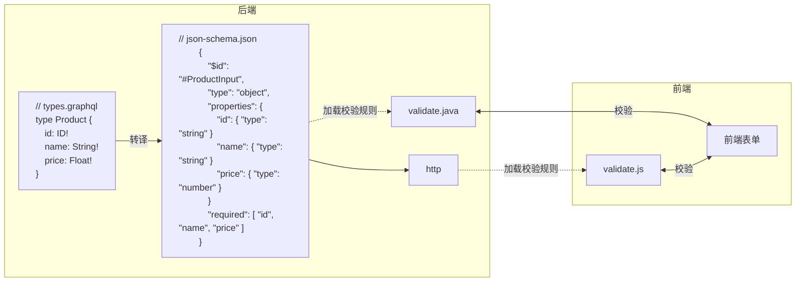

# 校验(json-schema)

[JSON Schema](https://json-schema.org/) 是一种用于验证和描述 JSON 数据结构的标准, 采用 JSON 格式定义数据结构和约束条件. 它提供灵活的验证规则, 层次化描述, 强大的文档功能及可扩展性, 能够提高数据质量, 简化开发流程

Graphoenix 将 GraphQL 定义自动编译为 JSON Schema, 提供开箱即用, 按需扩展的校验功能



## 安装

安装 graphoenix-json-schema 模块

```gradle
repositories {
    mavenCentral()
    // highlight-start
    jcenter()
    // highlight-end
}

dependencies {
    // highlight-start
    implementation 'org.graphoenix:graphoenix-json-schema:0.1.3'

    annotationProcessor 'org.graphoenix:graphoenix-json-schema:0.1.3'
    // highlight-end

    // ...
}
```

配置文件中使用 `package.localPackageNames` 添加 json-schema 模块

```application.conf
package {
  localPackageNames = ["io.graphoenix.jsonschema"]
}
```

## 定义 json-shcema

使用 [`@jsonSchema`](#jsonschema-指令) 注解来定义验证规则

1. 例: 规定用户名长度在 6 到 12 位之间

```graphql
"用户"
type User {
    "用户ID"
    id: ID
    "用户名"
    // highlight-start
    name: String! @jsonSchema(minLength: 6, maxLength: 12)
    // highlight-end
    "电子邮箱"
    email: String
    "联系方式"
    phoneNumbers: [String!]
    "用户类型"
    userType: UserType!
    "订单"
    orders: [Order!]
}
```

测试

```graphql
mutation {
  user(
    name: "Uma"
    email: "uma@example.com"
    userType: VIP
    phoneNumbers: ["13918124629", "18536492446"]
  ) {
    id
    name
    email
    phoneNumbers
    userType
  }
}
```

返回 json-schema 校验错误

```json
{
  "errors": [
    {
      "message": "$.name：必须至少为 6 个字符长",
      "locations": null,
      "path": ["name"],
      "extensions": null
    }
  ]
}
```

2. 例: 规定货物最少购买 1 件最多购买 999 件

```graphql
"订单项"
type OrderItem {
  "订单项ID"
  id: ID
  "产品"
  product: Product!
  "购买数量"
  // highlight-start
  quantity: Int! @jsonSchema(minimum: 1, maximum: 999)
  // highlight-end
}
```

测试

```graphql
mutation {
  order(
    items: [
      { product: { where: { id: { opr: EQ, val: "5" } } }, quantity: 1000 }
    ]
    where: { id: { opr: EQ, val: "4" } }
  ) @merge {
    id
    items {
      id
      product {
        name
      }
      quantity
    }
  }
}
```

返回 json-schema 校验错误

```json
{
  "errors": [
    {
      "message": "$.items[0].quantity：最大值必须为 999",
      "locations": null,
      "path": ["items", "0", "quantity"],
      "extensions": null
    }
  ]
}
```

---

## **指令说明**

### @jsonSchema 指令

| 字段              | 类型                        | 说明                                                                                                       |
| ----------------- | --------------------------- | ---------------------------------------------------------------------------------------------------------- |
| minLength         | Int                         | [字符串最小长度](https://json-schema.org/understanding-json-schema/reference/string#length)                |
| maxLength         | Int                         | [字符串最大长度](https://json-schema.org/understanding-json-schema/reference/string#length)                |
| pattern           | String                      | [正则表达式](https://json-schema.org/understanding-json-schema/reference/string#regexp)                    |
| format            | String                      | [格式](https://json-schema.org/understanding-json-schema/reference/string#format)                          |
| contentMediaType  | String                      | [内容媒体类型](https://json-schema.org/understanding-json-schema/reference/non_json_data#contentmediatype) |
| contentEncoding   | String                      | [内容编码](https://json-schema.org/understanding-json-schema/reference/non_json_data#contentencoding)      |
| minimum           | Float                       | [≥](https://json-schema.org/understanding-json-schema/reference/numeric#range)                             |
| exclusiveMinimum  | Float                       | [\>](https://json-schema.org/understanding-json-schema/reference/numeric#range)                            |
| maximum           | Float                       | [≤](https://json-schema.org/understanding-json-schema/reference/numeric#range)                             |
| exclusiveMaximum  | Float                       | [\<](https://json-schema.org/understanding-json-schema/reference/numeric#range)                            |
| multipleOf        | Float                       | [倍数](https://json-schema.org/understanding-json-schema/reference/numeric#multiples)                      |
| const             | String                      | [常量值](https://json-schema.org/understanding-json-schema/reference/const#constant-values)                |
| enum              | [String]                    | [枚举值](https://json-schema.org/understanding-json-schema/reference/enum#enumerated-values)               |
| items             | [JsonSchema](#jsonschema)   | [列表验证](https://json-schema.org/understanding-json-schema/reference/array#items)                        |
| minItems          | Int                         | [列表最小元素数](https://json-schema.org/understanding-json-schema/reference/array#length)                 |
| maxItems          | Int                         | [列表最大元素数](https://json-schema.org/understanding-json-schema/reference/array#length)                 |
| uniqueItems       | Boolean                     | [列表元素唯一性](https://json-schema.org/understanding-json-schema/reference/array#uniqueItems)            |
| allOf             | [[JsonSchema](#jsonschema)] | [AND](https://json-schema.org/understanding-json-schema/reference/combining#allOf)                         |
| anyOf             | [[JsonSchema](#jsonschema)] | [OR](https://json-schema.org/understanding-json-schema/reference/combining#anyOf)                          |
| oneOf             | [[JsonSchema](#jsonschema)] | [XOR](https://json-schema.org/understanding-json-schema/reference/combining#oneOf)                         |
| not               | [JsonSchema](#jsonschema)   | [NOT](https://json-schema.org/understanding-json-schema/reference/combining#not)                           |
| properties        | [[Property](#property)]     | [定义验证字段](https://json-schema.org/understanding-json-schema/reference/object#properties)              |
| if                | [JsonSchema](#jsonschema)   | [条件语句](https://json-schema.org/understanding-json-schema/reference/conditionals#ifthenelse)            |
| then              | [JsonSchema](#jsonschema)   | [条件语句](https://json-schema.org/understanding-json-schema/reference/conditionals#ifthenelse)            |
| else              | [JsonSchema](#jsonschema)   | [条件语句](https://json-schema.org/understanding-json-schema/reference/conditionals#ifthenelse)            |
| dependentRequired | [[Property](#property)]     | [必要依赖](https://json-schema.org/understanding-json-schema/reference/conditionals#dependentRequired)     |

## **输入类型说明**

### Property

| 字段       | 类型                      | 说明                                                                                                |
| ---------- | ------------------------- | --------------------------------------------------------------------------------------------------- |
| name       | String!                   | [字段名称](https://json-schema.org/understanding-json-schema/reference/object#properties)           |
| validation | [JsonSchema](#jsonschema) | [校验规则](https://json-schema.org/understanding-json-schema/reference/type#type-specific-keywords) |
| required   | [String]                  | [必须属性](https://json-schema.org/understanding-json-schema/reference/object#required)             |

### JsonSchema

| 字段              | 类型                        | 说明                                                                                                       |
| ----------------- | --------------------------- | ---------------------------------------------------------------------------------------------------------- |
| minLength         | Int                         | [字符串最小长度](https://json-schema.org/understanding-json-schema/reference/string#length)                |
| maxLength         | Int                         | [字符串最大长度](https://json-schema.org/understanding-json-schema/reference/string#length)                |
| pattern           | String                      | [正则表达式](https://json-schema.org/understanding-json-schema/reference/string#regexp)                    |
| format            | String                      | [格式](https://json-schema.org/understanding-json-schema/reference/string#format)                          |
| contentMediaType  | String                      | [内容媒体类型](https://json-schema.org/understanding-json-schema/reference/non_json_data#contentmediatype) |
| contentEncoding   | String                      | [内容编码](https://json-schema.org/understanding-json-schema/reference/non_json_data#contentencoding)      |
| minimum           | Float                       | [≥](https://json-schema.org/understanding-json-schema/reference/numeric#range)                             |
| exclusiveMinimum  | Float                       | [\>](https://json-schema.org/understanding-json-schema/reference/numeric#range)                            |
| maximum           | Float                       | [≤](https://json-schema.org/understanding-json-schema/reference/numeric#range)                             |
| exclusiveMaximum  | Float                       | [\<](https://json-schema.org/understanding-json-schema/reference/numeric#range)                            |
| multipleOf        | Float                       | [倍数](https://json-schema.org/understanding-json-schema/reference/numeric#multiples)                      |
| const             | String                      | [常量值](https://json-schema.org/understanding-json-schema/reference/const#constant-values)                |
| enum              | [String]                    | [枚举值](https://json-schema.org/understanding-json-schema/reference/enum#enumerated-values)               |
| items             | [JsonSchema](#jsonschema)   | [列表验证](https://json-schema.org/understanding-json-schema/reference/array#items)                        |
| minItems          | Int                         | [列表最小元素数](https://json-schema.org/understanding-json-schema/reference/array#length)                 |
| maxItems          | Int                         | [列表最大元素数](https://json-schema.org/understanding-json-schema/reference/array#length)                 |
| uniqueItems       | Boolean                     | [列表元素唯一性](https://json-schema.org/understanding-json-schema/reference/array#uniqueItems)            |
| allOf             | [[JsonSchema](#jsonschema)] | [AND](https://json-schema.org/understanding-json-schema/reference/combining#allOf)                         |
| anyOf             | [[JsonSchema](#jsonschema)] | [OR](https://json-schema.org/understanding-json-schema/reference/combining#anyOf)                          |
| oneOf             | [[JsonSchema](#jsonschema)] | [XOR](https://json-schema.org/understanding-json-schema/reference/combining#oneOf)                         |
| not               | [JsonSchema](#jsonschema)   | [NOT](https://json-schema.org/understanding-json-schema/reference/combining#not)                           |
| properties        | [[Property](#property)]     | [定义验证字段](https://json-schema.org/understanding-json-schema/reference/object#properties)              |
| if                | [JsonSchema](#jsonschema)   | [条件语句](https://json-schema.org/understanding-json-schema/reference/conditionals#ifthenelse)            |
| then              | [JsonSchema](#jsonschema)   | [条件语句](https://json-schema.org/understanding-json-schema/reference/conditionals#ifthenelse)            |
| else              | [JsonSchema](#jsonschema)   | [条件语句](https://json-schema.org/understanding-json-schema/reference/conditionals#ifthenelse)            |
| dependentRequired | [[Property](#property)]     | [必要依赖](https://json-schema.org/understanding-json-schema/reference/conditionals#dependentRequired)     |
